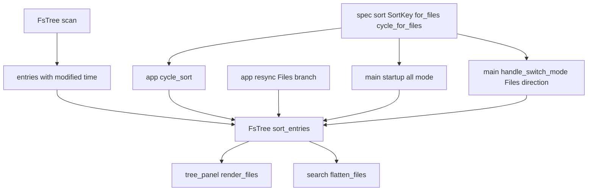

# Design — spec-viewer-files-mode-sort

## 정의
spec-viewer 사용자를 위해 `--all` 모드(순수 마크다운 디렉터리 트리)에서도 이름/최근 수정 정렬을 순환하며 트리 형제 순서를 바꿀 수 있게 하는 설계이다.

## Boundary Commitments

### In-Scope (This Spec Owns)
- **`FsEntry`의 수정시각 데이터**: `FsTree::scan`이 각 항목의 파일시스템 수정시각을 함께 읽어둔다(`src/spec/fs_tree.rs`).
- **형제 단위 재정렬 알고리즘**: 트리 중첩 구조(어느 항목이 어느 폴더 아래인지)를 바꾸지 않고, 각 폴더 레벨 안에서만 이름/최근 수정 순서로 재배열하는 `FsTree::sort_entries`(`src/spec/fs_tree.rs`).
- **`--all` 모드 전용 2단 순환**: `SortKey::for_files`/`SortKey::cycle_for_files` — phase/진행률을 이름으로 접고, 이름↔최근 수정만 순환(`src/spec/sort.rs`).
- **배선**: `cycle_sort`가 `TreeSource::Files`에서도 실제로 재정렬을 적용, `resync`의 Files 분기가 재스캔 후 현재 정렬을 재적용(`src/app/mod.rs`).
- **시작/모드 전환 시 초기 정렬**: `--all`로 시작할 때와 실행 중 전체 모드로 전환할 때 모두 현재 정렬 키(정규화됨)를 새 트리에 적용(`src/main.rs`).
- **정렬 키 표시**: Files 모드 패널 제목에 현재 정렬 키 표시(`src/ui/tree_panel.rs`).

### Out-of-Scope
- **`.kiro`/spec-kit 모드의 정렬 로직**: `spec::sort::sort_specs`/`SortKey::cycle`(4단)은 변경하지 않는다.
- **`.kiro` 모드의 자동 발견 그룹(steering 등) 순서**: `spec-viewer-kiro-folder-groups`가 만든 `KiroGroup.tree`는 항상 `FsTree::scan`이 만든 그대로(이름/경로순)를 쓰며, 이번 스펙의 재정렬 대상이 아니다 — `app::loader::read_groups`는 이번 스펙이 추가하는 `FsTree::sort_entries`를 절대 호출하지 않는다(요구사항 4.3의 무회귀 보장 방법 그 자체).
- **새 정렬 키 종류, 정렬 방향 토글, `--sort` CLI 값 목록 자체**: brief.md 그대로.

### Allowed Dependencies
- 외부: 신규 크레이트 없음. `std::fs::metadata`/`SystemTime`만 추가로 사용(이미 `app::loader`가 같은 패턴을 씀).
- 내부 의존 방향: `spec::fs_tree`(데이터+정렬 알고리즘) → `spec::sort`(모드별 유효 키 판단, `fs_tree`에 의존하지 않음 — 순수 enum 로직) → `app::mod`/`main`(배선) → `ui::tree_panel`(표시). 기존 레이어링(`spec` → `app` → `ui`, `spec`는 `app`/`ui`에 의존 안 함) 그대로.

### Revalidation Triggers
- `FsTree::scan`의 스캔 알고리즘(깊이 제한, 필터링)이 바뀌어 `entries`가 더 이상 "경로순 = 올바른 중첩"을 보장하지 않게 되면, `sort_entries`의 재구성 알고리즘도 재검토해야 한다.
- `spec-viewer-kiro-folder-groups`의 그룹이 향후 자체 정렬 기능을 원하게 되면, 이번 스펙이 만든 `sort_entries`를 재사용할지 새로 설계할지 재검토.

## Architecture

### Boundary Map


### Technology Stack
| Layer | Choice | Role |
|-------|--------|------|
| 수정시각 조회 | 기존 `std::fs::metadata` | 각 `FsEntry`의 `modified: SystemTime` 채움 |

### Key Decisions
- **`FsTree::scan`의 시그니처/기존 정렬(경로순)은 변경하지 않는다 — 재정렬은 별도 메서드 `sort_entries`로 분리** — 이유: `scan`은 `spec-viewer-kiro-folder-groups`의 모든 그룹이 공유해서 쓰므로, `scan` 자체를 정렬 키 인자를 받게 바꾸면 그룹 순서까지 영향권에 들어가 요구사항 4.3(그룹 순서 무회귀)을 깨뜨릴 위험이 생긴다. 별도 메서드로 분리하면 그룹 코드(`app::loader::read_groups`)는 이 메서드를 아예 호출하지 않는 것만으로 무회귀가 자동 보장된다(research.md).
- **재정렬은 트리를 임시로 중첩 구조(부모-자식)로 복원한 뒤 각 레벨을 정렬하고 다시 평탄화하는 방식** — 이유: `entries`가 평탄한 깊이-태그 목록이라 전체를 한 번에 뒤섞으면 "디렉터리 바로 다음에 그 하위 전체가 연속으로 온다"는 `tree_panel::build_files_items`/`search::flatten_files`의 전제가 깨진다(brief.md 제약).
- **`SortKey::for_files`로 phase/진행률을 이름에 접어, `.kiro` 모드의 `SortKey`를 그대로 재사용** — 이유: 새 enum이나 별도 타입을 만들지 않고 기존 4개 값 중 2개만 유효 취급하는 정규화 함수 하나로 충분(Simplification). 이 정규화가 표시(`label`)와 재정렬(`sort_entries`) 양쪽에서 같은 함수를 거치므로 항상 일관됨.
- **정렬 키(`state.sort_key`)는 모드 전환 시 리셋하지 않는다(기존 `spec-viewer-tree-navigation-modes`의 결정 그대로)** — 이유: 이미 `ApplySourceSwitch`가 `sort_key`를 건드리지 않기로 확정돼 있고, `handle_switch_mode`가 Kiro 방향에서 이미 `state.sort_key`를 재적용하고 있으므로, Files 방향도 대칭적으로 재적용해야 일관적이다(요구사항 2.4).

## System Flows

### 재정렬 알고리즘 (요구사항 1.1~1.3, 2.1)
```mermaid
flowchart TD
    flat[평탄한 entries 목록] --> rebuild[깊이 태그로 임시 중첩 트리 복원]
    rebuild --> sortLevel[각 레벨의 자식들을 key로 정렬]
    sortLevel --> recurse[재귀적으로 모든 하위 레벨에도 적용]
    recurse --> flattenBack[다시 평탄한 목록으로(전위 순회)]
    flattenBack --> newEntries[재정렬된 entries]
```
- `key`가 이름이면 각 레벨을 경로순(기존 `scan`의 기본과 동일 비교 기준)으로, 최근 수정이면 각 레벨을 수정시각 내림차순으로 정렬한다(동률은 경로순으로 안정적 타이브레이크) — 디렉터리와 파일은 같은 레벨에서 함께 정렬되어 기존 "이름순 뒤섞임" 관례를 그대로 유지한다(1.2/1.3).

## Components and Interfaces

### spec::fs_tree (module) — 데이터 모델과 재정렬
- Intent: 각 항목의 수정시각을 스캔 시점에 확보하고, 트리 중첩을 보존하며 형제 단위로 재정렬한다.
- Requirements: 1.1, 1.2, 1.3, 2.1
```rust
pub struct FsEntry {
    pub path: PathBuf,
    pub is_dir: bool,
    pub depth: u8,
    /// spec-viewer-files-mode-sort: 파일시스템 수정시각. 조회 실패 시
    /// `SystemTime::UNIX_EPOCH`(가장 오래된 값으로 취급 -- "최근 수정"
    /// 정렬에서 맨 뒤로 밀림).
    pub modified: SystemTime,
}

impl FsTree {
    pub fn scan(root: &Path) -> FsTree; // 기존 시그니처 그대로, entries에 modified만 추가로 채움

    /// spec-viewer-files-mode-sort: `entries`의 형제 그룹을 `key`
    /// (`SortKey::for_files`로 정규화됨)로 재정렬한다. 어느 항목이 어느
    /// 폴더 아래인지(중첩 구조)는 바꾸지 않는다.
    pub fn sort_entries(&mut self, key: SortKey);
}
```
- 계약 특이사항: `scan`을 호출하는 기존 모든 곳(`--all` 모드, `spec-viewer-kiro-folder-groups`의 그룹 스캔)은 아무 변경 없이 그대로 동작한다(`sort_entries`를 부르지 않는 한 순서는 기존과 동일). `sort_entries`는 `self.entries`를 제자리에서 교체하며, 호출하지 않으면 `scan`이 만든 경로순 그대로 남는다.

### spec::sort (module) — Files 모드용 키 정규화
- Intent: `.kiro` 전용 정렬 키(phase/진행률)를 Files 모드에서 의미 있는 값으로 접고, 2단 순환을 제공한다.
- Requirements: 1.1, 1.4
```rust
impl SortKey {
    /// phase/진행률 -> 이름으로 접고, 이름/최근 갱신은 그대로 통과시킨다.
    pub fn for_files(self) -> SortKey;
    /// 이름 <-> 최근 갱신만 순환(항상 `for_files()`를 먼저 거친 값 기준).
    pub fn cycle_for_files(self) -> SortKey;
}
```
- 계약 특이사항: 기존 `cycle`(4단, `.kiro` 전용)은 전혀 바뀌지 않는다. `label()`도 그대로 재사용— Files 모드는 표시 직전에 `for_files()`를 먼저 거친 값으로 `label()`을 호출한다.

### app::mod (module) — 배선
- Intent: `Files` 모드에서도 정렬 순환·재스캔이 실제 재정렬로 이어지게 한다.
- Requirements: 1.1, 1.2, 1.3, 2.1, 2.2, 2.3, 4.1, 4.2
```rust
fn cycle_sort(state: &mut AppState);
fn resync(state: &mut AppState); // 기존 함수, Files 분기만 확장
```
- 계약 특이사항: `cycle_sort`는 `state.root`가 `Kiro`면 기존 4단 순환+`sort_specs`, `Files`면 `cycle_for_files`+`FsTree::sort_entries`, `SpecKit`이면 아무 것도 하지 않는다(4.2, 기존과 동일 — spec-kit은 원래도 정렬 무영향). `resync`의 `Files` 분기는 재스캔한 새 `FsTree`에 `state.sort_key`로 즉시 `sort_entries`를 적용한 뒤 담는다(2.3). 트리의 펼침/선택 상태(`state.tree`)는 이 함수가 건드리지 않으므로 2.2는 별도 코드 없이 자연히 성립한다(재정렬은 `state.root`만 바꾸고 `state.tree`는 그대로).

### main (module) — 시작/모드 전환 시 초기 정렬
- Intent: `--all`로 시작하거나 실행 중 전체 모드로 전환할 때, 유효한(정규화된) 정렬 키가 즉시 반영되게 한다.
- Requirements: 1.4, 2.4
```rust
fn main(); // 기존 함수, `--all` 분기에서 state.sort_key 정규화 + 첫 정렬 적용 추가
fn handle_switch_mode(...) -> ...; // 기존 함수, Files 방향 분기에서 정렬 적용 추가
```
- 계약 특이사항: `main()`은 `state.sort_key = args.sort.into()` 직후, `state.root`가 `Files`면 `state.sort_key = state.sort_key.for_files()`로 덮어쓰고 그 값으로 `tree.sort_entries(...)`를 한 번 호출한다(1.4 — phase/진행률을 지정해도 이름으로 시작). `handle_switch_mode`의 Files 방향(현재 `FsTree::scan(start)`만 하던 분기)도 동일하게 `state.sort_key.for_files()`로 정렬을 적용한 뒤 `Action::ApplySourceSwitch`에 실어 보낸다 — Kiro 방향이 이미 `sort_specs(&mut spec_root.specs, state.sort_key)`를 적용하는 것과 대칭(2.4).

### ui::tree_panel (module) — 표시
- Intent: Files 모드 패널 제목에 현재 정렬 키를 보여준다.
- Requirements: 3.1
```rust
fn render_files(
    frame: &mut Frame,
    area: Rect,
    tree: &FsTree,
    tree_state: &mut TreeState<NodeId>,
    sort_key: SortKey, // 신규 파라미터
    search_matches: &[Vec<NodeId>],
    cache: &mut Option<FilesTreeItemCache>,
);
```
- 계약 특이사항: 제목을 `format!("Files [{}]", sort_key.for_files().label())`로 바꾼다(기존 `.kiro` 모드의 `"Specs [{}]"`와 동일한 형식). `render()`가 이미 받고 있는 `sort_key` 인자를 이 함수에도 그대로 넘기기만 하면 되고, `Tree`/`TreeItem` 빌드 로직(`build_files_items`) 자체는 변경 없음(정렬은 이미 `state.root`의 `entries` 순서에 반영되어 있으므로 렌더러는 그 순서를 그대로 그리기만 한다).

## Data Models
`FsEntry`에 `modified: SystemTime` 필드 추가(위 Components 참고) 외 신규 타입 없음.

## Error Handling
- **외부 자원 오류(파일시스템)**: 수정시각 조회 실패(권한 등)는 `SystemTime::UNIX_EPOCH`로 대체 — 그 항목이 "최근 수정" 정렬에서 맨 뒤로 밀릴 뿐 오류가 나지 않는다(`app::loader`의 기존 "읽기 실패는 건너뛰거나 대체값" 관례와 동일).
- **시스템 오류**: 없음(패닉 경로 없음).

## Testing Strategy
- **Depth**: Standard — 새 알고리즘(형제 단위 재정렬)이지만 기존 `FsTree`/`SortKey` 타입을 확장하는 수준이라 신규 상태기계는 아니다.
- **Unit**: `FsTree::sort_entries`가 이름/최근 수정 각각에서 형제만 재배열하고 중첩 구조(부모-자식 관계)는 그대로인 것(1.1~1.3, 2.1), 수정시각 조회 실패 시 맨 뒤로 밀리는 것; `SortKey::for_files`/`cycle_for_files`가 phase/진행률을 접고 2단만 순환하는 것(1.1, 1.4); `cycle_sort`/`resync`가 Files 모드에서 실제로 재정렬을 적용하는 것(2.3), `.kiro`/spec-kit 분기는 기존과 동일한 것(4.1, 4.2).
- **Integration**: `main()`의 `--all` 시작 경로가 `--sort phase`를 이름으로 정규화해 실제로 이름순 트리를 만드는 것(1.4); `handle_switch_mode`의 Files 방향이 현재 정렬 키를 적용하는 것(2.4).
- **E2E**: 실제 임시 디렉터리(하위 폴더 포함)로 `--all` 모드를 열어 실제 키 입력(`s`)으로 이름→최근 수정→이름 순환이 실제 렌더된 프레임에 반영되는 것, 정렬 중에도 펼침/선택이 유지되는 것, `spec-viewer-kiro-folder-groups`의 그룹 순서는 전혀 바뀌지 않는 것(4.3).
- **Acceptance**: 요구사항 10개 전부 실물 실행 확인, 가능하면 실제 컴파일된 바이너리 pty 스모크로 재확인.
- **Performance**: 해당 없음(이 크레이트 규모).

## File Structure Plan
```
src/spec/
  fs_tree.rs   # FsEntry.modified, FsTree::sort_entries 신규
  sort.rs      # SortKey::for_files/cycle_for_files 신규
src/app/
  mod.rs       # cycle_sort Files 분기, resync Files 분기 확장
src/main.rs    # --all 시작 시 정렬 정규화+적용, handle_switch_mode Files 방향 정렬 적용
src/ui/
  tree_panel.rs # render_files에 sort_key 파라미터, 제목에 정렬 키 표시
```
