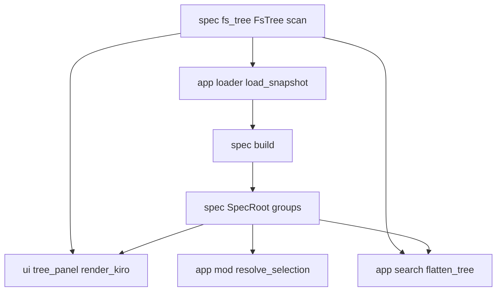
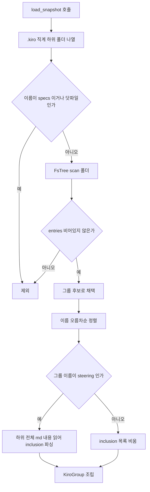

# Design — spec-viewer-kiro-folder-groups

## 정의
spec-viewer 사용자를 위해 `.kiro` 프로젝트의 `specs` 외 임의의 하위 폴더(마크다운을 포함한 모든 폴더, `steering` 포함)를 자동 발견해 하위 폴더까지 재귀적으로 탐색할 수 있게 하는 설계이다.

## Boundary Commitments

### In-Scope (This Spec Owns)
- **`.kiro` 하위 폴더 자동 발견**: `specs`를 제외한 모든 직계 하위 폴더 중 마크다운을 포함한(하위 폴더까지 재귀 검사) 폴더를 그룹으로 채택(`src/app/loader.rs`).
- **그룹의 도메인 모델**: `SpecRoot.groups: Vec<KiroGroup>`, `steering`이라는 이름의 그룹에 한한 `inclusion` 배지 데이터(`src/spec/mod.rs`).
- **그룹의 재귀 트리 렌더링**: 그룹 노드와 그 하위 폴더/파일을 `Kiro` 트리 안에 나란히 그림(`src/ui/tree_panel.rs`).
- **그룹의 검색 평탄화**: `flatten_tree`가 그룹의 하위 폴더/파일까지 순회 대상에 포함(`src/app/search.rs`).
- **그룹 파일의 선택·편집·감시 통합**: 기존 문서 선택/편집/watch 경로가 그룹의 `NodeId::File`/`Dir`을 올바르게 처리(`src/app/mod.rs`).

### Out-of-Scope
- **GitHub spec-kit(`.specify/`) 모드의 동등 기능**: `TreeSource::SpecKit`은 이번 스펙이 건드리지 않는다 — spec-kit은 `steering` 개념 자체가 없고(design.md 기존 스펙의 Out-of-Scope), 이번 요청도 `.kiro` 모드에 한정된다(brief.md). `render_spec_kit`/`flatten_spec_kit`/`spec_kit::build`를 전혀 수정하지 않는 것 자체가 요구사항 5.1(spec-kit 모드 무영향)의 보장 방법이다.
- **`specs` 폴더 자체의 표시 방식**: 스펙 트리/배지/정렬은 기존 그대로.
- **`TreeMode`/정렬 키/전체 모드↔스펙 모드 전환/전체펼치기·접기 키 정의**: 새 그룹 노드도 이 기존 액션들에 자연히 참여할 뿐, 액션 자체의 의미는 바꾸지 않는다.
- **그룹 폴더 생성/삭제 같은 쓰기 동작**: spec-viewer는 읽기 전용 뷰어라는 기존 원칙 그대로.

### Allowed Dependencies
- 외부: 신규 크레이트 없음. 기존 `ignore`(`FsTree::scan`이 이미 사용), `tui-tree-widget` 재사용.
- 내부 의존 방향: `spec`(데이터 모델: `KiroGroup`/`SpecRoot`/`build`) → `app::loader`(디스크 스캔: `load_snapshot`) → `app::mod`(리듀서: 선택/편집/watch 통합) / `app::search`(검색 평탄화) / `ui::tree_panel`(렌더링). 기존 의존 방향(`spec`이 `app`/`ui`에 의존하지 않음)을 그대로 유지.

### Revalidation Triggers
- `FsTree`의 스캔 규칙(깊이 제한, `.gitignore` 처리, 확장자 목록)이 바뀌면 그룹의 재귀 트리 동작도 함께 바뀐다 — 의도된 재사용이지만 `--all` 모드 전용 튜닝이 그룹에도 그대로 새는지 재검토 필요.
- `inclusion` 프론트매터 판정 기준이 바뀌면(원 `spec-viewer` 스펙 요구사항 2.8) `steering` 그룹의 배지 계산도 함께 재검토해야 한다.
- `.kiro` 하위에 `specs`/그룹 폴더가 아닌 새로운 예약 폴더(예: 향후 `.specify`류)가 추가되면, 그 폴더가 그룹으로 오인식되지 않도록 제외 목록 재검토 필요.

## Architecture

### Boundary Map


### Technology Stack
| Layer | Choice | Role |
|-------|--------|------|
| 재귀 디렉터리 스캔 | 기존 `spec::fs_tree::FsTree::scan`(`ignore` 크레이트) | 그룹 폴더 하나당 한 번씩 호출해 재귀 트리 확보 |
| 트리 위젯 | 기존 `tui_tree_widget::{Tree, TreeItem}` | 변경 없음 — `NodeId::Dir`/`File`을 그대로 씀 |

### Key Decisions
- **`SpecRoot.steering: Vec<SteeringDoc>` → `SpecRoot.groups: Vec<KiroGroup>`로 대체** — 이유: `steering`도 재귀 트리가 되어야 해서 평평한 모델을 유지할 수 없다(research.md).
- **그룹은 `NodeId::Dir`/`NodeId::File`(기존 `--all` 모드 타입)을 그대로 재사용, 새 `NodeId` variant 추가 없음** — 이유: SSoT/Simplification, 이미 검증된 재귀 트리 순회·렌더링·검색 코드를 재사용(research.md).
- **그룹 자동 발견은 `FsTree::scan` 결과의 `entries.is_empty()`로 판정** — 이유: "마크다운 존재 여부(재귀)" 검사를 별도로 구현하지 않고 스캔 결과 자체를 재사용(research.md).
- **그룹은 이름(폴더명) 오름차순으로 정렬** — 이유: 요구사항 1.5의 "일관된 순서"를 가장 단순하게 보장.
- **`inclusion` 배지는 폴더명이 정확히 `steering`인 그룹에만 계산** — 이유: 요구사항 3.1/3.2가 명시.
- **`build_files_items`/`flatten_files`에 `prefix`(및 전자는 `inclusion`) 파라미터 추가** — 이유: 그룹이 여러 개 나란히 붙는 구조를 지원하면서 기존 `--all` 모드 호출부는 빈 슬라이스로 동작 무변경(research.md).

## System Flows

### 그룹 자동 발견과 트리 조립 (요구사항 1.1~1.6)

- `filterSpecs`/`hasMd` 순서가 요구사항 1.1(발견)·1.2(비발견)·1.4(specs 제외)·1.6(그룹 없음 무오류)을 모두 만든다. `steeringCheck`가 3.1/3.2의 배지 유무를 가른다.

## Components and Interfaces

### spec (module) — 그룹 도메인 모델
- Intent: `.kiro` 하위 폴더 스캔 결과를 그룹 도메인 타입으로 조립한다. 파일시스템 접근 없음(순수 조립).
- Requirements: 1.1~1.6, 2.1~2.4, 3.1~3.2
```rust
pub struct SpecRoot {
    pub specs: Vec<Spec>,
    pub groups: Vec<KiroGroup>,   // was: pub steering: Vec<SteeringDoc>
}

/// 자동 발견된 `.kiro` 하위 폴더 하나(steering 포함). 이름은
/// `tree.root`의 파일명에서 파생하며 별도 필드로 중복 저장하지 않는다.
pub struct KiroGroup {
    pub tree: FsTree,
    /// `tree.root`의 폴더명이 정확히 "steering"일 때만 채워짐(그 외는
    /// 항상 빈 벡터). 경로는 `tree.entries` 중 파일 항목의 경로와 일치.
    pub inclusion: Vec<(PathBuf, Inclusion)>,
}

impl KiroGroup {
    pub fn name(&self) -> &str; // tree.root의 파일명 (표시용)
}

pub struct DirSnapshot {
    pub specs: Vec<SpecDirSnapshot>,
    pub groups: Vec<GroupSnapshot>,   // was: pub steering: Vec<FileSnapshot>
}

/// 그룹 하나의 스냅샷: 재귀 트리(파일시스템에서 이미 스캔됨)와, steering
/// 그룹에 한해서만 채워지는 파일 내용(inclusion 파싱용).
pub struct GroupSnapshot {
    pub tree: FsTree,
    pub steering_contents: Vec<(PathBuf, String)>,   // steering이 아니면 항상 빈 벡터
}

pub fn build(snapshot: &DirSnapshot) -> SpecRoot;
```
- 계약 특이사항: `build`는 `snapshot.groups`를 그대로(순서 보존) `SpecRoot.groups`로 옮기되, 각 `GroupSnapshot.steering_contents`를 `inclusion()`으로 파싱해 `KiroGroup.inclusion`을 채운다 — 정렬(1.5)과 발견 판정(1.1/1.2/1.6)은 로더(`app::loader`)의 책임이고 `build`는 순수 변환만 한다(design-principles "What, not how"). `KiroGroup.tree`가 `FsTree`(깊이 6까지 재귀)를 그대로 담으므로 몇 단계든 하위 폴더를 표현할 수 있다(2.1/2.2) — 새 재귀 로직 불필요. `steering`이라는 이름의 폴더도 이 동일한 구조를 쓰므로 다른 그룹과 똑같이 하위 폴더를 지원한다(2.3) — steering 전용 특례는 `inclusion` 필드 하나뿐(3.1/3.2).

### app::loader (module) — `.kiro` 하위 폴더 스캔
- Intent: `specs`를 제외한 `.kiro` 직계 하위 폴더 중 마크다운을 포함한 폴더를 찾아 재귀 스캔하고, `steering`이라는 이름의 폴더는 추가로 파일 내용을 읽는다.
- Requirements: 1.1~1.6, 3.1~3.2
```rust
pub fn load_snapshot(root: &Path) -> DirSnapshot;
```
- 계약 특이사항: `root`의 직계 하위 디렉터리를 순회하며, 이름이 `specs`이거나 닷파일인 것을 제외한 각 폴더에 `spec::FsTree::scan`을 호출한다. `scan` 결과의 `entries`가 비어있으면(재귀적으로 마크다운이 하나도 없음, 1.2/1.6) 그 폴더는 버린다. 남은 그룹들을 폴더명 오름차순으로 정렬한다(1.5). 폴더명이 정확히 `steering`인 그룹만 `tree.entries` 중 파일 항목 전체를 `fs::read`로 읽어 `GroupSnapshot.steering_contents`에 채운다(그 외 그룹은 빈 벡터 — 3.2, 파일 내용은 선택 시점에 지연 로딩).

### ui::tree_panel (module) — 그룹 렌더링
- Intent: 각 `KiroGroup`을 "폴더명 노드 + 재귀 트리"로 `Kiro` 트리 안에 스펙 노드들 다음에 나란히 그린다.
- Requirements: 1.1, 1.3, 2.1~2.4, 3.1~3.2
```rust
fn kiro_group_item(group: &KiroGroup, search_matches: &[Vec<NodeId>]) -> TreeItem<'static, NodeId>;

// 기존 함수 시그니처 확장 (design-synthesis "인터페이스만 일반화"):
fn build_files_items(
    entries: &[FsEntry],
    search_matches: &[Vec<NodeId>],
    prefix: &[NodeId],                  // 신규: 이 트리가 더 큰 트리 안에 중첩될 때의 조상 경로
    inclusion: &[(PathBuf, Inclusion)],  // 신규: 비어있으면 배지 없음(기존 --all 호출부는 &[])
) -> Vec<TreeItem<'static, NodeId>>;
```
- 계약 특이사항: `render_kiro`가 `root.groups`의 각 항목에 `kiro_group_item`을 호출해 스펙 노드들 뒤에 순서대로 추가한다(기존 `steering_group_item` 한 번 호출을 대체). `kiro_group_item`은 `NodeId::Dir(group.tree.root.clone())`을 자신의 id로, `group.name()`을 라벨로 삼고, 자식은 `build_files_items(&group.tree.entries, search_matches, &[own_id], &group.inclusion)`로 만든다. `--all` 모드의 `render_files`는 `build_files_items(entries, search_matches, &[], &[])`로 호출해 동작이 완전히 그대로 유지된다(회귀 없음). 파일 항목의 배지(`inclusion` 조회 결과가 `Some`일 때 `" [always]"`류 접미사)는 기존 `steering_item`의 포맷을 그대로 옮긴다.

### app::search (module) — 그룹 검색 평탄화
- Intent: `flatten_tree`가 각 그룹의 하위 폴더/파일까지 순회 대상에 포함시킨다.
- Requirements: 4.2
```rust
fn flatten_kiro_group(group: &KiroGroup) -> Vec<TreeRow>;

// 기존 함수 시그니처 확장:
fn flatten_files(tree: &FsTree, prefix: &[NodeId]) -> Vec<TreeRow>;
```
- 계약 특이사항: `flatten_kiro`가 기존 "Steering 그룹 하나"를 순회하던 자리를 `root.groups`를 순회하며 각각 `flatten_kiro_group`을 호출하는 것으로 대체한다. `flatten_kiro_group`은 `NodeId::Dir(group.tree.root.clone())` 행을 하나 먼저 넣고, `flatten_files(&group.tree, &[그 id])`의 결과를 이어 붙인다. `--all` 모드의 `flatten_files` 호출부는 `prefix: &[]`로 바뀌어 동작 그대로.

### app::mod (module) — 선택·편집·감시 통합
- Intent: 그룹의 `NodeId::File`/`Dir`이 기존 문서 선택/편집/watch 경로에서 스펙·`--all` 파일과 동일하게 동작하게 한다.
- Requirements: 2.4, 4.1, 4.3, 4.4, 4.5
```rust
fn resolve_selection(root: &TreeSource, path: &[NodeId], width: u16) -> DocView;
```
- 계약 특이사항: `(TreeSource::Kiro(_), Some(NodeId::File(path)))` 분기를 기존 "일어날 수 없는 조합 → Empty" 처리에서 `(TreeSource::Files(_), Some(NodeId::File(path)))`와 동일한 `loader::load_doc(path, width)` 호출로 바꾼다. `NodeId::Steering`/`SteeringGroup` 관련 분기(및 `NodeId` 자체의 두 variant)는 제거한다 — `(_, Some(NodeId::Dir(_))) => DocView::Empty`(폴더는 내용 없음, 1.9 계열)가 그룹의 루트 노드에도 그대로 적용된다. `expand_all`/`handle_tree_click`의 "폴더형 노드" 판정(`Spec`/`Dir`만 남고 `SteeringGroup` 제거)은 변경 없이 `Dir`이 그룹 루트를 이미 포함하므로 전체펼치기(4.4)·클릭 토글이 자동으로 성립한다. 편집(4.3)·감시(4.5)는 `NodeId::File`이 가리키는 실제 경로를 그대로 쓰므로 `--all` 모드와 동일하게 이미 동작한다(추가 코드 불필요, 확인만 필요).

## Data Models
위 Components 블록의 `SpecRoot`/`KiroGroup`/`DirSnapshot`/`GroupSnapshot`으로 충분히 정의됨. 불변식: `KiroGroup.inclusion`의 각 경로는 반드시 같은 `KiroGroup.tree.entries` 안의(파일, `is_dir == false`) 항목 경로와 일치해야 한다(다른 그룹·다른 파일 경로가 섞이면 배지 조회가 항상 실패하지만 패닉하지는 않음 — 조회는 `Option`).

## Error Handling
- **사용자 입력 오류**: 해당 없음(키 입력만).
- **외부 자원 오류(파일시스템)**: 그룹 폴더를 읽을 수 없거나(권한 등) 스캔 중 개별 항목을 읽지 못하면 `FsTree::scan`의 기존 관례(무시하고 계속)를 그대로 따른다 — 새 오류 처리 불필요.
- **시스템 오류**: 없음(패닉 경로 없음).
- **기능 강등**: `steering` 폴더의 특정 파일을 읽지 못하면 그 파일만 `inclusion` 배지 없이 표시(3.1의 "예외적으로" 사례) — 그룹 전체나 다른 파일에 영향 없음.

## Testing Strategy
- **Depth**: Complex — 핵심 도메인 타입(`SpecRoot`) 변경이 여러 모듈에 파급되고, `steering`이 평평한 모델에서 재귀 모델로 바뀌는 상태 전이가 있다(verification-mapping.md 기준 "도메인 규칙·통합·상태기계").
- **Unit**: `app::loader`의 그룹 발견(specs 제외, 마크다운 없는 폴더 제외, 정렬)과 `steering`만 내용을 읽는 것(1.1~1.6, 3.1~3.2); `spec::build`가 `GroupSnapshot`→`KiroGroup`을 올바르게 조립하고 `inclusion`을 파싱하는 것; `build_files_items`/`flatten_files`의 `prefix`/`inclusion` 파라미터가 기존 `--all` 호출(빈 슬라이스)에서 무회귀인 것과 그룹 호출(비어있지 않은 프리픽스)에서 올바른 경로를 만드는 것.
- **Integration**: `resolve_selection`이 그룹의 `NodeId::File`/`Dir`을 올바르게 처리(2.4, 4.1); `handle_tree_click`/`expand_all`이 그룹 루트와 하위 폴더를 폴더로 인식해 토글/전체펼치기(4.4)하는 것; `resync`가 그룹 폴더 아래 변경을 반영(4.5).
- **E2E**: 실제 임시 `.kiro` 트리(specs + steering + 가상의 reference 폴더, 각각 하위 폴더 포함)를 만들어 실제 렌더 프레임으로 세 그룹이 모두 보이고 하위 폴더까지 펼쳐지는 것, `steering` 파일만 배지가 보이는 것, 검색이 그룹 안 문서를 찾는 것을 확인.
- **Acceptance**: 요구사항 18개 전부 실물 실행 확인(가능하면 실제 컴파일된 바이너리 pty 스모크로 최소 1개 시나리오 재확인 — 이 프로젝트의 확립된 관례).
- **Performance**: 해당 없음(이 크레이트 규모에서 그룹 수·파일 수는 무시할 만함, research.md).

## File Structure Plan
```
src/spec/
  mod.rs       # SpecRoot.groups/KiroGroup/DirSnapshot.groups/GroupSnapshot, build()의 그룹 조립
  fs_tree.rs   # 변경 없음(그대로 재사용)
src/app/
  loader.rs    # load_snapshot의 그룹 자동 발견(specs 제외, FsTree::scan 판정, steering 전용 내용 읽기, 정렬)
  mod.rs       # resolve_selection의 (Kiro, File) 분기, NodeId::Steering/SteeringGroup 제거, expand_all/handle_tree_click의 폴더 판정에서 SteeringGroup 제거
  search.rs    # flatten_kiro의 그룹 순회, flatten_files의 prefix 파라미터
src/ui/
  tree_panel.rs # render_kiro의 그룹 렌더링, kiro_group_item 신규, build_files_items의 prefix/inclusion 파라미터, steering_group_item/steering_item 제거
```
