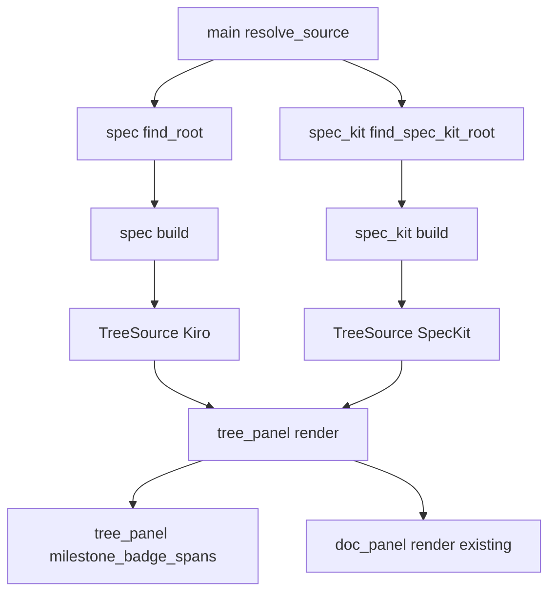
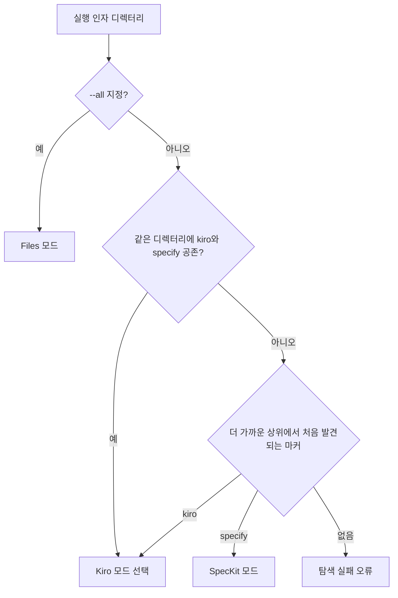
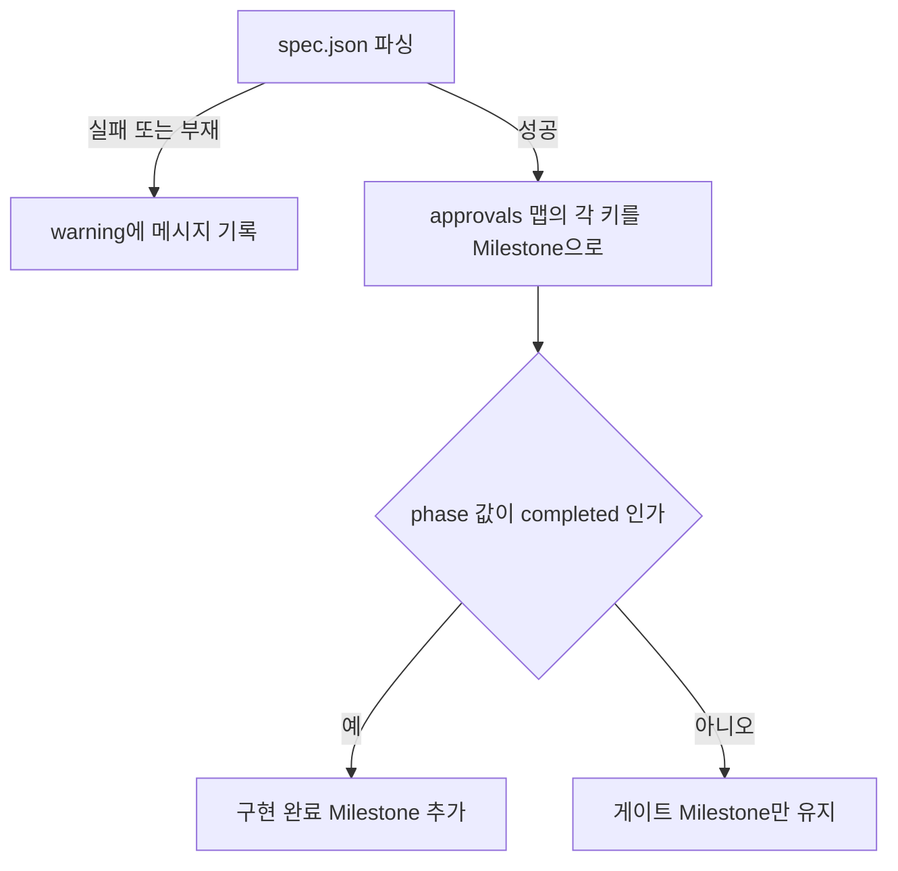

# Design — spec-viewer-spec-kit-support

## 정의
spec-viewer 사용자를 위해 GitHub spec-kit(`.specify/`+`specs/<NNN-이름>/`) 프로젝트를 `.kiro`와 배지 표현을 공유하는 방식으로 조회 전용 브라우징하게 하는 설계이다.

## Boundary Commitments

### In-Scope (This Spec Owns)
- **spec-kit 루트 인식과 파싱**: `.specify/` 자동 탐지, `specs/<NNN-이름>/` 디렉터리를 `Vec<Spec>`으로 정규화(`spec::spec_kit` 신규 모듈).
- **소스 무관 진행 배지 모델**: `Spec.milestones`/`Spec.warning`(신규 필드)과 `tree_panel`의 공유 배지 렌더 함수.
- **spec-kit 트리 렌더링**: `TreeSource::SpecKit` 신규 variant와 그 렌더 경로.
- **`.kiro` 표시 개선**: "게이트 전부 승인"과 "구현 완료"를 서로 다른 배지로 구분(이전 반려 사유의 재발 방지).

### Out-of-Scope
- **`specify` CLI 실행/연동**: 소유자는 사용자 자신의 `specify` 도구 — 이 스펙은 결과물(파일)만 읽는다.
- **`.specify/extensions`·presets·hooks·checklists**: 소유자는 spec-kit 자체 — 조회하지 않는다.
- **파일 편집**: 소유자는 `spec-viewer-editor-mode`(이미 구현됨, 추가 작업 불필요 — 요구사항 9.1).
- **`contracts/` 내부 파일 형식별 렌더링**: 일반 텍스트/코드 블록으로만 표시(요구사항 7.2), OpenAPI 등 스키마 인지 렌더링 없음.
- **기능 노드(최상위) 선택 시 자동 요약**: `.kiro`의 "## 정의 요약"과 동등한 기능은 spec-kit에 제공하지 않는다 — spec-kit엔 이 목적에 맞는 단일 규칙(어느 파일의 어느 섹션인지)이 없다. 대신 `spec.md` 자체를 문서 노드로 선택해 전체 내용을 본다(요구사항 7.1). requirements.md의 Boundary Context "Out of scope"를 이 결정으로 구체화한다.
- **git 확장(번호 붙은 기능 브랜치) 연동**: 대상 밖.

### Allowed Dependencies
- 외부: 신규 크레이트 없음. `serde_json`은 이 스펙에서 실질적으로 쓰이지 않는다(spec-kit엔 파싱할 JSON이 없음 — 파일 존재 확인과 `pulldown-cmark`를 통한 기존 마크다운 렌더링만 재사용).
- 내부 의존 방향: `spec::spec_kit`(신규) → `spec`(기존 `Spec`/`Milestone`/`DocEntry`/`DocKind`/`DocStatus`/`Progress` 재사용) → `app` → `ui::tree_panel` → `main`. `spec::spec_kit`은 `app`/`ui`를 몰라야 한다(기존 `spec` 모듈과 같은 의존 방향 원칙, 위반 시 설계 오류).

### Revalidation Triggers
- `.kiro`의 "구현 완료" 판정 문자열(`phase == "completed"`)이 이 저장소만의 관행에서 벗어나게 되면(다른 프로젝트가 다른 문자열을 쓰면) 재검토.
- spec-kit이 `.specify/feature.json` 대신 다른 방식으로 기능 목록을 관리하도록 업스트림이 바뀌면 재검토.
- `find_root`(마커 자체 반환)와 `find_spec_kit_root`(마커의 부모 반환)의 반환 의미 차이라는 전제가 깨지면(예: 향후 `.kiro`도 부모 반환 방식으로 바뀌면) 재검토.
- 세 번째 스펙 소스(다른 SDD 툴)가 추가되면 `Vec<Milestone>` 모델이 여전히 맞는지, 트레이트 승격이 필요한지 재논의.

## Architecture

### Boundary Map


### Technology Stack
| Layer | Choice | Role |
|-------|--------|------|
| 파일 존재 확인 | `std::path::Path::exists` | spec-kit 문서/마일스톤 판정(신규 의존성 없음) |
| 체크박스 진행률 | 기존 `spec::progress::count_progress` | tasks.md 진행률(요구사항 6.1~6.2, 재사용) |
| 트리 렌더링 | 기존 `ratatui`/`tui-tree-widget` | 공유 배지 스타일(요구사항 3.1~3.4) |

### Key Decisions
- **소스 무관 마일스톤 모델**: `Spec.milestones: Vec<Milestone>` — 이유: `.kiro`/spec-kit 배지 렌더링을 한 함수로 공유(research.md "소스 무관 마일스톤 목록").
- **경고 필드 분리**: `Spec.warning: Option<String>` — 이유: `.kiro` 전용 파싱 실패 개념을 배지 렌더링에서 소스 무관하게 분리(research.md).
- **spec-kit 루트는 부모 디렉터리 반환**: `find_spec_kit_root`가 `.specify/`가 아니라 그 부모를 반환 — 이유: `specs/`가 형제 디렉터리라서(research.md).
- **`TreeSource::SpecKit(Vec<Spec>)`, `SpecRoot` 미재사용**: 이유: 항상 빈 `steering` 필드를 억지로 넣지 않기 위해(research.md, Simplification).
- **`DocEntry`/`DocKind::Other`/`DocStatus::NotTracked` 그대로 재사용**: 이유: spec-kit 문서(승인 개념 없음, 존재 여부만)에 이미 정확히 맞음 — 새 문서-레벨 타입 불필요.
- **`.kiro`/`.specify` 공존 시 `.kiro` 우선**: 이유: 기존 사용자 동작 보존(하위 호환 우선).

## System Flows

### 루트 소스 선택 (요구사항 1.1~1.4)

- `--all`이 최우선(요구사항 1.4), 그다음 같은 디렉터리 공존 시 `.kiro` 우선(1.2), 그다음 더 가까운 상위 마커(1.1), 아무것도 없으면 기존과 동일한 탐색 실패(1.3).

### `.kiro` 마일스톤 계산 — 게이트 승인 vs 구현 완료 (요구사항 5.1~5.5)

- `warning`이 채워지면 배지 렌더링은 마일스톤 대신 경고 기호를 그린다(5.5). `phase == "completed"`일 때만 추가되는 마일스톤이 "게이트 전부 승인"(5.2)과 "구현 완료"(5.3)를 서로 다른 총개수(`n/total`)로 시각적으로 구분시킨다 — `bugfix.md` 전용 경로(5.4)도 `approvals`에 실제로 기록된 키만 Milestone이 되므로 동일 규칙으로 정확히 추적된다.

## Components and Interfaces

### spec (module) — 소스 무관 `Spec`/`Milestone` 모델
- Intent: `.kiro`와 spec-kit이 공유하는 진행 배지 데이터 모양을 정의한다.
- Requirements: 3.1, 3.2, 3.3, 3.4, 4.1, 4.2, 4.3, 4.4, 4.5, 5.1, 5.2, 5.3, 5.4, 5.5
```rust
#[derive(Debug, Clone, PartialEq, Eq)]
pub struct Milestone {
    pub name: String,
    pub done: bool,
}

pub struct Spec {
    pub name: String,
    pub dir: PathBuf,
    /// `.kiro`-only: `SortKey::Phase`/`SortKey::Updated`에만 쓰인다.
    /// spec-kit 스펙은 `None`(단일 메타 파일이 없음).
    pub kiro_meta: Option<Result<SpecMeta, MetaError>>,
    pub milestones: Vec<Milestone>,
    pub warning: Option<String>,
    pub docs: Vec<DocEntry>,
    pub definition: Option<String>,
}

pub enum TreeSource {
    Kiro(SpecRoot),
    SpecKit(Vec<Spec>),
    Files(FsTree),
}
```
- 계약 특이사항: `milestones`가 빈 벡터면 배지 없음(3.3). 서로 다른 두 `Spec`의 `milestones.len()`이 달라도 각자 독립적으로 `n/total`이 계산된다(3.2) — 어느 한쪽이 다른 쪽의 총개수에 맞춰 조정되지 않는다.

### spec::spec_kit (신규 모듈) — spec-kit 루트 탐지와 파싱
- Intent: `.specify/` 루트를 찾고 `specs/<NNN-이름>/`를 `Vec<Spec>`으로 정규화한다.
- Requirements: 1.1, 2.1, 2.2, 2.3, 2.4, 2.5, 4.1, 4.2, 4.3, 4.4, 4.5, 6.1, 6.2, 8.1
```rust
/// `.kiro::find_root`와 짝을 이루되, `.specify/`의 부모(프로젝트 루트)를
/// 반환한다 — `specs/`가 `.specify/`의 형제 디렉터리라서(research.md).
pub fn find_spec_kit_root(start: &Path) -> Option<PathBuf>;

/// `specs_dir`는 `find_spec_kit_root`가 반환한 경로에 `specs`를 붙인 것.
/// 파일 내용을 읽지 않고 존재 여부만 확인한다(문서 내용을 실제로 읽는 것은
/// 선택 시점의 기존 `app::loader`가 그대로 담당) -- 읽기 전용(8.1).
pub fn build(specs_dir: &Path) -> Vec<Spec>;
```
- 계약 특이사항: `build`가 만드는 `DocEntry`는 캐노니컬 순서(`spec.md → plan.md → tasks.md → research.md → data-model.md → quickstart.md → contracts/*`, 2.2)로 존재하는 것만 채워지고(2.3의 순서 밖 파일은 끝에 추가), `tasks.md` 슬롯만 `count_progress`로 `Progress`를 채운다(6.1, 6.2). 모든 문서는 `DocKind::Other(파일명)` + `DocStatus::NotTracked`(승인 개념 없음, 존재 여부만).

### ui::tree_panel — 공유 배지 렌더링
- Intent: `.kiro`/spec-kit 두 소스가 같은 배지 스타일을 그리도록 렌더 함수 하나를 공유한다.
- Requirements: 3.1, 3.2, 3.3, 3.4
```rust
/// `.kiro`의 `spec_item`과 spec-kit의 `feature_item`이 함께 호출한다 --
/// 배지 서식(진행 중 vs 완료 강조)이 이 함수 한 곳에만 존재.
fn milestone_badge_spans(
    milestones: &[Milestone],
    warning: &Option<String>,
    highlight: impl Fn(Style) -> Style,
) -> Vec<Span<'static>>;

fn feature_item(spec: &Spec, search_matches: &[Vec<NodeId>]) -> TreeItem<'static, NodeId>;
```
- `spec_item`(`.kiro`)은 그대로 유지하되 배지 계산 부분만 `milestone_badge_spans` 호출로 교체한다. `TreeSource::SpecKit`용 렌더 함수는 `feature_item`을 나열하고 Steering 그룹을 만들지 않는다.

### ui::doc_panel (기존, 무변경) — 문서 내용 표시
- Intent: spec-kit 문서도 `.kiro` 문서와 같은 경로로 렌더링된다.
- Requirements: 7.1, 7.2
- 계약 특이사항: 새 코드 없음 — `DocEntry.path`가 가리키는 파일을 기존 `app::loader`/`markdown` 파이프라인이 그대로 읽어 렌더링(마크다운+다이어그램, 7.1), `contracts/` 하위 파일도 동일 경로를 타므로 별도 처리 없이 일반 텍스트/코드 블록으로 보인다(7.2).

### main — 루트 해석 확장
- Intent: `resolve_source`가 `--all` → 같은 디렉터리 공존 시 `.kiro` → 더 가까운 마커 순으로 소스를 고른다.
- Requirements: 1.1, 1.2, 1.3, 1.4
- 계약 특이사항: `resolve_source`의 공개 시그니처는 변경하지 않는다 — 내부 분기만 `find_spec_kit_root`/`spec_kit::build` 호출로 확장. 아무 마커도 없으면 기존과 동일한 `StartupError`(1.3).

## Data Models
- `Milestone`/`Spec`은 위 Components에서 이미 인터페이스로 정의함.
- `DocEntry`(기존, 무변경): spec-kit 문서는 `kind: DocKind::Other(파일명.to_string())`, `status: DocStatus::NotTracked`, `progress: count_progress(내용)`(tasks.md만) 또는 `None`.
- 워치 대상 루트: `.kiro` 모드가 `.kiro/`를 감시하는 것과 대응해, spec-kit 모드는 `find_spec_kit_root`가 반환한 프로젝트 루트가 아니라 `<프로젝트 루트>/specs/`만 감시한다(불필요한 프로젝트 전역 변경 감시 방지).

## Error Handling
- **사용자 입력 오류**: 해당 없음(자동 탐지, 별도 CLI 옵션 없음).
- **외부 자원 오류(파일·권한)**: `specs/`가 없거나 비어 있으면 빈 트리(2.4), 기능 디렉터리 안에 인식 대상 문서가 없으면 자식 없는 빈 노드(2.5) — 둘 다 오류로 처리하지 않고 계속 동작.
- **시스템 오류**: 없음(파일 존재 확인만 수행, panic 경로 없음).
- **기능 강등**: spec-kit엔 파싱 실패 경고 개념이 없다는 것 자체가 이 기능의 한계로 받아들여진다 — `spec_kit::build`가 만드는 모든 `Spec.warning`은 항상 `None`(4.5). 어떤 경로로도 `.specify/`/`specs/` 아래를 쓰지 않는다(8.1, 읽기 전용).

## Testing Strategy
- **Depth**: Complex — `Spec` 구조체 필드 변경(`meta`→`kiro_meta` 리네임 포함)이 기존 `.kiro` 전용 테스트 다수에 영향을 주고, "게이트 승인 vs 완료" 같은 상태 판정 로직이 새로 생긴다(verification-mapping.md 기준 "도메인 규칙·통합" 해당).
- **Unit**: `Milestone` 계산 규칙 — `.kiro`(approvals 키별 변환 + `phase == "completed"` 시 추가, 5.1~5.5), spec-kit(spec.md/plan.md/tasks.md 존재, 4.1~4.5); `find_spec_kit_root` 우선순위 판정(1.1~1.4의 순수 로직 부분); `milestone_badge_spans`가 빈 목록/전부완료/경고 세 경우를 올바른 스타일로 반환하는지(3.1~3.4).
- **Integration**: `tree_panel::spec_item`/`feature_item`이 `milestone_badge_spans`를 통해 실제로 같은 스타일을 산출하는지(렌더 버퍼 검증); `main::resolve_source`가 마커 조합(둘 다 있음/`.kiro`만/`.specify`만/`--all`/둘 다 없음)마다 올바른 `TreeSource`·오류를 내는지.
- **E2E**: spec-kit 임시 프로젝트 픽스처(`tests/fixtures/spec-kit/`)로 뷰어를 열어 기능 트리 펼치기 → 문서 선택 → 렌더링까지 한 흐름(2.1~2.5, 7.1~7.2); tasks.md 체크박스 진행률 표시(6.1~6.2).
- **Acceptance**: 기존 `.kiro` 전체 회귀 스위트 100% 통과(무회귀) + spec-kit 신규 시나리오 실물 실행 확인 + "게이트 전부 승인"과 "구현 완료"가 실제로 다른 배지로 보이는 것 실물 확인(반려 재발 방지 검증).
- **Performance**: 해당 없음 — 파일 존재 확인 위주로 기존 `.kiro` 스캔과 동급 비용.

## File Structure Plan
```
src/spec/
  mod.rs           # Spec/Milestone/TreeSource::SpecKit 추가, kiro_meta/warning 필드
  meta.rs          # 기존 유지(SpecMeta/Approval/DocKind/MetaError) — 변경 없음
  progress.rs      # 기존 유지 — 재사용
  spec_kit.rs      # 신규: find_spec_kit_root, build
  sort.rs          # phase_key/updated_key가 kiro_meta 경유하도록 소폭 수정
src/ui/
  tree_panel.rs    # milestone_badge_spans 공유 함수, feature_item 신규, spec_item 배지 부분 교체
src/main.rs         # resolve_source에 spec-kit 분기 추가(마커 우선순위)
tests/fixtures/spec-kit/
  001-demo/spec.md, plan.md, tasks.md 등  # 신규: spec-kit 프로젝트 픽스처
```
