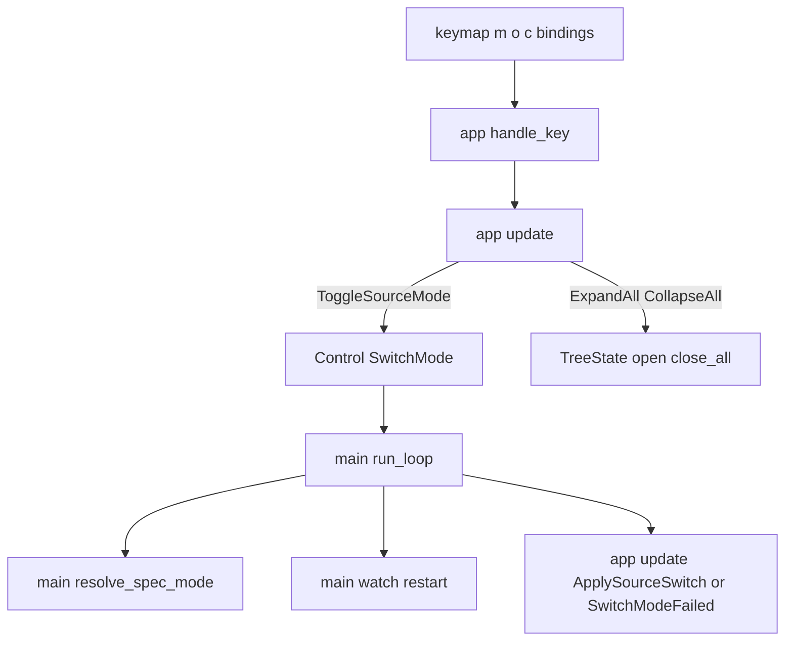
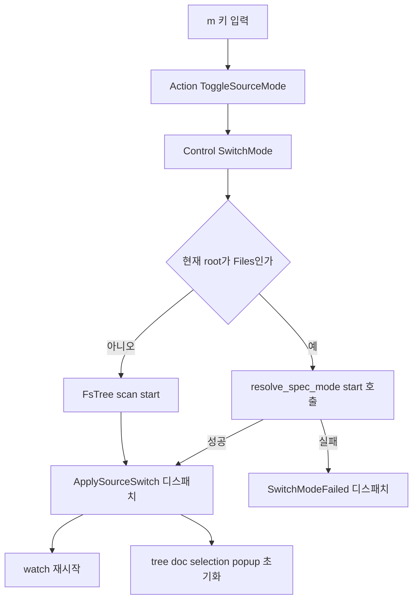

# Design — spec-viewer-tree-navigation-modes

## 정의
spec-viewer 사용자를 위해 실행 중 전체 모드/스펙 모드 전환과 전체펼치기/전체접기를 `Control::EditFile` 선례와 동일한 신호-위임 패턴으로 제공하는 설계이다.

## Boundary Commitments

### In-Scope (This Spec Owns)
- **모드 전환 신호와 상태 적용**: `Action::ToggleSourceMode`/`Action::ApplySourceSwitch`/`Action::SwitchModeFailed`, `Control::SwitchMode`(`src/app/mod.rs`).
- **전체펼치기/전체접기**: `Action::ExpandAll`/`Action::CollapseAll`(`src/app/mod.rs`, 순수 리듀서 내 처리, I/O 없음).
- **모드 전환 실제 실행**: 우선순위 판정 재사용, 파일 감시 재시작(`src/main.rs`).
- **키 바인딩 3개**: `m`(모드 전환), `o`(전체펼치기), `c`(전체접기)(`src/app/keymap.rs`).

### Out-of-Scope
- **`TreeMode`(패널 레이아웃)**: 기존 그대로, 소유자는 원 `spec-viewer` 스펙.
- **정렬 키(`SortKey`)**: 기존 그대로.
- **`.kiro`↔spec-kit 자동 인식 우선순위 알고리즘 자체**: `spec-viewer-spec-kit-support`가 이미 정의(`find_root`/`find_spec_kit_root`) — 이번 스펙은 그 결과를 재사용만 한다.
- **모드 전환 시 이전 트리의 선택/펼침/스크롤 승계**: 요구사항 1.6이 "승계 안 함"을 명시 — 새 트리 초기 상태로 리셋.
- **`Action::EditFailed`/편집모드 코드 변경**: `spec-viewer-editor-mode`의 산출물, 건드리지 않는다(research.md "SwitchModeFailed 별도 변형" 결정).

### Allowed Dependencies
- 외부: 신규 크레이트 없음. 기존 `tui-tree-widget`의 `TreeState::open`/`close_all`만 추가로 사용.
- 내부 의존 방향: `app`(Action/Control 정의, 순수 리듀서 로직) → `keymap`(바인딩) → `main`(I/O·감시 재시작 실행). `app`는 여전히 파일시스템 상향 탐색이나 터미널/프로세스를 직접 하지 않는다(그 몫은 `main`).

### Revalidation Triggers
- `resolve_source`의 우선순위 로직이 `resolve_spec_mode`로 추출된 이후 다시 갈라지면(둘 중 하나만 고쳐지면) 재검토.
- `run_loop`의 시그니처가 이후 또 커져 `args`/`tx`/`watch` 전달 방식이 바뀌면 이 설계의 전제(모드 전환 핸들러가 이 값들을 그대로 받는다는 것) 재검토.
- `flatten_tree`의 반환 형태(`Vec<(Vec<NodeId>, String)>`)가 검색 전용으로 바뀌어 전체펼치기가 더 이상 그대로 재사용할 수 없게 되면 재검토.

## Architecture

### Boundary Map


### Technology Stack
| Layer | Choice | Role |
|-------|--------|------|
| 트리 상태 | 기존 `tui_tree_widget::TreeState` | `open`/`close_all` 재사용(전체펼치기/접기) |
| 파일 감시 | 기존 `watch::start`/`watch::manual` | 모드 전환 시 새 대상으로 재호출 |

### Key Decisions
- **`start` 경로는 `main()` 지역 변수로 유지, `AppState` 필드 추가 없음** — 이유: `AppState::new` 26개 호출부 영향 회피, `app`의 부팅-경로 탐색 책임 배제(research.md).
- **`resolve_source`의 우선순위 로직을 `resolve_spec_mode(start) -> Result<(TreeSource, PathBuf), String>`로 추출해 공유** — 이유: SSoT(research.md).
- **`Action::SwitchModeFailed(String)`를 `Action::EditFailed`와 별도로 신설** — 이유: 다른 스펙의 승인된 코드/네이밍 경계 보존(research.md).
- **전체펼치기는 `flatten_tree`를 재사용해 폴더성 노드만 필터링** — 이유: 새 순회 로직 불필요(research.md).
- **모드 전환의 대상 디렉터리는 항상 최초 `start`** — 이유: 왕복 전환(스펙→전체→스펙)이 항상 같은 기준점에서 재판정되어 일관적임(1.8).
- **`--all` CLI 플래그와 `Args` 구조체는 변경하지 않는다** — 이유: `resolve_source`가 시작 시점에 한 번 참조하는 것 그대로 두고, 이후의 모드는 오직 `state.root`/런타임 전환으로만 결정되게 해 "초기값"이라는 의미를 코드로도 명확히 한다(3.2, 무회귀).

## System Flows

### 모드 전환 (요구사항 1.1~1.7)

- `checkCurrent`가 `Kiro`/`SpecKit`이면 무조건 `scanFiles`(1.1, 1.3 — 전체 모드는 항상 성공). `Files`면 `resolve_spec_mode`(1.2, 1.4). 성공 시에만 감시 재시작(1.5)과 상태 초기화(1.6, 1.7)가 함께 일어난다 — 실패 시(`applyFail`)는 화면이 전환 전 그대로 유지된다(감시 재시작도, 상태 초기화도 없음).

## Components and Interfaces

### app (module) — 모드 전환 신호와 전체펼치기/접기
- Intent: 리듀서가 결정할 수 있는 것(전체펼치기/접기, "전환하고 싶다"는 의사)과 결정할 수 없는 것(실제 우선순위 판정, 감시 재시작)을 분리한다.
- Requirements: 1.1~1.8, 2.1~2.4, 3.1
```rust
pub enum Action {
    // 기존 변형 그대로 + 아래 추가
    ToggleSourceMode,
    // 설계 보강(3.2 통합 중 발견): main이 감시를 재시작하면서 결정하는
    // Live/Manual 상태(state.watch)도 이 액션이 함께 반영해야 상태 표시줄이
    // 새 모드의 실제 감시 상태를 보여준다 -- 원래 시그니처에서 빠져 있던 것.
    ApplySourceSwitch { source: TreeSource, root: PathBuf, watch_status: WatchStatus },
    SwitchModeFailed(String),
    ExpandAll,
    CollapseAll,
}

pub enum Control {
    Continue,
    Quit,
    EditFile(PathBuf),
    SwitchMode,   // 신규
}
```
- 계약 특이사항: `Action::ToggleSourceMode`는 항상 `Control::SwitchMode`를 반환한다(현재 상태로 판단 가능한 조건 분기가 없음 — 판단은 `main`이 함). `Action::ApplySourceSwitch`는 `state.root`/`state.kiro_root`를 교체하고 `state.tree`/`state.doc`/`state.selection`/`state.search`/`state.tree_search`/`state.popup`을 초기 상태로 리셋하며, `watch_status`를 `state.watch`에 그대로 대입해 상태 표시줄이 새 모드의 실제 감시 상태(Live/Manual)를 반영하게 한다(1.5~1.7). `Action::ExpandAll`은 `flatten_tree`가 돌려주는 전체 노드 중 폴더성 노드(`Spec`/`SteeringGroup`/`Dir`) 경로 전부에 `state.tree.open()`을 호출한다(2.1). `Action::CollapseAll`은 `state.tree.close_all()`을 호출한다(2.2). 둘 다 `state.selection`(트리 노드 선택과는 별개인 문서 내 드래그 선택 필드)과 `state.tree`의 `selected`를 건드리지 않는다(2.3 — `TreeState::open`/`close_all`이 애초에 `selected`와 분리된 `opened` 필드만 다루므로 자연히 보장됨). 트리에 노드가 없으면(`flatten_tree`가 빈 벡터) 두 액션 모두 반복할 대상이 없어 자연히 아무 효과가 없다(2.4, 별도 분기 불필요).

### main — 모드 전환 실행과 감시 재시작
- Intent: `Control::SwitchMode`를 소비해 실제 파일시스템 판정과 감시 재시작을 수행한다.
- Requirements: 1.1~1.5
```rust
/// `resolve_source`와 공유하는 우선순위 판정(research.md "SSoT" 결정).
/// `.specify`/`.kiro` 둘 다 없으면 사람이 읽을 오류 메시지를 반환한다.
fn resolve_spec_mode(start: &Path) -> Result<(spec_viewer::spec::TreeSource, PathBuf), String>;

/// `Control::SwitchMode`를 처리한다: 현재 `state.root`의 종류로 방향을 정하고,
/// 성공하면 새 감시를 시작해 `*watch`를 교체하고 그 결과(Live/Manual)를
/// `watch_status`로 담아 `Action::ApplySourceSwitch`를, 실패하면
/// `Action::SwitchModeFailed`를 `step()`으로 디스패치한다.
fn handle_switch_mode<B: ratatui::backend::Backend<Error = std::io::Error>>(
    terminal: &mut ratatui::Terminal<B>,
    state: &mut spec_viewer::app::AppState,
    start: &Path,
    args: &Args,
    tx: &std::sync::mpsc::Sender<spec_viewer::watch::FsEvent>,
    watch: &mut spec_viewer::watch::Watch,
) -> std::io::Result<spec_viewer::app::Control>;
```
(구현 시 조정: 이 함수는 실제로 `handle_edit_file`과 동일하게 `B: ratatui::backend::Backend`(Error 제약 없음)로 선언되고 `Result<Control, B::Error>`를 반환한다 -- `TestBackend`(`Error = Infallible`)로 직접 구동해 이 태스크의 DONE 기준인 통합 테스트를 작성하기 위함이며, `run_loop`의 `B::Error = std::io::Error` 제약 하에서는 동작이 동일하다. task 3.1의 `SpecModeSource` 조정과 같은 종류의, 문서화된 구현 시 조정이다.)
- 계약 특이사항: `resolve_source`(기존, 시작 시점 전용)는 `resolve_spec_mode`를 호출해 `Err(String)`을 자신의 `StartupError::RootNotFound`로 얇게 변환하도록 리팩터링한다(동작 변화 없음, 순수 내부 재사용). `run_loop`의 시그니처는 `args`/`tx`/`watch: &mut Watch`를 추가로 받도록 확장된다(design.md Revalidation Triggers에 명시된 대로, `spec-viewer-editor-mode`가 이미 한 번 거친 것과 같은 종류의 확장). `handle_switch_mode`가 감시를 재시작한 뒤 그 결과(`watch::Watch::Live`/`Manual`을 요약한 `WatchStatus`)를 `Action::ApplySourceSwitch`의 `watch_status` 필드로 실어 보낸다 — `state.watch`를 갱신하는 유일한 경로다(위 "설계 보강" 참고).

### app::keymap (module) — 신규 키 바인딩
- Intent: 모드 전환/전체펼치기/전체접기 키를 기존 도움말 노출 메커니즘에 자연히 편입시킨다.
- Requirements: 4.1
```rust
// BINDINGS 배열에 추가 (design.md 예시, 실제 help 문구는 구현 시 확정)
Binding { keys: &[KeyCode::Char('m')], action: "toggle_source_mode", help: "전체 모드 ↔ 스펙 모드 전환" },
Binding { keys: &[KeyCode::Char('o')], action: "expand_all", help: "트리 전체 펼치기" },
Binding { keys: &[KeyCode::Char('c')], action: "collapse_all", help: "트리 전체 접기" },
```
- 계약 특이사항: 기존 `help_entries()`가 `BINDINGS`를 그대로 순회해 노출하므로(요구사항 4.1), 이 세 항목도 다른 키와 같은 형식으로 자동 노출된다 — 별도 처리 불필요.

## Data Models
- 신규 영속 타입 없음 — `Action`/`Control`에 위 Components로 이미 정의됨.
- `AppState`는 필드 추가 없음(research.md 결정) — `root`/`kiro_root` 두 기존 필드를 `main`이 직접 갱신한다.

## Error Handling
- **사용자 입력 오류**: 해당 없음(키 입력만).
- **외부 자원 오류(파일시스템)**: `.kiro`/`.specify` 둘 다 못 찾으면 `Action::SwitchModeFailed`로 안내 후 뷰어는 계속 동작(1.4). 전체 모드로 전환하려는 시점에 `start`가 더 이상 읽을 수 없는 디렉터리로 변했다면(드문 경쟁 상태) 같은 방식으로 실패 처리한다.
- **시스템 오류**: 없음(패닉 경로 없음, 감시 재시작 실패는 `watch::start`가 이미 `Watch::Manual`로 강등하는 기존 관례를 그대로 따름).
- **기능 강등**: 없음.

## Testing Strategy
- **Depth**: Standard — 신규 로직이지만 `Control::EditFile` 선례를 그대로 복제하는 구조라 새로운 상태기계는 아님(verification-mapping.md 기준 "신규 로직·다화면"에 해당, "도메인 규칙·상태기계"까지는 아님).
- **Unit**: `Action::ExpandAll`/`CollapseAll`이 `state.tree`의 `opened`/`selected`를 올바르게 바꾸는지(선택 유지 포함, 2.1~2.4); `Action::ApplySourceSwitch`가 `root`/`kiro_root`/`tree`/`doc`/`selection`/`popup`/`watch`를 정확히 리셋·반영하는지(1.5~1.7); `resolve_spec_mode`가 `resolve_source`와 동일한 우선순위 결과를 내는지(회귀).
- **Integration**: `handle_switch_mode`가 Files→Kiro/SpecKit, Kiro/SpecKit→Files, 실패 케이스 각각에서 올바른 Action(성공 시 `watch_status`가 실제 재시작 결과와 일치하는 `ApplySourceSwitch`)을 디스패치하고 `watch`가 실제로 새 root로 재시작되는지(임시 디렉터리 기반).
- **E2E**: 실행 중 `m` 키로 왕복 전환(스펙→전체→스펙) 후 트리와 감시가 일관된지; `o`/`c` 키로 전체펼치기 후 접기까지 실제 렌더 프레임으로 확인.
- **Acceptance**: 요구사항 15개 전부 실물 실행 확인(가능하면 `spec-viewer-spec-kit-support`가 남긴 `tests/fixtures/spec-kit/`를 재사용해 실제 컴파일된 바이너리로도 스모크 확인).
- **Performance**: 해당 없음.

## File Structure Plan
```
src/app/
  mod.rs      # Action::ToggleSourceMode/ApplySourceSwitch/SwitchModeFailed/ExpandAll/CollapseAll, Control::SwitchMode, 리듀서 처리
  keymap.rs   # m/o/c 바인딩
src/main.rs    # resolve_spec_mode 추출, resolve_source가 이를 재사용하도록 리팩터링, handle_switch_mode 신규, run_loop 시그니처 확장
```
