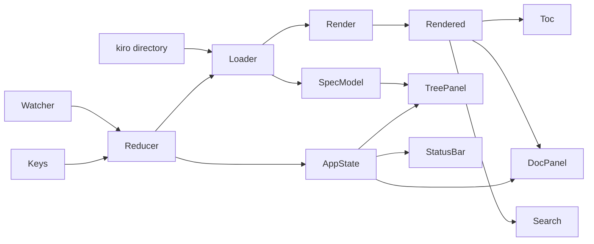
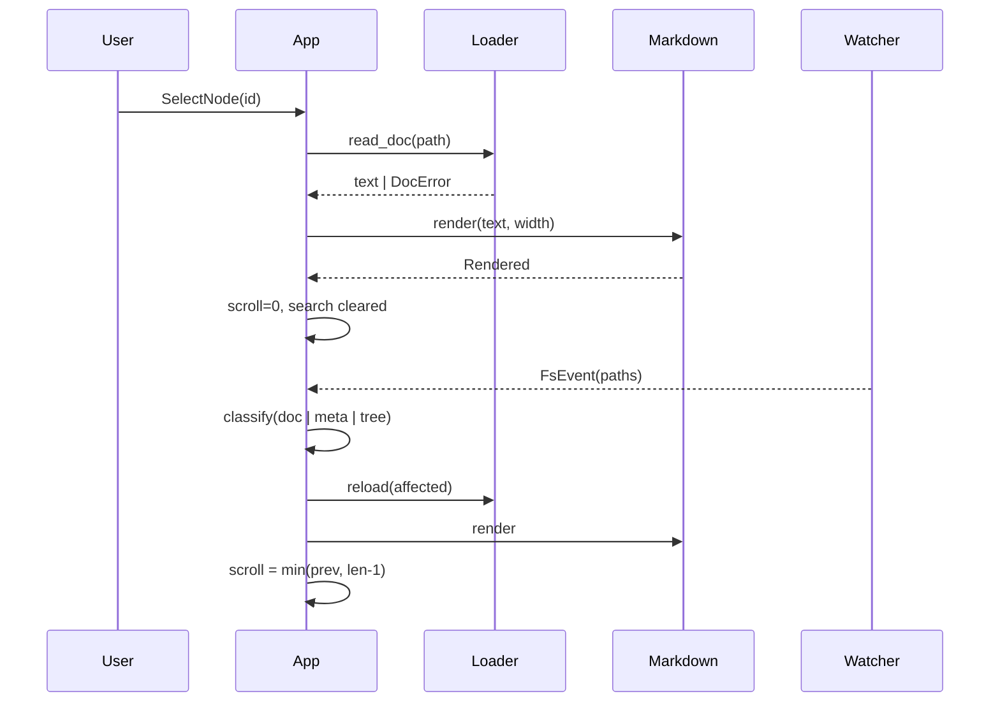

# Design — spec-viewer

## 정의
개발자를 위해 파일시스템 → 스펙 모델 → 마크다운 렌더 → 화면의 단방향 파이프라인으로 spec-viewer를 나누고 잇는 아키텍처 정의서이다.

## Boundary Commitments

### In-Scope (This Spec Owns)
- **Spec Modeling**: `.kiro/` 루트 탐지 → 도메인 모델 변환, `spec.json` 스키마 정규화, `tasks.md` 체크박스 집계.
- **Markdown Rendering**: 폭 고정 스타일 라인 생성, 헤딩 앵커 추출, 검색용 평문 생성, mermaid 서브셋(flowchart·er·class·state 그래프형 4종 + sequence) 텍스트 레이아웃.
- **Change Watcher**: 파일시스템 변경 감시 및 디바운스된 이벤트 전달, 수동 폴백.
- **Application Core**: 레이아웃 상태, 키·마우스 입력 처리(포커스·휠·클릭·경계 드래그·텍스트 선택), 리듀서 기반 상태 전이, 트리 표시 모드(always/auto/hidden)와 파일 뷰.
- **Theme**: 헤딩 6단계·밑줄·목록 기호·인용·링크·표·다이어그램 스타일 표 하나(`markdown/theme.rs`).

### Out-of-Scope
- **Schema Definition**: `spec.json` 스키마 및 파일명 규약 정의 (kiro 스킬군 소유).
- **Spec Mutation**: `spec.json` 승인 상태 변경 및 `.kiro/` 하위 파일 쓰기 일체.
- **Complex Rendering**: Mermaid 비그래프 유형(gantt/pie/mindmap) 해석, 이미지 렌더링, HTML/웹 출력.
- **Global Search**: 여러 문서에 걸친 통합 검색 (현재 문서 내 검색만 수행).
- **Workspace Integration**: `agw` 워크스페이스 `Cargo.toml` 관리 (독립 크레이트로 구성).

### Allowed Dependencies
- 외부: ratatui 0.30, crossterm 0.29, tui-tree-widget 0.24, pulldown-cmark 0.13, syntect 5.3(`default-fancy`), unicode-width 0.2, unicode-segmentation, notify 8.2 + notify-debouncer-full 0.6, serde_json, clap 4, thiserror, ignore 0.4(`--all` 파일 탐색), dg(optional feature `engine-dg`, git 의존 `github.com/hodorii/dg`, `default-features = false` → `cli` 기능 off). MIT/BSD/Apache-2.0 계열만 허용 — 카피레프트 의존성(graphs-tui, AGPL-3.0)은 도입했다가 공개 전 제거함(THIRD_PARTY.md 참조).
- 내부 의존 방향(왼→오만): `spec` → `markdown` → `watch` → `ui` → `app` → `main`. `spec`·`markdown`은 서로 모르며 I/O 없음. `ui`는 상태를 읽기만 한다 — 레이어를 거슬러 import하면 설계 위반.

### Revalidation Triggers
- `spec.json` 스키마(`phase`/`approvals` 키, `feature_name`/`name`)나 문서 4종 파일명 규약이 바뀌면 `spec` 모듈 계약 재검토.
- `agw` 워크스페이스로 편입되면 독립 크레이트 전제와 Allowed Dependencies 재검토.
- ratatui/crossterm 메이저 업그레이드 시 터미널 복원(8.6)·panic hook 경로 재검증.
- 문서가 수천 행 규모로 커지면 Synchronous Core 결정(동기 로드/렌더) 재검토.
- mermaid 비그래프 유형(gantt/pie) 요구가 생기면 층 배치 레이아웃 엔진 재검토.
- dg 경로/버전·lib API(render_diagram, RenderOptions, kind_of) 변경 시 dg_engine.rs 재검토.

## Architecture

### Boundary Map


순수 코어(`spec`, `markdown`) + I/O 껍질(`loader`, `watch`) + 단일 리듀서(`app`). 코어는 (입력, 폭) → 출력이 결정적이라 골든 테스트 대상.

### Technology Stack
| Layer | Choice | Role |
|-------|--------|------|
| CLI | clap 4 | `[PATH]`(디렉터리=트리, `.md` 파일=파일 뷰), `--all`(일반 마크다운 트리), `--tree always\|auto\|hidden`, `--diagram-engine`(기본 dg), `--no-watch`, `--log` |
| Diagram | dg 0.1 (path 의존, lib 타깃, `cli` 기능 off → clap·crossterm 미포함, MIT) | 기본 mermaid 그래프 엔진 (feature `engine-dg`) |
| TUI | ratatui 0.30 + crossterm 0.29 | 프레임 및 입력 |
| Tree | tui-tree-widget 0.24 | 트리 상태 및 렌더링 |
| Parser | pulldown-cmark 0.13 | 마크다운 이벤트 스트림 |
| Highlight | syntect 5.3 | 코드 펜스 구문 강조 |
| Width | unicode-width 0.2 | CJK 2칸 폭 계산 |
| Watch | notify 8.2 + debouncer-full | 파일 변경 이벤트 감시 |
| Mouse | crossterm `EnableMouseCapture` | 클릭·휠·드래그 이벤트 |
| Clipboard | OSC 52 이스케이프 | 선택 텍스트 복사 — 크레이트 없음, 미지원 터미널은 무시 |

### Key Decisions
- **Pre-computed Lines**: 렌더러가 폭에 맞춘 `Vec<Line>`을 미리 생성. 스크롤/검색/점프를 라인 인덱스로 단순화하여 O(1) 접근 및 상태 유지.
- **Synchronous Core**: 로드/렌더는 메인 스레드 동기 처리. 문서 크기가 작아 비동기 복잡도보다 동기 처리의 단순함이 이득.
- **Meta Normalization**: `feature_name` / `name` 스키마를 `parse_meta`에서 `SpecMeta`로 단일화하여 하류 모듈의 복잡도 제거.
- **Path-based NodeId**: 트리 식별자를 경로 기반으로 설정하여 재스캔 후에도 선택 상태(Selection)가 자동 유지.
- **Mouse hit-test from stored layout**: 매 프레임의 패널 `Rect`(tree/doc/separator)를 `AppState.layout`에 보관하고 마우스 좌표를 그 Rect 로 판정 — 위젯 내부 좌표 계산은 트리는 `TreeState` 오프셋+평탄화 순번, 문서는 `scroll + (y - top)`.
- **Selection copy via OSC 52**: 클립보드 크레이트 대신 터미널 OSC 52 시퀀스로 복사(`Clipboard` 트레이트 뒤에 두어 테스트는 싱크로 대체). 지원 안 하는 터미널은 조용히 무시(9.9, 9.8).
- **Theme table (mdview 채택)**: `Theme { heading: [Style;6], heading_rule: [Option<char>;6], list_marker, quote_bar, link_url, table_border, … }` 하나가 렌더러·패널 전체 스타일의 SSoT. mdview(MIT) 구조 채택, THIRD_PARTY.md 고지.
- **Table, GitHub style**: 열 폭은 내용 폭(합계가 페인 폭을 넘을 때만 넓은 열부터 축소 + 셀 줄바꿈). 격자 `┌─┬─┐ │ ├─┼─┤ … └─┴─┘` 에 행마다 `├─┼─┤` 구분선, 헤더 굵게(theme.table_header). 페인 폭 채움은 하지 않는다(5.4).
- **Overflow ladder (5.16)**: 엔진 디스패치가 폭 초과 시 라벨 축약 → 본문 접기(Class/Entity → 이름만) → 층 내 행 래핑(한 층의 노드를 폭에 맞춰 여러 줄로 배치, 간선은 행 사이 통로) → 소스 폴백. 폴백 라벨의 kind 는 파서가 판정한 종류를 그대로 전달(5.23).
- **TreeSource abstraction (--all)**: 트리 패널·리듀서·감시는 `TreeSource` 만 의존. `Kiro` 는 기존 SpecRoot, `Files` 는 `ignore::WalkBuilder`(hidden, max_depth 6, .gitignore) 결과. 배지·진행률·정의는 `Kiro` 에서만. 참조 mdview src/source.rs.
- **Pluggable GraphEngine**: 그래프형 배선은 `trait GraphEngine { fn name(); fn supports(kind) -> bool; fn render(src: &str, g: &Diagram, dir, width) -> Result<Vec<String>, Fallback> }` 뒤에 둔다. 구현: `builtin`(현 graph.rs), `mdview`(채택, MIT), `dg`(git 의존 `github.com/hodorii/dg`, lib 타깃, `cli` 기능 off, MIT, cargo feature `engine-dg` — 기본 활성). 선택은 `--diagram-engine`, 미지원 유형은 `builtin` 폴백(5.21). 기본 엔진은 feature `engine-dg` 이 켜진 빌드에서 `dg`, 아니면 `mdview`. dg 는 mermaid 원문을 입력받으므로 어댑터는 파싱 결과가 아닌 펜스 원문을 전달한다. (2026-09-17 갱신) sequence 다이어그램도 이 레지스트리를 거친다 — 선택된 엔진이 `"sequence"`를 지원하면(현재 `dg`만) 먼저 시도하고, 실패·미지원 시 `seq::layout`(전용 압축 렌더러)로 폴백한다. (카피레프트 배제 정책에 따라 이전에 있던 `graphs-tui`(AGPL-3.0) 엔진은 공개 전 제거함.)
- **Adopt mdview graph engine (build vs adopt)**: mdview `render/mermaid/graph.rs`(MIT) 채택 구현은 기능 `engine-dg` 가 없는 빌드의 기본 엔진이며 `--diagram-engine mdview` 로 항상 선택 가능하다(5.21). mdview 는 TB 고정이며 **그대로 따른다** — 띠 배선이 TB 를 전제로 하여 전치하면 통로 의미가 깨짐(실물 비교로 확인). 좌→우는 builtin 엔진의 몫. 대안 비교는 research.md.
- **Own mermaid subset**: 파서·레이아웃 자체 구현. 그래프형 4종(flowchart·er·class·state)은 노드 모양·간선 스타일만 다른 하나의 층 배치 엔진, sequence는 별도. 교차 최소화 없음 — 대안 비교는 research.md. (2026-09-17: sequence도 GraphEngine에 편입 — `dg`가 지원하면 그쪽 박스+생명선 렌더링을 우선 쓰고, 폭 초과·미지원 시에만 이 전용 sequence 렌더러로 폴백한다.)

## System Flows

### 문서 선택 → 렌더 → 변경 반영

- **폭 변경** (5.13): 화면 맨 위 라인의 직전 `HeadingAnchor` 순번을 새 `Rendered`에서 찾아 복원, 앵커가 없으면 스크롤 비율로 근사.
- **파일 변경 반영** (7.2): 라인 인덱스를 유지하고, 문서가 짧아져 `len`을 넘으면 `len-1`로 클램프.
- **이벤트 분류** (7.3, 7.4): 현재 문서 경로 변경 → 재렌더만 수행; `spec.json`/`tasks.md` 변경 → 해당 스펙 메타만 재빌드; 디렉터리·`.md` 추가/삭제/rename → 루트 재스캔.

## Components and Interfaces

### spec — SpecModel
- Intent: 디렉터리 스냅샷 → 스키마 무관 도메인 모델. I/O 없음(`DirSnapshot` 주입으로 인메모리 테스트).
- Requirements: 1.1~1.3, 2.1~2.5, 2.8, 3.1~3.5, 3.7, 4.1~4.4
```rust
pub fn find_root(start: &Path) -> Option<PathBuf>;                 // 1.1
pub fn build(snapshot: &DirSnapshot) -> SpecRoot;                   // 2.x, 3.x, 4.x
pub fn parse_meta(json: &str) -> Result<SpecMeta, MetaError>;       // 3.3~3.5
pub fn count_progress(tasks_md: &str) -> Option<Progress>;          // 4.1~4.3 (None = 체크박스 없음)
pub fn definition(doc_md: &str) -> Option<String>;                  // 3.7  `## 정의` 본문
pub fn inclusion(steering_md: &str) -> Inclusion;                   // 2.8  front matter, 부재 = Always

pub struct SpecRoot { specs: Vec<Spec>, steering: Vec<SteeringDoc> }
pub struct SteeringDoc { name: String, path: PathBuf, inclusion: Inclusion }
pub enum Inclusion { Always, Manual, FileMatch, Auto }                // 2.8
pub struct Spec { name: String, dir: PathBuf, meta: Result<SpecMeta, MetaError>, docs: Vec<DocEntry>, definition: Option<String> }
pub struct DocEntry { kind: DocKind, path: PathBuf, exists: bool, status: DocStatus, progress: Option<Progress> }
pub enum DocKind { Requirements, Bugfix, BizProcess, Design, Tasks, Research, Other(String) }   // 2.2 순서 = 선언 순서; approvals 키: requirements/bugfix/bizProcess/design/tasks
pub enum DocStatus { Missing, Generated, Approved, NoRecord, NotTracked }   // 3.2, 3.4; NotTracked = research·기타
pub struct SpecMeta { name: String, phase: String, approvals: BTreeMap<DocKind, Approval> }
pub struct Progress { done: u32, total: u32 }                       // total ≥ 1
pub enum NodeId { Spec(String), Doc(String, DocKind), SteeringGroup, Steering(String), Dir(PathBuf), File(PathBuf) }  // Clone+Eq+Hash; Dir/File = --all 모드
pub enum TreeSource { Kiro(SpecRoot), Files(FsTree) }                                   // 1.8: 트리 원천 2종, 패널·리듀서는 TreeSource 만 본다
pub struct FsTree { root: PathBuf, entries: Vec<FsEntry> }                              // .gitignore·숨김 제외, 깊이 6, 이름순 (ignore 크레이트)
pub struct FsEntry { path: PathBuf, is_dir: bool, depth: u8 }
```

### markdown — Renderer
- Intent: 마크다운 + 폭 → 스타일 라인·헤딩 앵커·검색용 평문. 순수 함수, 같은 (src, width) → 같은 출력.
- Requirements: 5.1~5.12, 5.14~5.19, 8.4(비UTF-8 연동), 10.1~10.7
```rust
pub fn render(src: &str, width: u16, theme: &Theme) -> Rendered;                       // 입력은 hangul::compose 로 NFC 정규화 후(10.6)
pub struct Rendered { lines: Vec<Line<'static>>, plain: Vec<String>, headings: Vec<HeadingAnchor>, footnotes: Vec<Footnote> }   // 각주는 문서 끝에 모아 출력(10.5)
pub struct Theme { /* mdview theme.rs 형태: heading[6], heading_rule[6], emphasis, strong, strikethrough, code, code_block, link, link_url, image, quote, quote_bar, list_marker, task_done, task_todo, rule, table_header, table_border, diagram_* */ }
pub struct HeadingAnchor { level: u8, text: String, line: usize }
```

### markdown::mermaid — Diagram
- Intent: mermaid 소스 + 폭 → 텍스트 다이어그램 행. 순수 함수. 미지원 유형은 `parse/generic.rs`가 행 단위 `Shape::Class` 박스 그래프로 변환(5.15); 노드 0개·폭 초과만 `Err`로 돌려 `code.rs`가 소스 박스로 폴백(5.15, 5.16).
- Requirements: 5.7, 5.14~5.22
```rust
pub fn render_mermaid(src: &str, width: u16) -> Result<Vec<String>, Fallback>;
pub enum Diagram { Graph { dir: Dir, nodes: Vec<Node>, edges: Vec<Edge>, groups: Vec<Subgraph> }, Sequence { actors: Vec<String>, messages: Vec<Message> } }
pub enum Dir { TB, LR }
pub struct Node { id: String, shape: Shape }
pub enum Shape { Box(String), Entity { name: String, fields: Vec<String> }, Class { name: String, attrs: Vec<String>, methods: Vec<String> }, State(String), Start, End }   // 5.7, 5.17~5.19
pub struct Edge { from: String, to: String, label: Option<String>, style: EdgeStyle }
pub enum EdgeStyle { Arrow, Line, Cardinality(String, String), Inherit, Compose, Aggregate, Transition }
pub enum Fallback { Empty { kind: String }, Overflow { kind: String } }   // 5.15, 5.16 → code.rs 소스 박스 + 유형명 라벨
```
- Graph 레이아웃(flowchart·er·class·state 공통): longest-path 층 배치, 같은 층은 선언 순, 노드는 `Shape`별 박스(`┌─┐│└─┘`; Entity/Class는 `├─┤` 구획선, Start/End는 `●`/`◉`), 간선 `─►`(LR)/`│▼`(TB) + 라벨, 카디널리티는 선 양끝 기호, 상속은 `─▷`, 구성은 `◆─`, `subgraph`는 점선 테두리. er/class/state 기본 방향 TB(`direction` 선언 시 따름). 교차 최소화 없음.
- Sequence 레이아웃: 참여자 균등 열 + 생명선 `│`, 메시지 1건 = 1행 `A ──label──► B`(자기 메시지는 루프), `note`·`loop`는 라벨 행으로 축약.
- 폭 초과: 노드/참여자 라벨을 `…`로 축약 → 여전히 초과면 `Err`(5.16).

### watch — FsWatcher
- Intent: 루트 아래 변경을 디바운스된 경로 집합으로 전달.
- Requirements: 7.1, 7.3~7.6
- Event: 루트 재귀 감시, 디바운스 300ms(7.1의 2초 이내 충족). rename은 `RenameMode::Both`로 합쳐져 `[from, to]` 전달.
- Failure: `Watch::start(root) -> Watch::Live(Debouncer) | Watch::Manual(reason)` — 등록 실패 또는 `--no-watch` 지정 시 Manual. Manual이면 상태 표시줄에 `watch off` 표시, `r` 키로 수동 새로고침(7.6).

### app — State & Reducer
- Intent: 모든 상태 전이의 단일 지점.
- Requirements: 1.3~1.5, 2.6~2.7, 3.6, 5.13, 6.1~6.11, 7.2, 8.1~8.3, 8.5, 8.6
```rust
pub struct AppState { root: SpecRoot, tree: TreeState<NodeId>, focus: Panel, doc: DocView, scroll: usize,
    search: SearchState, popup: Option<Popup>, watch: WatchStatus, size: (u16, u16),
    tree_mode: TreeMode, tree_visible: bool, layout: PanelLayout, split: u16,           // 1.7, 9.6
    selection: Option<Selection>, drag: Option<Drag> }                                   // 9.7, 9.9
pub enum TreeMode { Always, Auto, Hidden, Single }                                      // 1.7/1.10: Auto = 파일 인자면 숨김, 폭<80 이면 Single 처럼; Single = 트리 전체 폭 ↔ 문서 전체 폭(Enter/Esc)
pub enum SortKey { Name, Phase, Updated, Progress }                                     // 2.9: 트리 정렬, 핫키 순환, `--sort`
pub struct FileInfo { modified: SystemTime, size: u64, lines: usize }                  // 6.12: DocView::Rendered 에 동봉, Fs 이벤트 시 갱신
pub struct PanelLayout { tree: Rect, sep: Rect, doc: Rect }                              // 매 프레임 갱신, 마우스 hit-test 근거
pub struct Selection { anchor: (usize, usize), head: (usize, usize) }                    // (line, col) 문서 좌표, 반전 표시
pub enum Drag { Split, Select }
pub enum DocView { Empty, Rendered { path: PathBuf, r: Rendered }, Definition { spec: String, text: Rendered }, Missing(PathBuf), Deleted(PathBuf),
    ReadError { path: PathBuf, msg: String }, MetaError { spec: String, msg: String } }   // 2.4, 3.6, 7.5, 8.3
pub enum Action { Key(KeyEvent), Mouse(MouseEvent), Tick, Resize(u16, u16), Fs(FsEvent), Refresh, ToggleTree, Quit }
// Mouse: Down(Left) → 좌표의 패널에 포커스(9.1); 트리 행이면 선택·문서 로드(9.4), 폴더/▶▼ 이면 토글(9.5); sep 이면 Drag::Split(9.6); 문서면 Drag::Select 시작(9.7)
//        Drag(Left) → Split: split 갱신(최소 20열) / Select: head 갱신, 포인터가 doc 상/하 경계면 Tick 마다 1행 자동 스크롤
//        Up(Left)   → Select 이면 선택 텍스트를 Clipboard 로(OSC 52) 후 drag 종료(9.9); ScrollUp/Down → 좌표 패널 3행(9.2)
// Key: Up/Down 은 포커스 패널에 1행(9.3); Esc → 선택 해제; 트리 토글 키 → ToggleTree(1.7)
pub fn update(state: &mut AppState, action: Action) -> Control;   // Continue | Quit
```
- 키맵은 `keymap.rs`의 표 하나에서 동작과 도움말(6.11)을 함께 생성. 마우스 매핑은 `mouse.rs`의 표 하나.
- 파일 뷰(1.6): `[PATH]`가 `.md` 파일이면 `doc`에 그 파일을 로드하고 `tree_visible=false`(Auto), 루트는 파일 위치에서 탐지해 두었다가 토글 시 트리 구성.
- 영속 상태 없음, 파일 쓰기 없음(8.1, 8.2). 로그는 `--log <file>` 지정 시에만 파일로.

### ui — Panels
- `tree_panel`: `[phase]` 배지, 문서 상태 기호(`·` 미생성 / `○` 미승인 / `●` 승인 / `?` 상태없음 / `!` 경고, 미추적 문서는 기호 없음), 진행률 `n/m`(전부 완료 시 강조), steering `[inclusion]` 배지(2.8).
- `doc_panel`: `lines[scroll..scroll+h]`를 행 단위 `&Line` 렌더, 검색 일치 span 재스타일.
- `status_bar`: 경로 · `NN%` · 파일 정보(수정일 · 크기 · 행수, 6.12) · `/검색어 (i/n)` · `watch off`.
- 트리 검색(2.10): `SearchState` 를 패널별로 두지 않고 `focus` 에 따라 대상만 바꾼다 — 트리는 평탄화된 노드 이름 목록을, 문서는 `plain` 을 검색. 일치 이동 시 조상 노드를 `TreeState::open` 으로 펼친다.
- 레이아웃 모드(1.10): `TreeMode` 전이는 리듀서 한 곳(`Action::SetTreeMode`), Single 은 `doc_focus: bool` 로 트리/문서 전체 폭을 오간다. 핫키는 keymap 표에서 정의하고 도움말에 자동 노출.
- `popup`: `Clear` + 중앙 `Block` — TOC / 도움말 / 검색 입력 / 메시지.
- 폭 < 80 또는 `tree_visible=false` → 문서 패널 전체 폭(8.5, 1.6, 1.7). 두 패널일 때 사이에 1열 `sep`(드래그 핸들, 9.6).
- `doc_panel`: `selection` 범위 셀을 `Modifier::REVERSED`로(9.7); 표는 패널 폭까지 확장(5.4).

## Data Models
도메인 타입은 위 `spec`·`markdown`·`app` 인터페이스가 전부다. 영속 저장 없음 — `DirSnapshot`은 테스트에서만 인메모리로 구현.

## Error Handling
- **사용자 입력 오류**: 루트 탐색 실패 → 탐색 경로 포함 stderr 출력 + exit 2 (1.3).
- **문서 단위 오류**: `DocView::{Missing, Deleted, ReadError, MetaError}`로 패널에 격리 표시하고 앱은 계속 동작 (2.4, 3.5, 3.6, 7.5, 8.3). `## 정의` 부재 시 `Definition`은 "정의 없음" 안내(3.7).
- **디코딩 오류**: `from_utf8_lossy` → 대체 문자 `U+FFFD` (8.4).
- **시스템 패닉**: `ratatui::init`의 panic hook이 터미널을 복원한 뒤 stderr 출력, exit 1 (8.6).
- **기능 강등**: syntect 실패 → 무강조 코드블록으로 대체; watcher 등록 실패 → Manual 모드로 전환; 마우스 캡처 실패 → 키보드만(9.8); OSC 52 미지원 → 복사 무시(9.9); dg 가 폭에 맞추지 못해 `None` 을 돌려주면 `Fallback::Overflow` → 5.16 소스 박스(5.24).

## Testing Strategy
- **Unit**: `spec::meta` 스키마 2종·승인 누락·깨진 JSON(3.3~3.5) · `spec::progress` 체크박스 혼합/없음/전부완료(4.2~4.4) · `spec::build` 문서 순서·누락·steering 분리(2.2~2.5) · `find_root`(1.1, 1.3) · `markdown::wrap` CJK 혼합·중첩·걸린 들여쓰기(5.1, 5.2, 5.9) · `table` 폭 배분(5.4) · `code` 가로 잘림·mermaid 폴백 박스(5.6, 5.15) · `mermaid::parse` 5종 + generic 폴백(5.7, 5.14, 5.15, 5.17~5.19) · `mermaid::graph` TB/LR 방향·Shape 구획·카디널리티·상속 화살표·`[*]`·subgraph·축약(5.7, 5.16~5.19) · `mermaid::seq` 참여자·메시지 순서(5.14) · `app::search` 대소문자·순환·해제(6.5~6.9).
- **Integration** (`tests/fixtures/kiro`): 루트 로드 전체 스냅샷 · 비UTF-8 표시(8.4) · 실제 파일 변경 → 2초 이내 이벤트(7.1) · 삭제 → `Deleted`(7.5) · `--no-watch` → Manual + `r`(7.6). 읽기 권한 실패(8.3)는 픽스처 대신 읽기 함수 오류 주입으로 재현 — git이 권한 비트를 보존하지 않음.
- **E2E** (TestBackend, `BP-SPEC-VIEW.L2-A1~A6` 대응): 실행 → 2패널 표시 · 펼침 → 배지/진행률/경고 · 노드 선택(정상/미생성/경고) · 리사이즈 후 위치 유지 · 좁은 폭 단일 패널 전환 · 헤딩 점프/TOC/검색/도움말 · Fs 이벤트 주입 후 스크롤·배지·선택 유지 · 종료 시 터미널 복원.
- **Mouse (reducer + TestBackend)**: `Action::Mouse` 주입 — 클릭 포커스(9.1), 휠 3행(9.2), 트리 클릭 선택/토글(9.4, 9.5), sep 드래그 split 변화(9.6), 문서 드래그 선택 반전 셀 + 경계 자동 스크롤(9.7), Up 시 Clipboard 싱크에 OSC 52 페이로드(9.9). 실물: tmux 마우스 이벤트 캡처.
- **Engine comparison (5.22)**: `tests/snapshots/engines/<doc>.<engine>.txt` — 활성 엔진마다 design.md 집합을 렌더해 저장; 자동 단정은 폴백 규칙(5.21)만.
- **Quality vs glow (10.8)**: `glow -s dark -w 100` 이 설치된 환경에서만 이 저장소 design.md 집합을 양쪽으로 렌더해 `tests/snapshots/glow-vs-m/`에 저장(검토용); 자동 단정은 10.1~10.7 기호·밑줄·각주 존재.
- **Performance**: 500행 문서 렌더 < 50ms — tasks.md 2.9(선택)에서 회귀 테스트로 감시.

## File Structure Plan
```
spec-viewer/
  Cargo.toml                 # 독립 크레이트
  Makefile                   # build/test/run/install(~/.local/bin/m)/clean
  THIRD_PARTY.md             # mdview MIT notice
  src/
    main.rs                  # Entry, Terminal init/restore
    app/
      mod.rs                 # AppState, Action, update()
      keymap.rs              # Key → Action mapping
      mouse.rs               # MouseEvent → Action (hit-test on PanelLayout)
      clipboard.rs           # Clipboard trait; Osc52 impl, test sink
      loader.rs              # File I/O -> spec::DirSnapshot (type defined in spec, re-exported here)
      search.rs              # Plain-text search logic
    spec/
      mod.rs                 # SpecRoot, Spec, DocEntry
      meta.rs                # SpecMeta normalization
      progress.rs           # tasks.md progress aggregation
    markdown/
      mod.rs                 # render(src, width) -> Rendered
      block.rs               # Block-level assembly
      inline.rs              # Inline styling & Spans
      wrap.rs                # Grapheme-aware wrapping
      table.rs               # Table width distribution
      code.rs                # Syntax highlighting & caching; mermaid fallback box
      theme.rs               # Theme table (mdview-derived, MIT notice in THIRD_PARTY.md)
      footnote.rs            # footnote collection → document tail
      hangul.rs              # NFD → NFC syllable compose (mdview-derived)
      mermaid/
        mod.rs               # render_mermaid(src, width) -> Result<Vec<String>, Unsupported>
        parse/               # one subset parser per kind → Diagram
          flow.rs  er.rs  class.rs  state.rs  seq.rs  generic.rs   # generic: unsupported kinds → line-per-Class-box graph
        engine/
          mod.rs             # trait GraphEngine, registry, --diagram-engine selection, fallback; default = dg when feature engine-dg
          dg_engine.rs       # cfg(feature = "engine-dg"): dg crate (git dep, lib target, MIT) — flowchart/class/er/state in-process
          builtin.rs         # current layered layout (graph.rs) behind the trait
          mdview.rs          # mdview-derived engine (MIT): block layering, barycenter, band wiring, LR transpose
        graph.rs             # builtin layout kept for fallback
        seq.rs               # actors, lifelines, messages
    watch/
      mod.rs                 # FsWatcher & Debouncer
    ui/
      mod.rs                 # Layout & Frame assembly
      tree_panel.rs          # Spec tree rendering
      doc_panel.rs           # Line-based doc rendering
      status_bar.rs          # Path, Progress, Watch status
      popup.rs              # TOC, Help, Search input
  tests/
    fixtures/kiro/            # 두 스키마, 누락 문서, 깨진 json, 비UTF-8, 추가 .md
    spec_model.rs             # 트리·메타·진행률·find_root
    render_golden.rs          # 폭 40/80/120 렌더 스냅샷
    app_flow.rs                # TestBackend로 BP-SPEC-VIEW L2 흐름
```

