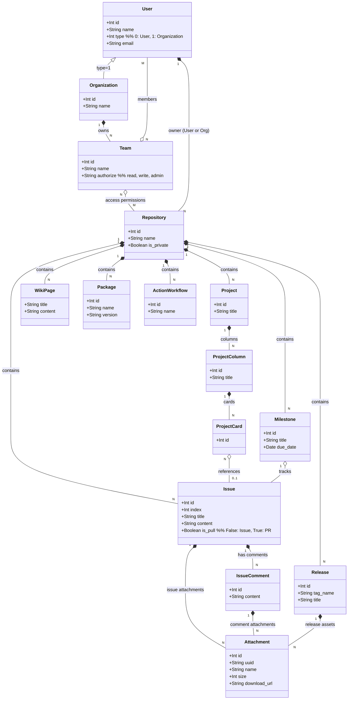

## Gitea / Github ER Model

```mermaid
classDiagram
    %% Identity & Access Layer
    class User {
        +Int id
        +String name
        +Int type  %% 0: User, 1: Organization
        +String email
    }

    class Organization {
        +Int id
        +String name
    }

    class Team {
        +Int id
        +String name
        +String authorize %% read, write, admin
    }

    %% Core Repository Layer
    class Repository {
        +Int id
        +String name
        +Boolean is_private
    }

    %% Management & Artifact Layer
    class Project {
        +Int id
        +String title
    }

    class ProjectColumn {
        +Int id
        +String title
    }

    class ProjectCard {
        +Int id
    }

    class Milestone {
        +Int id
        +String title
        +Date due_date
    }

    class Issue {
        +Int id
        +Int index
        +String title
        +String content
        +Boolean is_pull  %% False: Issue, True: PR
    }

    class IssueComment {
        +Int id
        +String content
    }

    class Attachment {
        +Int id
        +String uuid
        +String name
        +Int size
        +String download_url
    }

    class WikiPage {
        +String title
        +String content
    }

    class Release {
        +Int id
        +String tag_name
        +String title
    }

    class Package {
        +Int id
        +String name
        +String version
    }

    class ActionWorkflow {
        +Int id
        +String name
    }

    %% Relationships
    User <|-- Organization : type=1
    Organization "1" *-- "N" Team : owns
    Team "N" o-- "M" User : members
    Team "N" o-- "M" Repository : access permissions

    User "1" *-- "N" Repository : owner (User or Org)
    
    Repository "1" *-- "N" Issue : contains
    Repository "1" *-- "N" Milestone : contains
    Repository "1" *-- "N" Project : contains
    Repository "1" *-- "N" WikiPage : contains
    Repository "1" *-- "N" Release : contains
    Repository "1" *-- "N" Package : contains
    Repository "1" *-- "N" ActionWorkflow : contains

    Project "1" *-- "N" ProjectColumn : columns
    ProjectColumn "1" *-- "N" ProjectCard : cards
    ProjectCard "N" o-- "0..1" Issue : references

    Milestone "1" o-- "N" Issue : tracks
    Issue "1" *-- "N" IssueComment : has comments

    %% Attachment Relationships
    Issue "1" *-- "N" Attachment : issue attachments
    IssueComment "1" *-- "N" Attachment : comment attachments
    Release "1" *-- "N" Attachment : release assets
```
