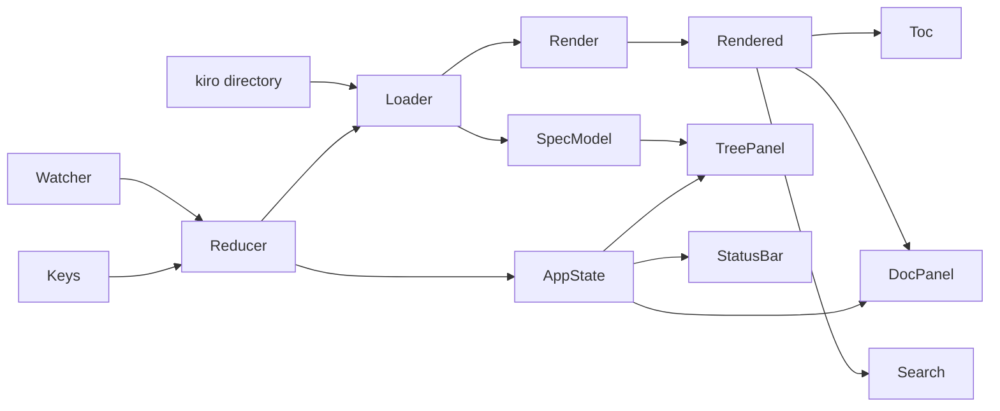
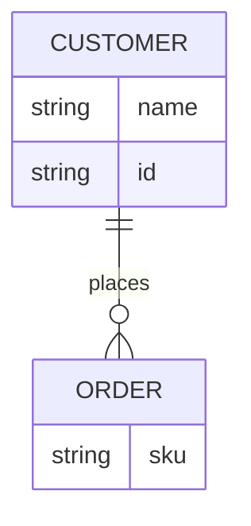
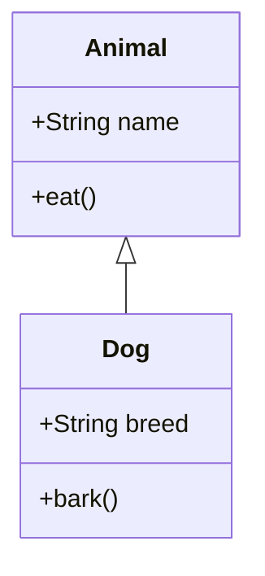
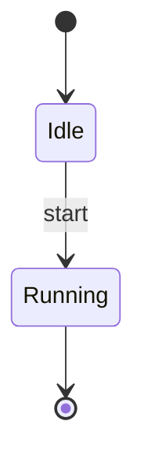
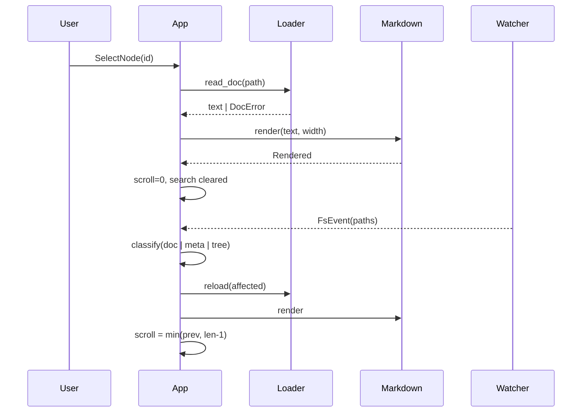

# Spec Viewer 골든 테스트

## 개요

이 문서는 spec-viewer 렌더러의 폭 40/80/120 골든 스냅샷을 위한 종합 픽스처입니다.
CJK와 Latin 문자가 섞인 문단, 중첩 목록, 표, 코드 펜스, 그리고 5종의 mermaid
다이어그램(flowchart/er/class/state/sequence)을 모두 포함합니다. This paragraph
mixes 한글 and English text on purpose so wrap.rs's grapheme-aware wrapping is
exercised at every width alongside the rest of the fixture.

### 중첩 목록

- 최상위 항목 A
  - 하위 항목 A-1
  - 하위 항목 A-2
    - 더 깊은 항목 A-2-a
- 최상위 항목 B
  - Nested English item B-1

### 표

| Component | Role | 상태 |
| --- | --- | --- |
| Loader | 파일 로드 | done |
| Render | 마크다운 렌더 | done |
| Watcher | 변경 감시 | in-progress |

### 코드 예시

```rust
fn add(a: i32, b: i32) -> i32 {
    a + b
}
```

## Boundary Map (flowchart)



## 엔터티 관계 (er)



## 클래스 관계 (class)



## 상태 전이 (state)



## System Flows (sequence)


