# Design — spec-viewer

## 정의
개발자를 위해 파일시스템 → 스펙 모델 → 마크다운 렌더 → 화면의 단방향 파이프라인으로 spec-viewer를 나누고 잇는 아키텍처 정의서이다. (2026-09-21 리버스 엔지니어링 갱신 — 실제 `src/` 코드를 근거로 재작성했으며, 옛 `.kiro` 요구사항 번호는 코드에서 확인되지 않는 한 인용하지 않는다.)

## Boundary Commitments

### In-Scope (This Spec Owns)
- **Spec Modeling**: `.kiro/` 루트 탐지(`find_root`) → 도메인 모델 변환(`spec::build`), `spec.json` 스키마 관대한 정규화(`parse_meta`), `tasks.md` 체크박스 집계(`count_progress`), 스펙 정렬(`spec::sort`, 4키 순환).
- **Markdown Rendering**: 폭 고정 스타일 라인 생성, 헤딩 앵커·각주 추출, 검색용 평문 생성, mermaid 서브셋(flowchart·er·class·state 그래프형 4종 + sequence) 파싱과 교체 가능한 3종 레이아웃 엔진(`builtin`/`mdview`/`dg`).
- **Change Watcher**: 파일시스템 변경 감시(`notify` + `notify-debouncer-full`, `NoCache`) 및 디바운스된 이벤트 전달, 수동 폴백.
- **Application Core**: 레이아웃 상태, 키·마우스 입력 처리(포커스·휠·클릭·경계 드래그·텍스트 선택·경계 자동 스크롤), 리듀서 기반 상태 전이, 트리 표시 모드(always/auto/hidden/single)와 파일 뷰, 문서·트리 이중 검색.
- **Theme**: `markdown/theme.rs`의 `Theme` 구조체 하나에 헤딩 6단계·강조·표·규칙선 스타일을 모은다 — 단, 실제로 이 값을 읽는 곳은 `markdown` 모듈 자기 자신뿐이다. `ui::doc_panel`은 `Theme`를 참조하지 않고 자기 소유의 `span_style`/`line_style`/`heading_style` 함수로 같은 팔레트를 독립적으로 재구현하고 있다 — "Theme table (SSoT)"라는 설계 의도와 실제 구현 사이의 드리프트이며, 아래 Key Decisions에서 있는 그대로 기록한다.

### Out-of-Scope
- **Schema Definition**: `spec.json` 스키마 및 파일명 규약 정의 (kiro 스킬군 소유).
- **Spec Mutation**: `spec.json` 승인 상태 변경 및 `.kiro/` 하위 파일 쓰기 일체 — `loader`는 읽기 전용이며 쓰기 경로가 없다.
- **Complex Rendering**: gantt/pie/mindmap 등 mermaid 비그래프 유형은 전용 레이아웃이 없다 — `parse::generic`이 `:`/`->`/`-->` 패턴만 관계로 인식하고 나머지는 줄 전체를 상자 하나로 뭉뚱그리는 휴리스틱 폴백만 제공한다. 이미지 렌더링·HTML/웹 출력 없음.
- **Global Search**: 여러 문서에 걸친 통합 검색 (현재 포커스된 패널 — 문서 또는 트리 — 내부만 검색).
- **Workspace Integration**: `agw` 류 워크스페이스 `Cargo.toml` 관리 (독립 크레이트, `[[bin]] name = "m"`).

### Allowed Dependencies
- 외부(Cargo.toml 기준): ratatui 0.30, crossterm 0.29, tui-tree-widget 0.24, pulldown-cmark 0.13, syntect 5.3(`default-features = false` + `default-fancy`), unicode-width 0.2, unicode-segmentation 1.12, notify 8.2 + notify-debouncer-full 0.6, serde_json 1 + serde(derive), clap 4(derive), thiserror 2, ignore 0.4(`--all` 파일 탐색), dg 0.2.1(git 의존 `github.com/hodorii/dg`, branch `main`, `default-features = false` → `cli` 기능 off, optional `engine-dg` 피처 — 기본 활성). MIT/BSD/Apache-2.0 계열만 허용 — 카피레프트 의존성(graphs-tui, AGPL-3.0)은 도입했다가 공개 전 완전히 제거함(코드베이스에 흔적 없음, THIRD_PARTY.md에 이력만 기록).
- 내부 의존 방향(왼→오만): `spec` → `markdown` → `watch` → `app` → `ui` → `main`. `spec`·`markdown`은 서로 모르며 I/O 없음. `ui`는 상태를 읽기만 한다 — 레이어를 거슬러 import하면 설계 위반. (`lib.rs`는 `markdown`/`spec`/`app`/`ui` 4개 모듈에 `#[allow(dead_code)]`를 달아 아직 전부 소비되지 않는 pub API를 허용한다 — `watch`만 예외.)

### Revalidation Triggers
- `spec.json` 스키마(`phase`/`approvals`/`updated_at` 키, `feature_name`/`name`)나 문서 7종(spec.json/requirements/bugfix/biz-process/design/tasks/research) 파일명 규약이 바뀌면 `spec` 모듈 계약 재검토.
- `dg`가 `branch = "main"`으로 고정돼 있어 `Cargo.lock` 갱신 시 상류가 조용히 바뀔 수 있다 — `dg::render_diagram`/`RenderOptions`/`diagram::kind_of` API가 바뀌면 `dg_engine.rs` 재검토.
- `agw` 워크스페이스로 편입되면 독립 크레이트 전제와 Allowed Dependencies 재검토.
- ratatui/crossterm 메이저 업그레이드 시 터미널 복원(`ratatui::init`/`restore`)·마우스 캡처 실패 허용 경로 재검증.
- 문서가 수천 행 규모로 커지면 Synchronous Core 결정(동기 로드/렌더) 재검토.
- mermaid 비그래프 유형(gantt/pie) 요구가 생기면 층 배치 레이아웃 엔진 재검토.
- `markdown::Theme`가 `ui` 레이어까지 실제로 관통하게 되면(또는 반대로 완전히 걷어내면) "Theme table" Key Decision과 이 문서의 드리프트 서술을 갱신.

## Architecture

### Boundary Map
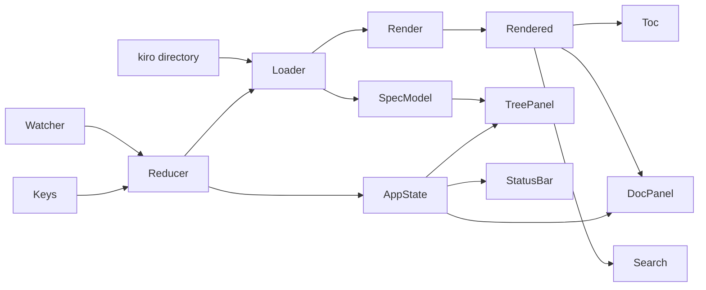

순수 코어(`spec`, `markdown`) + I/O 껍질(`loader`, `watch`) + 단일 리듀서(`app`). 코어는 (입력, 폭) → 출력이 결정적이라 골든 테스트 대상. (이 다이어그램 소스 자체가 `engine/mdview.rs`의 `real_boundary_map_matches_reference_mdview_tb_output_at_100_and_120` 골든 테스트에서 폭 100·120으로 렌더되어 `tests/fixtures/mdview-tb/boundary-map-w{100,120}.txt`와 문자 그대로 비교된다 — 이 펜스를 고치면 그 두 스냅샷도 같이 갱신해야 한다.)

### Block Diagram (레이어 블록도)
"Allowed Dependencies"의 내부 의존 방향(`spec`/`markdown`/`watch` → `app` → `ui` → `main`)을 mermaid의 `block-beta` 블록 다이어그램 문법으로 그린 것 — GitHub/mermaid-live 등 mermaid 공식 렌더러에서는 실제 블록도로 그려지지만, **spec-viewer 자신의 `sniff_kind`는 `block-beta`를 인식하는 4종(flowchart/er/class/state)에 넣지 않았으므로 이 펜스는 이 앱 안에서는 `generic` 폴백(줄 단위 상자화)으로 렌더된다** — PlantUML과 마찬가지로 "spec-viewer가 못 그리는 실제 mermaid 문법"의 또 다른 사례.
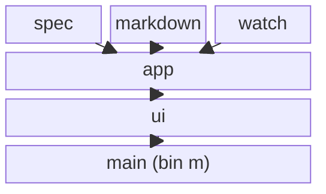

### Technology Stack
| Layer | Choice | Role |
|-------|--------|------|
| CLI | clap 4(derive) | `[PATH]`(디렉터리=`.kiro` 트리 탐지, `.md` 파일=파일 뷰), `--all`(`.kiro` 무시하고 지정 디렉터리를 마크다운 트리로, 대상이 없거나 못 읽으면 exit 2), `--tree <auto\|always\|hidden\|single>`, `--sort <name\|phase\|updated\|progress>`, `--diagram-engine <dg\|mdview\|builtin>`(문자열 검증, 기본값은 `engine-dg` 피처 컴파일타임 분기), `--no-watch`, `--log <path>`(`.kiro` 루트 내부면 거부), `--version`/`-V`(clap `version` 속성이 자동 처리) |
| Diagram | dg 0.2.1 (git dep, lib 타깃, `cli` 기능 off, MIT), `engine-dg` 피처로 켬/끔 | flowchart/er/class/state/sequence 지원(generic 미지원), mermaid 원문을 그대로 받아 내부에서 폭 맞춤 재시도까지 마친 텍스트를 반환 |
| TUI | ratatui 0.30 + crossterm 0.29 | 프레임 및 입력, `ratatui::init`/`restore`가 raw mode·대체화면·패닉 훅 복원까지 담당 |
| Tree | tui-tree-widget 0.24 | 트리 상태(`TreeState<NodeId>`)와 렌더링, 행 히트테스트(`rendered_at`) |
| Parser | pulldown-cmark 0.13 (TASKLISTS·STRIKETHROUGH·TABLES·FOOTNOTES) | 마크다운 이벤트 스트림 |
| Highlight | syntect 5.3(`default-fancy`) | 코드 펜스 구문 강조 — 색상은 버리고 `font_style` 유무만으로 Code/Plain 2분류 |
| Width | unicode-width 0.2 + unicode-segmentation 1.12 | CJK 2칸 폭 계산, 그래핌 단위 줄바꿈 |
| Watch | notify 8.2 + notify-debouncer-full 0.6 (`NoCache`) | 디바운스 300ms 파일 변경 감시 |
| Mouse | crossterm `EnableMouseCapture`(실패해도 계속 진행, 로컬 플래그로만 추적) | 클릭·휠·드래그 이벤트 |
| Clipboard | OSC 52 이스케이프, base64 자체 구현 | 크레이트 없이 `ESC ] 52 ; c ; <base64> BEL`을 stdout에 직접 write, 미지원 터미널은 무시 |

### Key Decisions
- **Pre-computed Lines**: 렌더러가 폭에 맞춘 `Vec<Line>`을 미리 생성. 스크롤/검색/점프를 라인 인덱스로 단순화하여 O(1) 접근 및 상태 유지. `lines`와 `plain`은 항상 1:1 병렬 배열이라는 불변식을 렌더러 전체가 지킨다.
- **Synchronous Core**: 로드/렌더는 메인 스레드 동기 처리. 문서 크기가 작아 비동기 복잡도보다 동기 처리의 단순함이 이득.
- **Input event coalescing per draw**: 메인 루프(`main::run_loop`)는 100ms 폴 사이클에 쌓인 raw 입력 이벤트를 0-타임아웃 폴로 전부 소진하며 `update`만 반복 호출하고, `terminal.draw`는 그 배치 끝에 한 번만 수행한다. 마우스 휠/트랙패드 버스트가 프레임당 여러 이벤트를 낳는데 다이어그램이 많은 문서는 매 draw가 상대적으로 비싸(더블버퍼 diff가 스킵할 셀이 적음), 이벤트당 draw하면 입력 속도를 못 따라가 지연이 누적되던 문제를 해결.
- **Idle redraw 억제**: poll이 타임아웃(입력 없음)됐을 때 `state.auto_scroll`이 무장돼 있지 않으면 `Action::Tick`조차 보내지 않고 재draw도 하지 않는다 — 유휴 상태에서 100ms 하트비트로 계속 다시 그리는 낭비를 없앤다. `auto_scroll`이 무장돼 있을 때만 Tick으로 드래그 자동 스크롤을 진행시킨다.
- **Meta Normalization**: `feature_name` / `name` 스키마를 `parse_meta`에서 `SpecMeta`(+ `updated_at: Option<String>`, ISO-8601 원문 그대로 보관해 사전식 정렬에 재사용)로 단일화. 실패는 `MetaError::{InvalidJson, MissingName}`(`thiserror`) 딱 두 가지뿐 — phase 누락, approvals 일부/전체 누락, bool이 아닌 값 등은 전부 관대하게 기본값으로 흡수해 파싱 성공 처리한다.
- **Path-based NodeId**: 트리 식별자를 경로 기반으로 설정하여 재스캔 후에도 선택 상태(`TreeState`)가 자동 유지.
- **Spec sort as its own module**: `spec::sort::{SortKey, sort_specs}` — 이름/단계는 오름차순, 최근 갱신/진행률은 내림차순, 모두 이름을 2차 정렬키로 써서 `spec.json` 파싱 실패 스펙이 섞여 있어도 결정론적 순서를 보장한다. 정렬은 트리 렌더 시점이 아니라 `main`(시작 시) · `app::cycle_sort`/`resync`(런타임 재스캔 후)가 미리 적용해 두고, 트리 패널 제목의 `[정렬 키]` 표시만 `sort_key` 필드를 읽는다.
- **DocView carries file metadata**: `DocView::Rendered { path, r, meta: FileInfo }` — 렌더 결과 옆에 `modified`/`size`/`lines`를 동봉해 상태바가 별도 `stat` 호출 없이 표시. `Deleted`는 로더가 직접 만들지 않고, 이전에 `Rendered`였던 경로가 재로드 시 `Missing`으로 나오면 리듀서가 `Deleted`로 승격시킨다.
- **Dual, independent search state**: 문서 검색(`AppState.search`)과 트리 검색(`AppState.tree_search` + `tree_matches: Vec<Vec<NodeId>>`)은 완전히 분리된 상태를 갖는다 — 포커스에 따라 하나의 `SearchState`를 공유하지 않는다. 트리 쪽 `SearchState.matches`는 실제 매치가 아니라 `0..len()` 자리표시자(상태바 "(i/n)" 카운트 렌더링 경로 공유용)이고, 진짜 매치 경로는 `tree_matches`에 있다. 일치 이동 시 조상 노드를 `TreeState::open`으로 펼친다.
- **Mouse hit-test from stored layout**: 매 프레임의 패널 `Rect`(tree/doc/separator)를 `AppState.layout: PanelLayout`에 보관하고 마우스 좌표를 그 Rect로 판정(`mouse::panel_at`) — 숨겨진 패널은 `Rect::default()`라 자동으로 매치되지 않는다. 문서 좌표는 `doc_position_at`/`doc_position_clamped`(`line = scroll + (y - inner.y)`), 경계 판정은 `doc_edge_at`. 트리 행 히트테스트는 자체 구현 없이 `TreeState::rendered_at`에 위임. `split`(트리 폭) 최소 20열(`MIN_PANEL_WIDTH`).
- **Selection copy via OSC 52**: 클립보드 크레이트 대신 터미널 OSC 52 시퀀스로 복사, base64 인코더도 자체 구현(`Clipboard` 트레이트 뒤에 두어 테스트는 `TestSink`로 대체). 지원 안 하는 터미널은 조용히 무시.
- **Theme table — 의도된 SSoT이지만 UI까지 관통하지 않음**: `markdown::Theme`(heading[6]/heading_rule[6]/emphasis/strong/strikethrough/code/quote/quote_bar/list_marker/task_done/task_todo/rule/table_header/table_border/text/link, 16필드)은 `markdown` 모듈 내부(`block.rs`/`inline.rs`)에서만 참조되며, 구조에 영향을 주는 건 사실상 `heading_rule` 문자뿐이다(`render`는 `Theme::default()`로 `render_with`를 얇게 감싼 래퍼). `ui::doc_panel`은 `Theme`를 import조차 하지 않고 같은 색 배정을 자기 `span_style`/`line_style`/`heading_style` 함수로 독립적으로 재구현한다. `task_done`/`task_todo` 필드는 정의만 있고 어디서도 읽히지 않는 죽은 코드(체크박스는 `SpanStyle::Plain`으로 삽입됨). 즉 "테마 하나로 렌더러·패널 전체 스타일을 통제"라는 원래 설계 의도는 아직 실현되지 않았다.
- **Table, GitHub style**: 열 폭은 내용 폭(합계가 페인 폭을 넘을 때만 넓은 열부터 축소, 최후엔 비례 축소 + 셀 줄바꿈). 격자 `┌─┬─┐│├─┼─┤…└─┴─┘`에 헤더 뒤뿐 아니라 모든 본문 행 사이에도 구분선, 헤더 굵게. 페인 폭 채움은 하지 않는다.
- **Pluggable GraphEngine**: `trait GraphEngine: Send + Sync { fn name(&self) -> &'static str; fn supports(&self, kind: &str) -> bool; fn render(&self, src: &str, diagram: &Diagram, width: u16) -> Result<Vec<String>, Fallback>; }` — 별도 `dir` 인자는 없고 필요하면 `Diagram::Graph{dir,..}`에서 각 엔진이 스스로 꺼낸다. 레지스트리는 프로세스 전역 `OnceLock<RwLock<EngineState>>`(`register`/`select`/`current`/`engines`), `builtin`+`mdview`가 항상 등록되고 `engine-dg` 피처일 때만 `dg`가 추가된다(현재 최대 3개, `graphs-tui`는 레지스트리 어디에도 없다). 세 엔진의 `supports()` 커버리지가 서로 다르다: `builtin`/`mdview`는 flowchart·er·class·state·**generic**(sequence 미지원), `dg`는 flowchart·er·class·state·**sequence**(generic 미지원). 그래프형은 선택된 엔진이 `supports(kind)`가 거짓이면 `builtin`으로 자동 폴백. sequence는 선택된 엔진이 `supports("sequence")`할 때만(현재 `dg`) 먼저 시도하고, 실패·미지원 시 `seq::layout`(전용 압축 렌더러)로 폴백. 기본 엔진은 `engine-dg` 피처가 켜지면 `dg`, 아니면 `mdview`. `dg`는 파싱 결과가 아닌 mermaid 펜스 원문을 그대로 받는다.
- **Adopt mdview graph engine**: `engine/mdview.rs`는 mdview `render/mermaid/graph.rs`(MIT) 포팅 — subgraph를 클러스터로 묶은 랭킹(`longest_path`), 4패스 barycenter 순서 정렬 + 그룹 응집, 긴 간선의 더미 노드 분할, 랭크 경계마다 구간 스케줄링으로 배정한 밴드 배선(순방향은 세로-가로-세로, 피드백 간선은 몸통 오른쪽 전용 거터로 우회), 자기 루프는 `↺` 글리프+라벨을 노드 옆에 직접 텍스트로. `Dir`는 완전히 무시하고 **항상 TB**로 그린다(`graph LR` 선언도 무시) — 과거 LR 전치 지원을 추가했다가 코너 글리프 겹침·`┼` 크로싱 문제로 제거했고, 이 사실은 이 파일 "Boundary Map" 골든 테스트가 계속 diff 0으로 검증한다. 오버플로 사다리(라벨 축약 → Class/Entity 본문 접기 → `n.header`가 있는 다이어그램에 한해 층 내 행 래핑 → 소스 폴백)는 **이 엔진에만** 구현돼 있다. 캔버스는 `canvas.rs`(방향 비트마스크 박스드로잉 병합, mdview 포팅, `builtin`과 공유)를 사용.
- **Own mermaid subset (builtin)**: `graph.rs`는 자체 층 배치(간선 relaxation, barycenter 없이 "같은 층은 선언 순")로 LR/TB 양방향을 렌더하며, 오버플로는 라벨 축약(`MIN_BUDGET=3`까지) 한 단계뿐 — mdview의 본문 접기·행 래핑 사다리는 없다. `seq.rs`는 별도의 컴팩트 화살표 리스트 sequence 렌더러(참여자 균등폭 열, self-message 3행 루프, 라벨 축약 후 오버플로). 둘 다 교차 최소화 없음. `mermaid::parse::seq`는 mermaid의 `note`/`loop`/`alt`/`opt`/`par` 구조 키워드를 전혀 인식하지 않는다 — 그런 줄은 participant도 message도 아니므로 조용히 드롭된다.
- **Watch startup latency (`NoCache`)**: `watch::start`는 `notify_debouncer_full::new_debouncer_opt` + `NoCache::new()`를 명시적으로 쓴다 — 기본 `RecommendedCache`가 등록 시점에 루트 아래를 동기적으로 walk+stat 해서 rename-id 캐시를 시딩하는데, 이 크레이트의 `FsEvent`는 애초에 rename을 delete/create와 구분해 주지 않으므로 그 캐시는 순수 오버헤드였다. 대형 디렉터리에서 `start()`가 첫 프레임을 블로킹하던 회귀를 캐시 없음으로 해결(전용 성능 회귀 테스트로 감시).
- **`--all` 모드 TreeItem 캐시**: `AppState.files_tree_cache: Option<FilesTreeItemCache>` — `ui::tree_panel::render_files`가 `(entries, search_matches)`가 이전과 같으면 `Vec<TreeItem>` 재빌드를 건너뛴다. `Kiro` 모드는 규모가 작아 매 프레임 새로 빌드해도 무방(캐시 없음). 대형 `--all` 디렉터리에서 스크롤마다 전체 `TreeItem` 트리를 재할당하던 회귀 수정.

## System Flows

### 문서 선택 → 렌더 → 변경 반영
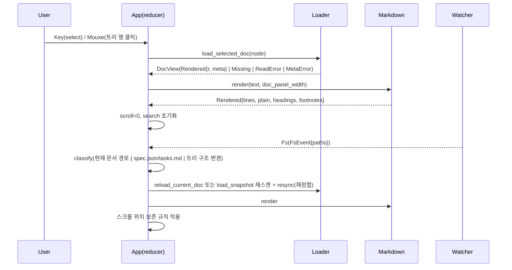
- **폭 변경**: 화면 맨 위 라인이 속한 헤딩을 `(level, text)` 동일성으로 새 `Rendered.headings`에서 다시 찾아 그 라인으로 스크롤을 복원한다. 같은 헤딩을 못 찾으면(제목이 바뀌었거나 삭제됨) **비율 근사가 아니라** `scroll.min(새 문서 길이-1)`로 단순 클램프한다.
- **파일 변경 반영**: 재로드 결과가 `Missing`이고 직전 `DocView`가 그 경로의 `Rendered`였다면 리듀서가 `Deleted`로 승격한다. 라인 인덱스는 문서가 짧아져 길이를 넘으면 클램프.
- **이벤트 분류**: 현재 열려 있는 문서 자신의 경로가 바뀌면 `reload_current_doc`(트리 선택과 무관하게 항상 재로드, 파일 뷰 모드 회귀 수정); `spec.json`/`tasks.md` 변경 → 해당 스펙 메타만 재빌드; 디렉터리·`.md` 추가/삭제/이름변경 → 루트 재스캔(`load_snapshot`) 후 `spec::sort_specs`로 정렬을 다시 적용(`resync`).

### 문서 선택 → 렌더 → 변경 반영 (PlantUML, 생명선 포함)
위와 같은 흐름을 PlantUML 시퀀스 다이어그램으로 다시 그린 것 — `activate`/`deactivate`로 각 참여자의 활성 구간(생명선 위 실행 막대)을 명시한다. mermaid판과 마찬가지로 spec-viewer 자신은 이 펜스를 다이어그램으로 그리지 않는다(코드 펜스 언어가 `plantuml`이라 `code.rs`의 일반 하이라이팅 경로로 감 — 위 "다이어그램 유형 커버리지 샘플" 참고). PlantUML 렌더러(plantuml.com/서버, VS Code 확장 등)로 보는 참고 자료다.
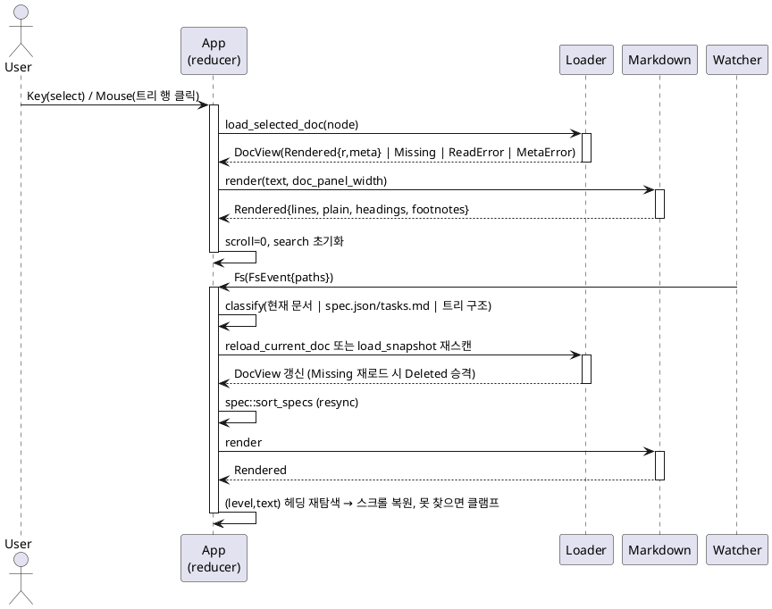

## Components and Interfaces

### spec — SpecModel
- Intent: 디렉터리 스냅샷 → 스키마 무관 도메인 모델. I/O 없음(`DirSnapshot` 주입으로 인메모리 테스트) — 실제 파일 읽기는 `app::loader`가 담당하고 `DirSnapshot`/`SpecDirSnapshot`/`FileSnapshot`을 재수출한다.
```rust
pub fn find_root(start: &Path) -> Option<PathBuf>;
pub fn build(snapshot: &DirSnapshot) -> SpecRoot;
pub fn parse_meta(json: &str) -> Result<SpecMeta, MetaError>;
pub fn count_progress(tasks_md: &str) -> Option<Progress>;
pub fn definition(doc_md: &str) -> Option<String>;
pub fn inclusion(steering_md: &str) -> Inclusion;
pub fn sort_specs(specs: &mut [Spec], key: SortKey);

pub struct DirSnapshot { pub specs: Vec<SpecDirSnapshot>, pub steering: Vec<FileSnapshot> }
pub struct SpecDirSnapshot { pub name: String, pub dir: PathBuf, pub files: Vec<FileSnapshot> }
pub struct FileSnapshot { pub name: String, pub path: PathBuf, pub content: String }

pub struct SpecRoot { pub specs: Vec<Spec>, pub steering: Vec<SteeringDoc> }
pub struct SteeringDoc { pub name: String, pub path: PathBuf, pub inclusion: Inclusion }
pub enum Inclusion { Always, Manual, FileMatch, Auto }
pub struct Spec { pub name: String, pub dir: PathBuf, pub meta: Result<SpecMeta, MetaError>, pub docs: Vec<DocEntry>, pub definition: Option<String> }
pub struct DocEntry { pub kind: DocKind, pub path: PathBuf, pub exists: bool, pub status: DocStatus, pub progress: Option<Progress> }
pub enum DocKind { Requirements, Bugfix, BizProcess, Design, Tasks, Research, Other(String) }   // Ord — BTreeMap 키; 선언 순서 = approvals 키 우선순위
pub enum DocStatus { Missing, Generated, Approved, NoRecord, NotTracked }   // NotTracked = research·Other
pub struct SpecMeta { pub name: String, pub phase: String, pub approvals: BTreeMap<DocKind, Approval>, pub updated_at: Option<String> }
pub struct Approval { pub generated: bool, pub approved: bool }
pub enum MetaError { InvalidJson(String), MissingName }   // thiserror::Error
pub struct Progress { pub done: u32, pub total: u32 }
pub enum NodeId { Spec(String), Doc(String, DocKind), SteeringGroup, Steering(String), Dir(PathBuf), File(PathBuf) }
pub enum TreeSource { Kiro(SpecRoot), Files(FsTree) }
pub enum SortKey { Name, Phase, Updated, Progress }   // Default = Name
impl SortKey { pub fn cycle(self) -> SortKey; pub fn label(self) -> &'static str; pub fn from_cli(s: &str) -> Option<SortKey>; }
pub struct FsTree { pub root: PathBuf, pub entries: Vec<FsEntry> }
pub struct FsEntry { pub path: PathBuf, pub is_dir: bool, pub depth: u8 }
impl FsTree { pub fn scan(root: &Path) -> FsTree; }
```
- `find_root` 우선순위: ①`start/.kiro`가 있으면 그것 ②`start` 자체 이름이 `.kiro`면 그것 ③`start`의 조상을 순서대로 올라가며 처음 `.kiro` 자식을 찾으면 그것 ④없으면 `None`.
- `build`: `Spec.docs` 순서를 강제한다 — 슬롯1(`bugfix.md` 존재 또는 `spec.json.approvals.bugfix` 있으면 `Bugfix`, 아니면 `Requirements`) → `BizProcess`(존재 무관 항상 슬롯) → `Design`(동일) → `Tasks`(동일) → `Research`(파일이 실제로 있을 때만) → 표준 7파일명 외 나머지는 `Other(파일명)`으로 이름 오름차순. `## 정의`는 슬롯1 문서에서만 추출. `exists`와 `status`는 서로 독립 계산이라 불일치 가능(예: `spec.json`엔 `generated: true`인데 파일이 없을 수 있음).
- `doc_status`: `meta`가 `Err`면 무조건 `NoRecord`. `Ok`면 `approved`→`Approved`, `generated`→`Generated`, 둘 다 false 또는 키 없음→`Missing`/`NoRecord`.
- `definition`: 트림 후 정확히 `"## 정의"`인 줄부터 다음 `## ` 헤딩(또는 EOF) 직전까지, 앞뒤 빈 줄 트림. 본문이 없거나 헤딩 자체가 없으면 `None`.
- `inclusion`: front matter(`---`~`---`) 안의 `inclusion` 키를 `always/manual/fileMatch/auto`로 매핑, 없거나 인식 못 하면 항상 `Always` 폴백.
- `count_progress`: 각 줄에서 `- [x]`/`[ ]`(옵션 태스크 `[ ]*` 포함) 패턴만 평면 집계, 중첩 구조는 보지 않음. 체크박스 0개면 `None`.
- `sort_specs`: `Name`/`Phase`는 오름차순, `Updated`(`updated_at` 원문 문자열 비교, 없으면 `""`로 항상 꼴찌)/`Progress`(`docs` 중 첫 `progress: Some`의 비율, 없으면 -1.0으로 꼴찌)는 내림차순, 전부 이름을 2차키로 결정론적 정렬. `spec.json` 파싱 실패 스펙이 섞여도 패닉 없음.
- `FsTree::scan`(`--all` 전용, `ignore::WalkBuilder`): 숨김 제외, `.gitignore`는 실제 git 저장소 안에서만 자동 적용, `max_depth(6)`, `.md`/`.markdown`(대소문자 무시)만 리프 채택, 마크다운을 하나도 담지 않은 디렉터리는 가지치기. `depth`는 root 기준 상대 컴포넌트 수. `entries`는 전체 경로 문자열 정렬(디렉터리가 자손의 접두어이므로 서브트리가 자연히 뭉침).

### markdown — Renderer
- Intent: 마크다운 + 폭 → 스타일 라인·헤딩 앵커·검색용 평문·각주. 순수 함수, 같은 (src, width, theme) → 같은 출력. `footnote.rs`라는 별도 파일은 없다 — 각주 수집·출력 로직 전부가 이 `mod.rs`에 들어있다.
```rust
pub fn render(src: &str, width: u16) -> Rendered;                        // Theme::default()로 render_with를 감싼 얇은 래퍼
pub fn render_with(src: &str, width: u16, theme: &Theme) -> Rendered;    // theme.heading_rule만 구조에 반영
pub struct Rendered { pub lines: Vec<Line>, pub plain: Vec<String>, pub headings: Vec<HeadingAnchor>, pub footnotes: Vec<Footnote> }
pub struct Line { pub indent: u16, pub spans: Vec<Span>, pub style: Option<LineStyle> }
pub struct Span { pub text: String, pub style: SpanStyle }
pub enum SpanStyle { Plain, Bold, Italic, Strikethrough, Code, Link }
pub enum LineStyle { Heading(u8), Quote, ListItem(u16), Table, Plain }
pub struct HeadingAnchor { pub level: u8, pub text: String, pub line: usize }
pub struct Footnote { pub index: usize, pub name: String, pub text: String }   // index = 첫 참조 순서(1-based)

pub struct Theme {
    heading: [Style; 6], heading_rule: [Option<char>; 6],
    emphasis: Style, strong: Style, strikethrough: Style, code: Style,
    quote: Style, quote_bar: Style, list_marker: Style,
    task_done: Style, task_todo: Style,   // 정의만 있고 실제로 읽는 곳 없음(죽은 필드)
    rule: Style, table_header: Style, table_border: Style, text: Style, link: Style,
}
impl Theme { pub fn heading_rule_char(level: u8) -> Option<char>; pub fn span_style(SpanStyle) -> Style; pub fn line_style(&LineStyle) -> Style; }
```
- **파이프라인**: `hangul::compose(src)`(NFD→NFC 정규화) → `strip_frontmatter` → `pulldown_cmark::Parser::new_ext`(TASKLISTS|STRIKETHROUGH|TABLES|FOOTNOTES)로 이벤트 전체 수집 → `mod.rs` 메인 루프가 `Tag::Heading`→`block::push_heading`, `Tag::CodeBlock`→`code::push_code_block`, `Tag::Paragraph`→`block::push_paragraph`, `Tag::List`→`block::push_list`(재귀), `Tag::BlockQuote`→`block::push_quote`, `Tag::Table`→`table::render_table`, `Tag::FootnoteDefinition`→본문 대신 내부 상태에 수집, `Event::Rule`→`"---"`로 위임. 각주가 있으면 문서 끝에 `"각주"` 절을 첫 참조 순서로 출력.
- **inline.rs**: `Text`/`Code`/`SoftBreak`/`HardBreak`/`TaskListMarker`/`FootnoteReference`/`Emphasis`/`Strong`/`Strikethrough`/`Link`/`Image`를 스팬으로 변환, 인접 동일 스타일 스팬 자동 병합. 체크박스는 전용 상수 문자(`✓`/`□`) + `SpanStyle::Plain`으로 삽입(Theme의 task_done/task_todo가 죽은 필드인 이유). 링크는 `텍스트 (URL)`, 이미지는 `🖼 대체텍스트 (URL)` 형식으로 URL을 본문에 노출.
- **wrap.rs**: `Plain` 스타일 스팬만 공백 기준 단어 분리, 그 외 스타일은 스팬 전체를 하나의 "단어"로 취급(너무 길면 그래핌 단위 강제 분할). 폭 계산은 `unicode_width`로 CJK 2칸 반영.
- **table.rs**: 열 폭은 내용 폭 기본, 가용폭(`width - (3*ncols+1)`) 초과 시에만 가장 넓은 열부터 최소 1까지 축소 → 그래도 넘치면 비례 축소. 모든 행 사이에 `├─┼─┤`, 헤더 Bold.
- **code.rs**: 언어가 `mermaid`면 `render_mermaid` 결과를 삽입, 실패 시 `Mermaid (Empty|Overflow): <kind>` 라벨 + 원본 소스를 폭에 맞춰 절단. 일반 코드는 탭 4칸 확장 후 syntect(`base16-ocean`, `SyntaxSet::load_defaults_newlines`)로 하이라이트하되 색상은 버리고 `font_style` 유무로 Code/Plain 2분류만. `resolve_lang_alias`가 rust→rs, python→py, javascript/typescript→js, shell→sh 매핑.
- **theme.rs**: 목록 기호·체크박스 문자는 Theme 데이터가 아니라 `const`(테마 무관 고정). H3~H6는 밑줄이 없는 대신 넷 모두 서로 다른 색/굵기로 구분.
- **hangul.rs**: 외부 정규화 크레이트 없이 유니코드 한글 합성(NFD→NFC) 알고리즘을 직접 구현, mdview(MIT) 포팅.

### markdown::mermaid — Diagram 파싱
- Intent: mermaid 소스 + 폭 → 텍스트 다이어그램 행. `parse::parse`가 첫 줄 접두사로 `flow`/`er`/`class`/`state`/`seq`/`generic` 6개 서브파서 중 하나로 디스패치한다.
```rust
pub fn render_mermaid(code: &str, width: u16) -> Result<Vec<String>, Fallback>;
pub fn parse::parse(src: &str) -> Result<Diagram, Fallback>;
pub enum Diagram { Graph { dir: Dir, nodes: Vec<Node>, edges: Vec<Edge>, groups: Vec<Subgraph> }, Sequence { actors: Vec<String>, messages: Vec<Message> } }
pub enum Dir { TB, LR }
pub struct Node { pub id: String, pub shape: Shape }
pub enum Shape { Box(String), Entity { name: String, fields: Vec<String> }, Class { name: String, attrs: Vec<String>, methods: Vec<String> }, State(String), Start, End }
pub struct Edge { pub from: String, pub to: String, pub label: Option<String>, pub style: EdgeStyle }
pub enum EdgeStyle { Arrow, Line, Cardinality(String, String), Inherit, Compose, Aggregate, Transition }
pub struct Subgraph { pub title: String, pub members: Vec<String> }
pub struct Message { pub from: String, pub to: String, pub label: String, pub self_msg: bool }
pub enum Fallback { Empty { kind: String }, Overflow { kind: String } }
```
- **flow.rs**(flowchart): 헤더 2번째 토큰이 `LR`/`RL`이면 `Dir::LR`, 그 외(TD/BT 포함) 전부 TB. 노드 라벨은 `((...))`/`[...]`/`(...)`/`{...}` 4종 괄호에서 텍스트만 뽑되 **모양 구분 정보는 버리고 전부 `Shape::Box`**. 간선 파이프 라벨(`-->|label|`)·대시 라벨(`-- label -->`)·다중 화살표 체인·`---`(Line), `subgraph`~`end`(단일 슬롯, 중첩 미지원), `%%` 줄 주석.
- **er.rs**: 카디널리티 기호 8종 고정 매칭, `label:` 텍스트. 엔티티는 한 줄 또는 여러 줄 `NAME { ... }` 블록. `direction`/`subgraph` 미지원, 항상 TB.
- **class.rs**: `class Name { ... }`, 가시성 기호(`+-#~`)로 멤버 분리, `(` 포함 시 method. 관계 연산자 8종 순서 매칭. **따옴표 다중성(`"1"`,`"N"`) 표기를 파싱 시 제거**(과거 `Organization "1" *-- "N" Team`이 가짜 노드 2개를 만들어 15개 클래스가 42개로 부풀던 실측 버그의 수정 — `gitea-github-schema.md` 픽스처가 재현 케이스), 멤버 뒤 인라인 `%%` 주석도 제거. 항상 TB, subgraph 미지원.
- **state.rs**: `A --> B`/`A --> B : label`만 인식, `[*]`는 화살표 왼쪽이면 `Start` 오른쪽이면 `End`(같은 id로 둘 다 존재 가능). `direction`/subgraph/중첩 상태 미지원, 항상 TB.
- **seq.rs**(parse): `participant`/`actor`(+`as alias`) 등록. 화살표 4종(`-->>`,`->>`,`-->`,`->`)을 인식하되 **스타일 차이는 구분하지 않고 전부 동일한 `Message`**. `note`/`loop`/`alt`/`opt`/`par` 등 구조 키워드는 인식하지 않아 해당 줄은 조용히 드롭된다.
- **generic.rs**(gantt/pie/mindmap 등 미지원 유형 공용 폴백): 각 줄에서 `-->`/`->`/`:` 를 찾아 좌우가 식별자스러우면 노드+간선으로, 아니면 줄 전체를 `제목 + 나머지`의 `Shape::Class` 상자 하나로. 노드 0개면 `Fallback::Empty`.
- `canvas.rs`는 파싱이 아니라 **엔진 렌더링 계층**(`graph.rs`·`engine/mdview.rs`가 공유하는 방향 비트마스크 박스드로잉 캔버스)이므로 다음 절에서 다룬다.

### markdown::mermaid — 다이어그램 유형 커버리지 샘플
이 문서 자체가 `tests/engine_compare.rs`의 입력(모든 `mermaid` 펜스를 추출해 등록된 엔진 전부로 렌더)이므로, `parse::parse`가 실제로 디스패치하는 6갈래(flow/er/class/state/seq/generic) 전부와, mermaid가 아닌 다이어그램 언어(PlantUML)가 코드 펜스로 왔을 때의 처리까지 한 자리에서 보여준다. flowchart 예시는 위 "Boundary Map"(골든 테스트 고정이라 그대로 둠), sequence 예시는 아래 "System Flows"에 있다.

classDiagram(도메인 모델 — 따옴표 다중성 표기는 `class.rs`가 파싱 시 제거해서 가짜 노드가 생기지 않는다):
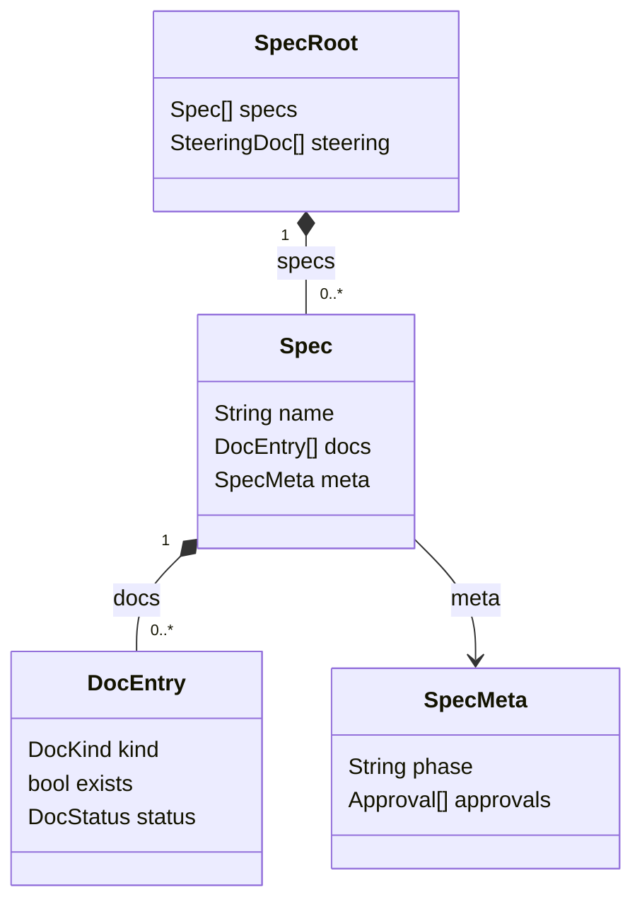

erDiagram(카디널리티 8종 고정 테이블 중 2종 사용):
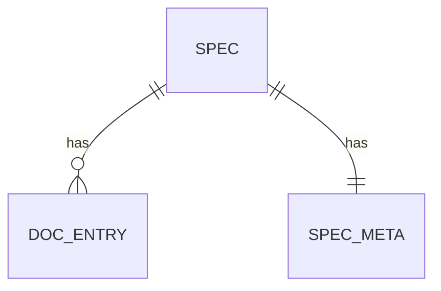

stateDiagram-v2(`DocStatus` 전이 — `[*]`는 화살표 왼쪽이면 Start, 오른쪽이면 End로 같은 id가 공존 가능):
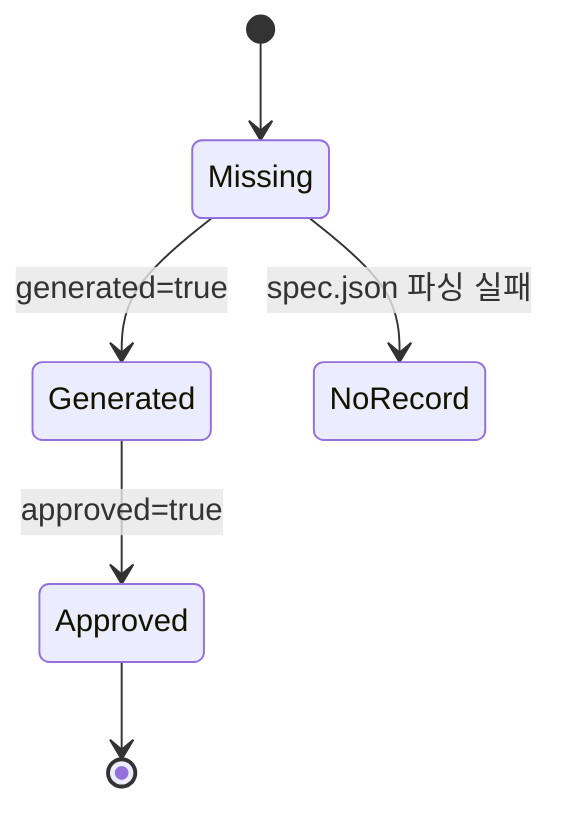

generic 폴백(전용 레이아웃이 없는 유형 — 예: gantt. `parse::generic`이 `:`/`->`/`-->` 관계만 인식하고 나머지는 줄 전체를 상자 하나로 뭉갠다). 최소 재현은 `parse::generic`의 전용 단위 테스트(`test_gantt_fixture_line_per_box`) 입력 그대로 — `title`/`section`/`Kickoff`/`Research` 각 줄이 첫 토큰을 이름, 나머지를 속성 한 줄로 갖는 `Shape::Class` 상자가 되고, 마지막 줄만 `Kickoff --> Research` 간선으로 인식된다:
```mermaid
gantt
    title Adoption Timeline
    section Planning
    Kickoff :done, 2024-01-01, 3d
    Research :active, 2024-01-04, 5d
    Kickoff --> Research
```

**같은 폴백을 이 저장소의 실제 타임라인으로**(`git log --oneline --all`, 2026-09-21, 단일 브랜치 `main`) — 첫 태스크만 실제 커밋 시각(`2026-09-21 13:09`)으로 시작하고, 그 뒤로는 전부 `after <이전 태스크 id>`로 이어 붙여 "각 커밋은 바로 앞 커밋이 끝난 시각에 시작한다"는 것을 mermaid 문법 자체로 강제했다(절대 시각을 각 줄에 따로 계산해 넣는 대신, 이전 히스토리의 완료 시각에 다음 히스토리의 시작을 못박는 방식) — 10개 커밋이 동시에 일어난 게 아니라 13:09~16:58 사이에 하나씩 순서대로 일어났다는 사실이 이 체이닝 자체로 드러난다. 마지막 `0564b3c`(현재 HEAD)는 다음 커밋이 없어 `milestone`으로 표시했다. spec-viewer 안에서는 각 줄의 첫 토큰(태스크 이름)이 서로 달라 `ensure_box`가 매번 새 상자를 만들므로 14줄(메타 4 + 태스크 10) 전부 상자로 살아남지만, `generic` 파서는 `section`/`dateFormat`/`axisFormat`/`title` 메타 줄과 태스크 줄을 구분하지 않고, `after id1` 같은 의존 표기도 이해하지 못한 채 전부 나란한 상자로 늘어놓으므로 시간축이 있는 실제 간트 차트로는 그려지지 않는다(같은 소스를 GitHub/mermaid-live 등 실제 mermaid 렌더러에 붙여넣으면 태그 경계로 두 구간이 나뉘고 각 막대가 바로 앞 막대에 이어 붙는 정상적인 간트 차트로 보인다):
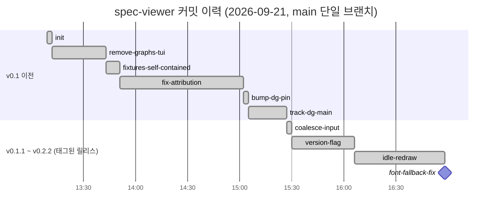

**gitGraph — 같은 커밋 이력을 계보로**(`git log --oneline --all --decorate`, 짧은 해시 + 실제 태그 4개, 단일 브랜치라 `branch`/`merge` 없이 `main` 한 줄): 향후 spec-viewer의 `sniff_kind`/`DgEngine::supports`가 고쳐져 `gitGraph`가 `generic`이 아니라 dg로 실제로 라우팅되는지 **회귀 검증용으로 쓸 목적**으로 실제 프로젝트 데이터를 그대로 담아 둔다. 지금은(수정 전) spec-viewer 파이프라인에서 `commit id: "..."` 줄이 전부 첫 토큰 `commit`으로 시작해 `generic::ensure_box`의 id 중복 제거에 걸리므로, 10개 커밋 중 맨 처음 한 줄만 상자로 남고 나머지 9개·태그 4개는 전부 사라진다(직접 렌더해 확인함):
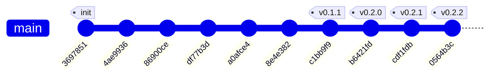
`dg::render_diagram`을 spec-viewer의 게이트 없이 이 소스로 직접 호출해 실측한 결과(**폭에 민감** — 짧은 해시 10개도 폭 100에서는 dg가 `None`을 돌려준다, 즉 라우팅이 고쳐진 뒤에도 이 문서를 폭 100으로 볼 땐 `Fallback::Overflow: gitGraph`로 소스 폴백이 나오는 게 정상이다; 폭 150 이상에서만 한 줄로 다 들어간다):
```text
main  ●3697851───●4ae9936───●86900ce───●df77b3d───●a0afce4───●8e4e382───●c1bb9f9───●b6421fd───●cdf1fdb───●0564b3c
```
(dg는 README에 명시된 대로 `type:`/`tag:` 필드를 렌더링 시 무시하므로, 실제 dg 출력에는 위 소스의 태그 4개가 반영되지 않는다 — 계보 트랙과 커밋 점·id만 그린다. 그러니 이 fence로 향후 라우팅 수정을 검증할 때는 "태그가 안 보이는 것"을 회귀로 오인하지 않아야 한다.)

PlantUML(스펙 외 — spec-viewer가 인식하는 다이어그램이 아니다): `markdown::code::push_code_block`은 언어가 정확히 `"mermaid"`일 때만 `render_mermaid`로 위임한다. 그 외 언어는 syntect 일반 하이라이팅 경로로 가는데, 기본 번들(`SyntaxSet::load_defaults_newlines`)엔 PlantUML 문법이 없어 `find_syntax_by_extension("plantuml")`이 `None`을 반환하고 `find_syntax_plain_text()`로 강등된다 — 즉 아래 펜스는 다이어그램으로 그려지지 않고 무강조 텍스트 코드블록으로 그대로 표시된다(`engine_compare.rs`의 펜스 추출도 `mermaid` 언어 태그만 보므로 이 펜스는 애초에 그 테스트 대상이 아니다):
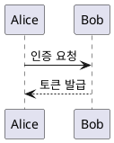

### markdown::mermaid::engine — GraphEngine
Key Decisions의 "Pluggable GraphEngine"/"Adopt mdview graph engine"/"Own mermaid subset" 참고. 등록·선택은 `engine::{register, select, current, engines}`(`OnceLock<RwLock<EngineState>>`).
```rust
pub trait GraphEngine: Send + Sync {
    fn name(&self) -> &'static str;
    fn supports(&self, kind: &str) -> bool;
    fn render(&self, src: &str, diagram: &Diagram, width: u16) -> Result<Vec<String>, Fallback>;
}
pub fn engines() -> &'static [&'static dyn GraphEngine];
pub fn register(engine: &'static dyn GraphEngine) -> Result<(), String>;
pub fn select(name: &str) -> Result<(), String>;
pub fn current() -> &'static dyn GraphEngine;
```
- `BuiltinEngine`("builtin"): `graph::layout(diagram, width, sniff_kind(src))`의 얇은 래퍼.
- `MdviewEngine`("mdview"): `engine/mdview.rs` — 클러스터 랭킹 → barycenter 순서 → 더미노드 좌표 배치 → 밴드 배선/피드백 거터 → `Canvas` 합성. TB 고정.
- `DgEngine`("dg", `engine-dg` 피처): `dg::render_diagram(src, Some(Language::Mermaid), &RenderOptions{width, diagram_caption:false, ..})`에 원문을 그대로 전달, `None`이면 `Fallback::Overflow`(kind는 `dg::diagram::kind_of`로 판정).

**dg가 실제로 지원하는 다이어그램 중 spec-viewer 파이프라인에는 닿지 않는 것들** — `../dg`(`~/tools/dg`, README 기준)는 자체 파서로 mermaid `flowchart`/`graph`·`sequenceDiagram`·`classDiagram`·`erDiagram`·`stateDiagram(-v2)`·`block-beta`·`gitGraph`·`pie`·`xychart-beta`/`xychart`·`quadrantChart`·`gantt` 11종과, PlantUML 시퀀스·클래스·ER·간트(`@startgantt`)·컴포넌트/배치/유스케이스까지 전부 실제 도표(막대·사분면·좌표축 등)로 그려낸다. 그런데 `DgEngine::supports`는 `flowchart|er|class|state|sequence` 5종만 선언하고, 애초에 `render_mermaid`(mermaid/mod.rs)가 넘기는 `kind` 자체가 dg가 아니라 spec-viewer 자신의 `parse::parse`/`sniff_kind`(그래프형 4종 접두어 외엔 전부 `"generic"`)로 먼저 정해진다 — 그 결과 `block-beta`/`gitGraph`/`pie`/`xychart-beta`/`quadrantChart`/`gantt`는 `--diagram-engine dg`를 선택해도 `selected.supports("generic") == false`에 막혀 **dg의 진짜 렌더러에 한 번도 도달하지 못하고** 매번 `BuiltinEngine`의 조잡한 줄 단위 상자화로 대체된다. PlantUML은 한 층 더 앞에서 막힌다 — `code.rs::push_code_block`이 펜스 언어가 정확히 `"mermaid"`일 때만 다이어그램 경로로 보내므로, dg가 `Language::PlantUml`을 직접 지원해도 어떤 엔진을 고르든 그 펜스는 애초에 `render_mermaid` 근처에도 못 간다.

직접 검증(spec-viewer의 실제 파이프라인 대 `dg::render_diagram`을 그 게이트 없이 바로 호출한 결과, 둘 다 폭 70):
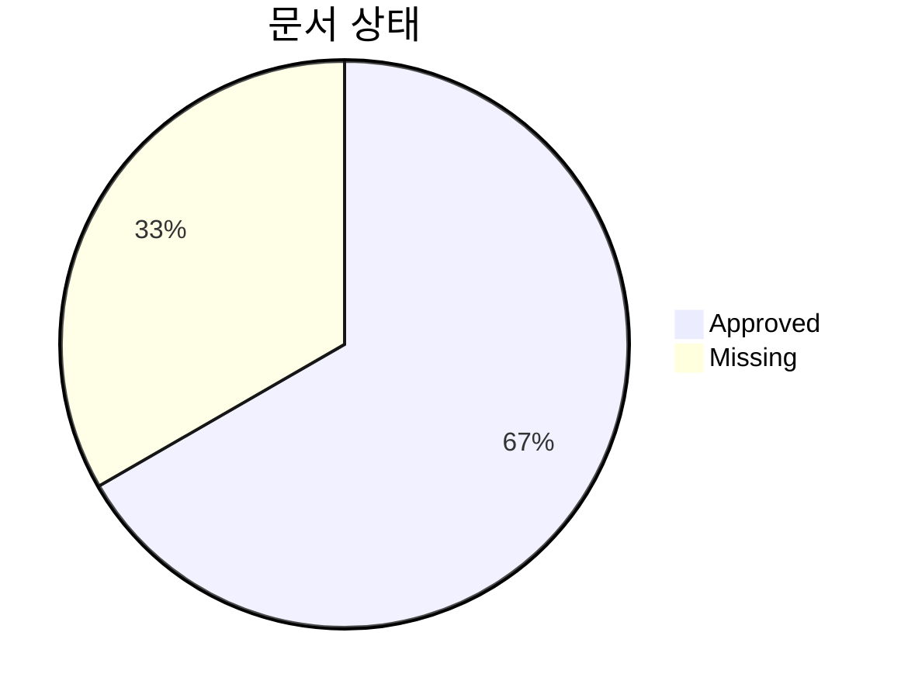
- spec-viewer 파이프라인(`--diagram-engine dg` 선택 상태에서도): `sniff_kind`가 `"generic"`으로 판정 → `DgEngine::supports("generic")==false` → `BuiltinEngine`이 `"Approved"`/`"Missing"`을 각각 독립된 상자로(호 안 원문이 그대로 상자 본문에 남음) 나란히 그린다.
- `dg::render_diagram`을 게이트 없이 직접 호출하면:
```text
문서 상태
Approved ██████████████████████████████                66.7%
Missing  ███████████████                               33.3%
```

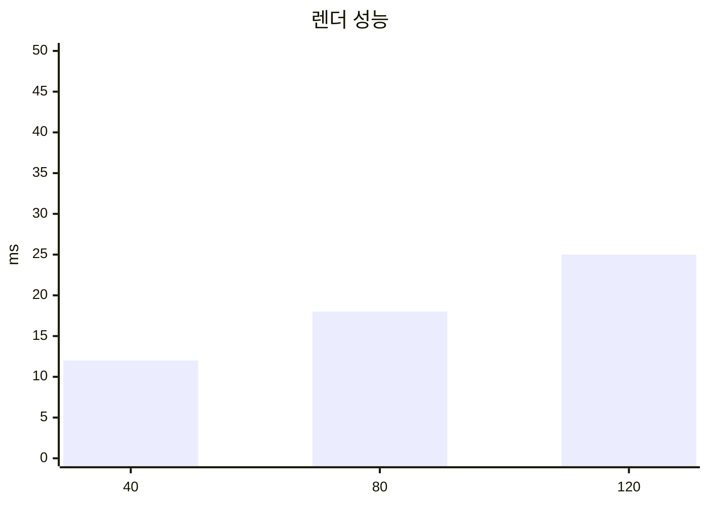
- spec-viewer 파이프라인: 마찬가지로 `"generic"`으로 막혀 `title`/`x-axis`/`y-axis`/`bar` 네 줄이 각각 상자 하나씩으로.
- `dg::render_diagram` 직접 호출:
```text
                              렌더 성능
↑ ms
50 ┤
   │                            ████████              ████████
   │      ████████              ████████              ████████
 0 ┤      ████████              ████████              ████████
   └──────────┴─────────────────────┴─────────────────────┴───────
             40                    80                    120
```
(전체 축·눈금 포함 원본은 위 소스를 `dg -d -l mermaid`로 직접 렌더하면 재현된다.)

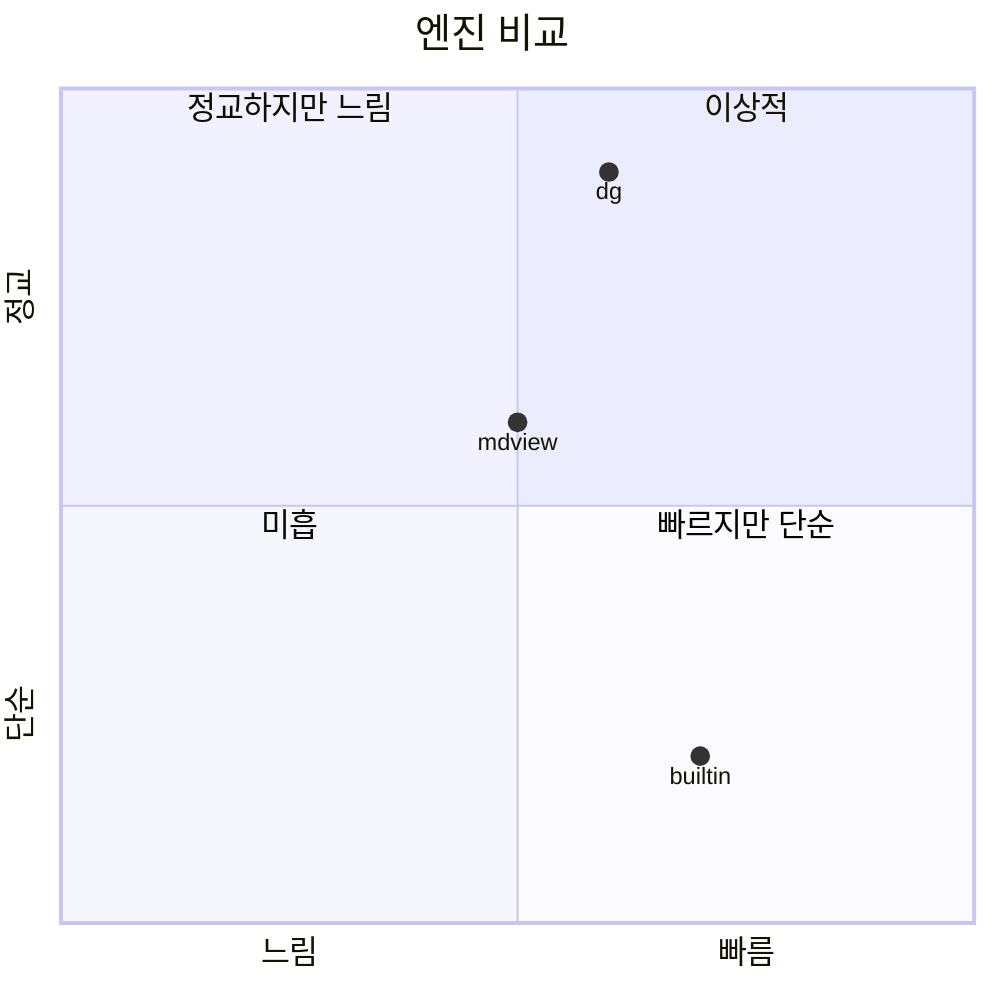
- spec-viewer 파이프라인: 10줄이 각각 독립 상자로 흩어짐(사분면·점 배치 정보는 전혀 반영되지 않음).
- `dg::render_diagram` 직접 호출은 실제로 `builtin`/`mdview`/`dg` 세 점을 사분면 좌표에 정확히 찍는다(`● dg`가 "이상적" 사분면, `● builtin`이 "빠르지만 단순" 사분면 등) — 이 저장소가 위에서 줄곧 이야기해 온 3-엔진 비교(`Own mermaid subset`/`Adopt mdview graph engine`/`Pluggable GraphEngine` 참고)를 dg 자신의 quadrantChart로 그린 것이기도 하다.

(`gitGraph`도 dg가 지원하는 12번째 mermaid 종류지만, 이 문서에는 실제 git 이력을 gantt 하나로만 담기로 했으므로 별도 예시는 싣지 않는다 — 위 "generic 폴백" gantt 항목 참고.)

### watch — FsWatcher
- Intent: 루트 아래 파일시스템 변경을 디바운스된 절대경로 집합(`FsEvent`)으로 전달.
```rust
pub struct FsEvent { pub paths: Vec<PathBuf> }
pub enum Watch { Live(Debouncer<notify::RecommendedWatcher, notify_debouncer_full::NoCache>), Manual(String) }
pub fn start(root: &Path, tx: Sender<FsEvent>) -> Watch;
pub fn manual(reason: impl Into<String>) -> Watch;
```
- `start`: root를 `canonicalize()`(실패 시 원본) 후 재귀 감시, 디바운스 300ms, `NoCache`(위 Key Decisions 참고). 등록 실패 시 사유 문자열을 담아 `Watch::Manual`. 이벤트 경로도 각각 `canonicalize()` 후 릴레이.
- `manual(reason)`: 단순 생성자 — `--no-watch`는 `watch` 모듈이 아니라 `main`이 `start()`를 아예 호출하지 않고 이걸로 대신하는 방식.
- 주의: 이 모듈은 rename을 delete/create와 구분해서 합쳐주지 않는다(`RenameMode` 커스터마이즈 없음, `notify::Config::default()` 그대로) — 상위 리듀서의 이벤트 분류가 이 사실을 전제해야 한다.

### app — State & Reducer
```rust
pub struct AppState {
    root: TreeSource, kiro_root: PathBuf,
    tree_mode: TreeMode, tree_visible: bool, doc_focus: bool,   // doc_focus: Single 모드 전용
    tree: TreeState<NodeId>, sort_key: SortKey,                  // SortKey는 spec::sort 소유
    focus: Panel, doc: DocView, scroll: usize,
    search: SearchState, tree_search: SearchState, tree_matches: Vec<Vec<NodeId>>,
    popup: Option<Popup>, watch: WatchStatus, size: (u16, u16),
    layout: PanelLayout, split: u16,
    drag: Option<Drag>, selection: Option<Selection>, auto_scroll: Option<AutoScrollDir>,
    clipboard: Box<dyn Clipboard>,
    files_tree_cache: Option<FilesTreeItemCache>,
}
pub type FilesTreeItemCache = (Vec<FsEntry>, Vec<Vec<NodeId>>, Vec<TreeItem<'static, NodeId>>);
pub enum Panel { Tree, Doc }
pub enum TreeMode { Always, Auto, Hidden, Single }
pub enum WatchStatus { Live, Manual { reason: String } }
pub struct SearchState { query: String, matches: Vec<usize>, current: Option<usize> }
pub enum Popup { Toc(usize), Help(Vec<(String, String)>), SearchInput(String), Message(String) }
pub struct PanelLayout { tree: Rect, sep: Rect, doc: Rect }
pub struct Selection { anchor: (usize, usize), head: (usize, usize) }
pub enum Drag { Split, Select }
pub enum AutoScrollDir { Up, Down }
pub struct FileInfo { modified: SystemTime, size: u64, lines: usize }
pub enum DocView { Empty, Rendered { path: PathBuf, r: Rendered, meta: FileInfo },
    Definition { spec: String, text: Rendered }, Missing(PathBuf), Deleted(PathBuf),
    ReadError { path: PathBuf, msg: String }, MetaError { spec: String, msg: String } }
pub enum Control { Continue, Quit }
pub enum Action { Key(KeyEvent), Mouse(MouseEvent), Tick, Resize(u16, u16),
    Fs(watch::FsEvent), Refresh, ToggleTree, SetTreeMode(TreeMode), Quit }
pub fn update(state: &mut AppState, action: Action) -> Control;
pub const NARROW_WIDTH_THRESHOLD: u16 = 80;
pub const TREE_PANEL_PERCENT: u16 = 30;
pub fn doc_panel_width(state: &AppState) -> u16;   // ui::render와 공식을 공유(드리프트 방지)
```
- **키 처리**: 팝업이 열려 있으면 `handle_popup_key`만 소비(Toc j/k/Enter/Esc, SearchInput 문자입력/Enter/Esc, Help/Message는 Esc). 전역 우선순위 Esc — ①트리 포커스+검색어 있으면 검색 해제 ②selection 있으면 해제 ③Single 모드 doc_focus면 트리로 복귀. 그 외엔 `keymap::action_for_key`로 조회한 액션명을 매치. 키맵 전체(`keymap::BINDINGS`, 도움말 문구까지 공유):

  | 키 | 동작 | 키 | 동작 |
  |---|---|---|---|
  | `q` | 종료 | `n`/`N` | 다음/이전 검색 결과(포커스 패널 기준) |
  | `Tab` | 패널 전환 | `Up`/`Down` | 트리 이동 또는 문서 1줄 스크롤(포커스 기준) |
  | `j`/`k` | 1줄 아래/위 | `Left`/`Right` | 트리 접기/펼치기 |
  | `d`/`u` | 반 화면 아래/위 | `r` | 수동 새로고침 |
  | `PageDown`/`f`, `PageUp`/`b` | 한 화면 아래/위 | `t` | TOC 열기 |
  | `g`/`Home`, `G`/`End` | 처음/끝 | `/` | 검색 입력(포커스 패널 기준) |
  | `[`/`]` | 이전/다음 헤딩 | `T` | 트리 패널 토글(`--tree always`에서 무시) |
  | `Enter` | 선택한 트리 노드 로드 | `1`/`2`/`3`/`4` | 레이아웃 auto/fold/expand/single |
  | `?` | 도움말 | `s` | 정렬 키 순환(이름→phase→최근 갱신→진행률) |

- **마우스**(`mouse.rs`): `Down(Left)` → `panel_at`로 히트테스트 후 Tree면 포커스+선택(+`Spec`/`SteeringGroup`/`Dir`면 토글도), Doc면 새 `Selection` 시작+`Drag::Select`, Sep이면 `Drag::Split`. `Drag(Left)`: Split→`resize_split`(최소 20열), Select→`drag_select`(head 갱신, 상하 경계 도달 시 `auto_scroll` 무장). `Up(Left)`: Select였으면 `copy_selection`(OSC52) 후 drag 해제. `ScrollUp/Down`: 포인터 아래 패널을 포커스 무관 3행 이동. `Tick`: `auto_scroll` 무장 시에만 1행 스크롤+selection.head 확장.
- **검색**(`search.rs`): 문서 검색은 `Rendered.plain` 대소문자 무시 부분일치. 트리 검색은 `flatten_tree`(TreeSource별 이름 평탄화) + `reveal_and_select`(조상 전개+선택)로 별도 관리(위 Key Decisions "Dual search state" 참고).
- **로더**(`loader.rs`): `DOC_PANEL_BORDER = 2`(테두리만큼 렌더 폭을 줄임). `load_snapshot`은 `.kiro/specs/*`(직계만) + `.kiro/steering/*.md`를 읽어 `DirSnapshot` 생성(닷파일 스킵, 디렉터리 없으면 빈 목록, `from_utf8_lossy`). `load_doc`은 미존재→`Missing`, 읽기 실패→`ReadError`, 성공 시 `FileInfo` 동봉. `modified`는 unix `localtime_r` FFI 자체 선언(외부 libc 크레이트 없음) 또는 실패 시 Howard Hinnant civil-from-days 알고리즘으로 UTC 폴백. `load_selected_doc`/`resolve_selection`/`reload_current_doc`으로 트리 선택 로드와 파일 자기 재로드를 분리.
- **클립보드**(`clipboard.rs`): `trait Clipboard { fn set(&mut self, text: &str); }` — `Osc52`(stdout 직접 write, RFC 4648 base64 자체 구현), `TestSink(Rc<RefCell<Option<String>>>)`.
- 영속 상태 없음, 파일 쓰기 없음. 로그는 `main`이 `--log <file>` 지정 시에만 파일로.

### ui — Panels
```rust
pub fn render(frame: &mut Frame, state: &mut AppState);
```
- **레이아웃 우선순위**: ①`!tree_visible` → 문서 전체 폭 ②`TreeMode::Single` → `doc_focus`로 트리/문서 중 하나 전체 폭 ③`width < NARROW_WIDTH_THRESHOLD`(80) → `focus`만으로 단일 패널 ④그 외 2패널: `split`(초기 `TREE_PANEL_PERCENT`=30%, 이후 유지) + 1열 `sep` + 나머지 doc.
- **선택/포커스 오버레이**: `doc_panel`이 그린 뒤 프레임 버퍼를 직접 mutate해서 선택 범위에 `Modifier::REVERSED`, 포커스 패널의 우상단 셀에 `●`(Cyan)와 테두리 전체를 Cyan으로 재색칠 — 하위 패널 렌더러의 시그니처를 바꾸지 않기 위한 "그린 후 덧칠" 방식.
- **tree_panel**: `Kiro`/`Files` 두 경로(`render_kiro`/`render_files`). `Kiro`는 매 프레임 재빌드(규모가 작아 캐시 불필요), `Files`는 `files_tree_cache`로 캐싱. 상태 기호: `Missing→"·"`, `Generated→"○"`, `Approved→"●"`, `NoRecord→"?"`, `NotTracked→" "`(공백). `!`는 상태 기호가 아니라 `spec.json` 파싱 실패 시 spec 이름 옆의 경고 배지. 미생성 문서는 `DIM`. 진행률 `n/m`(완료 시 Bold+Green). 검색 매치 노드는 노란 배경. 제목은 `"Specs [{sort_key.label()}]"`(정렬 자체는 이미 적용돼 있고 표시만).
- **doc_panel**: `Theme`를 받지 않고 자체 `span_style`/`line_style`/`heading_style`로 렌더(위 Key Decisions "Theme table" 참고). 검색 하이라이트는 **줄 단위**(현재 매치 LightYellow+REVERSED, 그 외 Yellow bg). `DocView::{Empty,Missing,Deleted,ReadError,MetaError}`는 고정 메시지 `Paragraph`.
- **status_bar**: 세그먼트 순서는 **경로 · 파일정보(수정일·크기·행수, 폭≥80만) · NN% · 검색(`/query (i/n)`) · watch off**(파일정보가 퍼센트보다 앞 — 코드 자체 주석이 예전 문서 순서를 명시적으로 뒤집었다고 밝힘). 라인 1개 이하면 항상 100%.
- **popup**: `centered_rect(60,60)` + `Clear`. `Popup::Toc(usize)`는 선택 인덱스만 들고, 헤딩 목록은 매 렌더마다 현재 `DocView`에서 다시 뽑는다. 4종(Toc/Help/SearchInput/Message).

### main.rs — CLI/엔트리포인트
```rust
#[derive(Parser)]
#[command(name = "m", about = "Spec Viewer CLI", version)]
pub struct Args {
    path: Option<PathBuf>, all: bool, no_watch: bool, log: Option<PathBuf>,
    tree: TreeMode,        // ValueEnum: Always|Auto|Hidden|Single, 기본 auto
    sort: SortArg,         // ValueEnum: Name|Phase|Updated|Progress, 기본 name — spec::SortKey로 1:1 변환
    diagram_engine: String,  // 문자열, 기본값은 engine-dg 피처 여부로 컴파일타임 분기(dg | mdview)
}
pub enum StartupError { RootNotFound(PathBuf), LogInsideKiro(PathBuf), AllTargetUnreadable(PathBuf) }  // 셋 다 exit_code() == 2
pub fn resolve_startup(args: &Args) -> Result<(PathBuf, Option<PathBuf>), StartupError>;
pub fn step<B: Backend>(terminal, state, action) -> Result<Control, B::Error>;  // reducer 1회 + draw 1회
```
- `--all`이면 `find_root`/`.kiro`를 완전히 건너뛰고 `args.path`(기본 cwd)를 `FsTree::scan` — 대상을 `read_dir`로 못 열면 `AllTargetUnreadable`(빈 트리로 조용히 넘어가지 않음). 아니면 `resolve_startup`(루트 탐색 + `--log`가 `.kiro` 내부면 거부) → `load_snapshot` → `spec::build` → `spec::sort_specs`(시작 시점에 이미 정렬).
- `--diagram-engine` 검증(`engine::select`)은 터미널 초기화 **전에** 수행, 실패 시 stderr + exit 2.
- `.md` 파일 인자는 `doc_panel_width`(터미널 전체 폭이 아니라 2패널이면 그보다 좁은 실제 렌더 폭)로 즉시 로드.
- 메인 루프·마우스 캡처 실패 허용·이벤트 코얼레싱·idle redraw 억제는 위 Key Decisions 참고. 패닉 훅은 `ratatui::init()`이 표준으로 설치(별도 커스텀 훅 없음).

## Data Models
도메인 타입은 위 `spec`·`markdown`·`app` 인터페이스가 전부다. 영속 저장 없음 — `DirSnapshot`은 테스트에서만 인메모리로 구현.

### Entity-Relationship (PlantUML)
`spec` 모듈의 실제 관계(§Components and Interfaces "spec — SpecModel"의 구조체 필드 그대로). `Spec.meta`는 `Result<SpecMeta, MetaError>`라 항상 존재하되 내용이 성공/실패로 갈리므로 `|o--o|`(0..1)로 표시했다. spec-viewer는 이 펜스도 다이어그램으로 그리지 않는다(PlantUML 미지원, 위 참고).
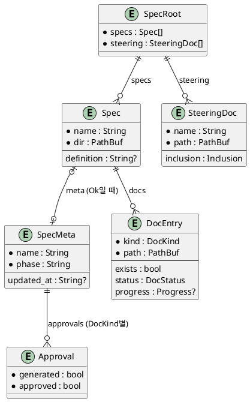

### Class Diagram (PlantUML)
같은 도메인을 UML 클래스 다이어그램으로 — Rust `enum`은 `<<enumeration>>` 스테레오타입으로 표시했다.
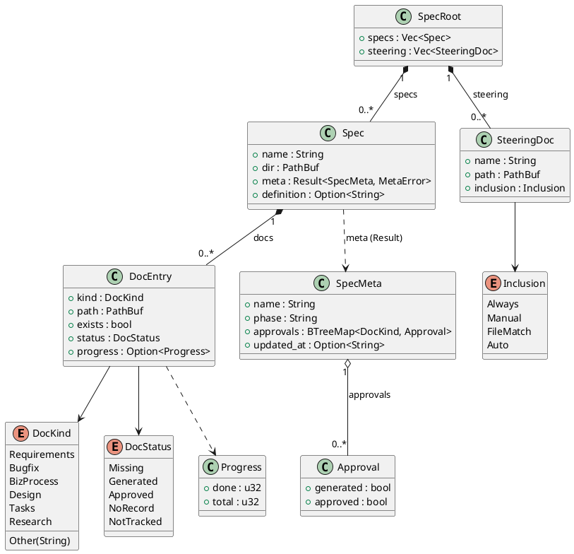

## Error Handling
- **사용자 입력 오류**: 루트 탐색 실패(`RootNotFound`)/`--log`가 `.kiro` 내부(`LogInsideKiro`)/`--all` 대상 디렉터리 불가(`AllTargetUnreadable`) → 탐색 경로 포함 stderr + exit 2. `--diagram-engine` 오값도 stderr + exit 2.
- **문서 단위 오류**: `DocView::{Missing, Deleted, ReadError, MetaError}`로 패널에 격리 표시하고 앱은 계속 동작. `## 정의` 부재 시 `Definition`은 "정의 없음" 안내.
- **디코딩 오류**: `from_utf8_lossy` → 대체 문자 `U+FFFD`.
- **시스템 패닉**: `ratatui::init`의 표준 panic hook이 터미널을 복원한 뒤 stderr 출력, 러너 에러 시 exit 1.
- **기능 강등**: syntect 실패 → 무강조 코드블록; watcher 등록 실패 → `Watch::Manual`; 마우스 캡처 실패 → 로컬 플래그만 기록하고 키보드로 계속(상태 필드 없음); OSC 52 미지원 → 복사 무시; 각 GraphEngine이 폭에 못 맞추면(`dg`는 내부 재시도까지 마친 뒤) `Fallback::Overflow` → `code.rs`가 소스 박스 폴백.

## Testing Strategy
- **Unit** (각 모듈 `#[cfg(test)]`): `spec::meta` 스키마 관대함·MissingName·InvalidJson · `spec::progress` 체크박스 혼합/없음/전부완료 · `spec::mod::build_tests` 문서 순서·누락·steering 분리·exists/status 불일치 · `spec::sort` 4키 순환·2차 정렬·파싱실패 안전성 · `find_root` 우선순위 · `markdown::wrap` CJK·스타일별 단어분리 · `table` 폭 배분 · `code` 가로 잘림·언어 별칭·mermaid 폴백 라벨 · `mermaid::parse::{flow,er,class,state,seq,generic}` 각 문법 부분집합(class.rs의 따옴표 다중성/인라인 주석 리그레션 포함) · `mermaid::graph`(builtin) TB/LR·라벨축약 · `mermaid::engine::mdview` 랭킹/순서/배치/밴드배선/오버플로 사다리 각 단계 + Boundary Map 골든(§Architecture) · `mermaid::engine::dg_engine` 화살표 렌더 스모크 · `mermaid::engine::mod` 레지스트리/폴백 · `app::search` 문서·트리 검색 분리 동작 · `app::mod` 리듀서(`reducer_tests`, 2998줄 파일의 절반 가량) · `keymap` 키→액션 매핑 · `main` `resolve_startup`/`resolve_source` 경로 검증.
- **Integration** (`tests/integration.rs`, 실제 `tests/fixtures/kiro` + 진짜 파일워처): 루트 로드, 비UTF-8 표시, 실제 변경 → `FsEvent`, 삭제 → `Deleted`, `--no-watch`/등록 실패 → Manual. 각 테스트가 픽스처 트리를 임시 디렉터리로 복사해 격리.
- **E2E** (`tests/app_flow.rs`, `TestBackend`): `.kiro/specs/spec-viewer/biz-process.md`의 L2 활동(`BP-SPEC-VIEW.L2-A1~A6`)별 실행→펼침→선택→탐색→변경반영→종료 시나리오.
- **Mouse/Visual** (`tests/visual_defects.rs`, `TestBackend` 실버퍼 검사): 클릭/드래그/스크롤이 실제 렌더 셀에 반영되는지. `tests/table_overflow.rs`는 이 저장소가 아니라 상위 `../.kiro/specs/spec-viewer/design.md`(실제 프로젝트 사양 디렉터리)에 대해 표 오버플로 회귀를 검증하므로, 이 크레이트가 그 상위 디렉터리 밖에 단독 체크아웃되면 해당 3개 테스트는 `DocView::Missing`으로 실패한다(환경 전제 문제이며 이 fixture 파일과는 무관).
- **Engine comparison** (`tests/engine_compare.rs`): **바로 이 파일**(`tests/fixtures/mermaid-samples/spec-viewer/design.md`)에서 모든 mermaid 펜스를 추출해 등록된 모든 엔진으로 폭 100 렌더 후 `tests/snapshots/engines/`에 저장(리뷰용, 자동 단정 없음), 자동 단정은 "각 엔진이 최소 하나는 비어있지 않게 렌더" + "미지원 kind(erDiagram)도 최종 결과는 Ok"뿐.
- **Boundary Map 골든**: `mermaid::engine::mdview`의 단위 테스트가 이 파일의 "### Boundary Map" 다음 펜스를 직접 파싱해 폭 100·120으로 렌더하고 `tests/fixtures/mdview-tb/boundary-map-w{100,120}.txt`(또는 로컬에 `mdview` 참조 바이너리가 있으면 그 출력)와 문자 그대로 비교한다 — 그 펜스는 이 문서 갱신 중에도 그대로 유지했다.
- **Glow 비교** (`tests/glow_snapshot.rs`): `glow` 설치 시에만 실제 `.kiro/specs/*/design.md`를 glow와 이 렌더러 양쪽으로 나란히 저장(리뷰용). 체크박스/링크/이미지/각주 자동 단정은 실제 design.md들에 그 요소가 없어 이 파일 안의 전용 스모크 픽스처로 별도 확인한다.
- **Performance**: `tests/render_perf.rs` 500행 문서 렌더, `watch::start` 대형 디렉터리 시작 지연(빈 디렉터리 대비 150ms 미만 차이), `--all` 모드 `FilesTreeItemCache` 히트/미스 시간 비교.

## File Structure Plan
```
spec-viewer/
  Cargo.toml                 # 독립 크레이트, [[bin]] name = "m", feature engine-dg (dep:dg)
  Makefile                   # build/test/run/install(~/.local/bin/m)/clean/install-remote
  THIRD_PARTY.md             # mdview MIT notice
  src/
    lib.rs                   # pub mod markdown/spec/watch/app/ui 재노출
    main.rs                  # Args(clap)/StartupError/resolve_startup/resolve_source/step/run_loop
    app/
      mod.rs                 # AppState, Action, DocView, update() — 2998줄, 후반부는 reducer_tests
      keymap.rs               # BINDINGS 표: 키 -> 액션명 + 도움말 텍스트
      mouse.rs                # MouseEvent -> Action (PanelLayout 히트테스트)
      clipboard.rs            # Clipboard trait; Osc52 impl(base64 자체구현), TestSink
      loader.rs               # File I/O -> spec::DirSnapshot 재수출, load_doc/load_definition/load_selected_doc
      search.rs                # 문서 검색 + 트리 검색(flatten_tree/reveal_and_select) 분리 로직
    spec/
      mod.rs                 # SpecRoot, Spec, DocEntry, TreeSource, find_root, build, definition, inclusion
      meta.rs                 # SpecMeta/MetaError/Approval/DocKind 정규화
      progress.rs             # tasks.md 체크박스 집계
      sort.rs                  # SortKey, sort_specs
      fs_tree.rs               # --all 모드 FsTree::scan (ignore::WalkBuilder)
    markdown/
      mod.rs                 # render/render_with, 각주 수집·출력(footnote.rs 없음)
      block.rs                # 블록 조립(헤딩/문단/리스트/인용/표 위임)
      inline.rs               # 인라인 스타일링 & 스팬
      wrap.rs                  # 그래핌 인지 줄바꿈
      table.rs                 # 표 폭 배분
      code.rs                  # syntect 하이라이트 & mermaid 위임
      theme.rs                 # Theme 테이블(구조 영향은 heading_rule만, 색은 markdown 내부 전용)
      hangul.rs                 # NFD -> NFC 음절 합성(mdview 포팅)
      mermaid/
        mod.rs                 # render_mermaid(src, width), sniff_kind
        canvas.rs               # 방향 비트마스크 박스드로잉 캔버스(graph.rs/engine/mdview.rs 공유, mdview 포팅)
        graph.rs                 # builtin 레이아웃(층 배치, 라벨축약 1단계)
        seq.rs                   # 전용 압축 sequence 렌더러(참여자 균등열, self-loop)
        parse/
          mod.rs                 # parse() 디스패치
          flow.rs  er.rs  class.rs  state.rs  seq.rs  generic.rs
        engine/
          mod.rs                 # trait GraphEngine, 레지스트리(OnceLock<RwLock>), --diagram-engine 선택/폴백
          builtin.rs               # graph::layout 래퍼
          mdview.rs                 # mdview 포팅 층 배치(랭킹/barycenter/밴드배선/오버플로 사다리), Boundary Map 골든 테스트 보유
          dg_engine.rs               # cfg(feature = "engine-dg"): dg 크레이트에 원문 그대로 위임
    watch/
      mod.rs                   # FsWatcher & Debouncer(NoCache)
    ui/
      mod.rs                   # 레이아웃 분기 & 프레임 조립, 선택/포커스 오버레이
      tree_panel.rs             # Kiro/Files 트리 렌더, FilesTreeItemCache
      doc_panel.rs               # 라인 기반 문서 렌더(자체 span/line/heading 스타일)
      status_bar.rs               # 경로·파일정보·퍼센트·검색·watch 상태
      popup.rs                    # TOC/도움말/검색입력/메시지
  tests/
    fixtures/kiro/               # 두 스키마, 누락 문서, 깨진 json, 비UTF-8, 추가 .md
    fixtures/mermaid-samples/spec-viewer/design.md   # 바로 이 파일 — engine_compare.rs/mdview 골든의 입력
    fixtures/mdview-tb/           # Boundary Map 참조 스냅샷(w100/w120)
    fixtures/golden/               # render_golden.rs 소스 + 폭 40/80/120 스냅샷
    integration.rs, app_flow.rs, table_overflow.rs, visual_defects.rs,
    engine_compare.rs, glow_snapshot.rs, render_golden.rs, render_perf.rs, support/mod.rs
```

## Optional (필요 시만)

### Security
- 네트워크 접근 없음(모든 의존성이 로컬 파일 I/O·터미널 I/O) — 유일한 예외는 `cargo build` 시점의 `dg` git 의존성 페치이며 런타임 공격 표면이 아니다.
- 파일시스템은 읽기 전용(`spec::mod`/`app::loader` 어디에도 쓰기 경로 없음). 신뢰할 수 없는 `spec.json`/마크다운이어도 패닉하지 않도록 관대한 파서(`parse_meta`)와 손실 허용 디코딩(`from_utf8_lossy`)으로 흡수한다.
- 렌더된 문서 텍스트는 별도 이스케이프 새니타이즈 없이 그대로 ratatui `Span`에 들어간다 — 원본 마크다운에 터미널 제어문자가 섞여 있으면 그대로 화면에 전달될 수 있다("신뢰하는 로컬 스펙 문서를 보는 도구"라는 전제 위에서 받아들인 위험이며, 임의 원격 마크다운을 여는 뷰어로 확장할 때는 재검토 대상).
- OSC 52 클립보드 복사는 사용자가 마우스로 명시적으로 선택한 범위만 전송한다 — 문서 내용이 자동으로 클립보드나 다른 채널로 유출되는 경로는 없다.

### Performance
- 500행 문서 렌더 < 50ms(`tests/render_perf.rs`), Synchronous Core 결정의 전제(문서가 이 규모를 훨씬 넘으면 Revalidation Trigger).
- `watch::start` 등록 비용이 디렉토리 파일 수에 비례하지 않는다(`NoCache`, 5만 파일 디렉터리와 빈 디렉터리 차이 150ms 미만 — 전용 회귀 테스트).
- `--all` 모드 `FilesTreeItemCache`가 입력이 안 바뀌면 `Vec<TreeItem>` 재빌드를 건너뛰어 대형 디렉터리 스크롤이 매끄럽다(전용 회귀 테스트: 2만 항목에서 캐시 히트가 미스의 절반 미만 시간).
- 메인 루프의 입력 이벤트 코얼레싱(폴 사이클당 draw 1회)과 idle redraw 억제(유휴 시 100ms 하트비트 재draw 없음)로 마우스 휠 버스트·대기 상태 양쪽의 불필요한 렌더 비용을 없앤다.
