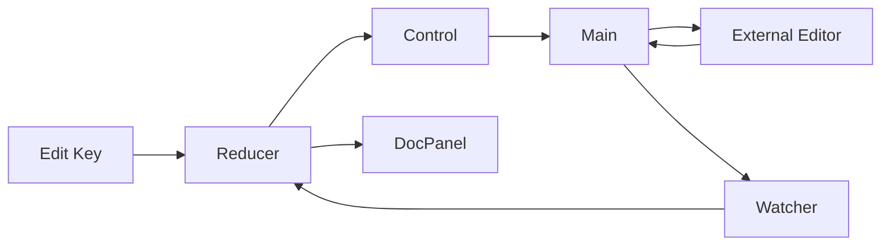
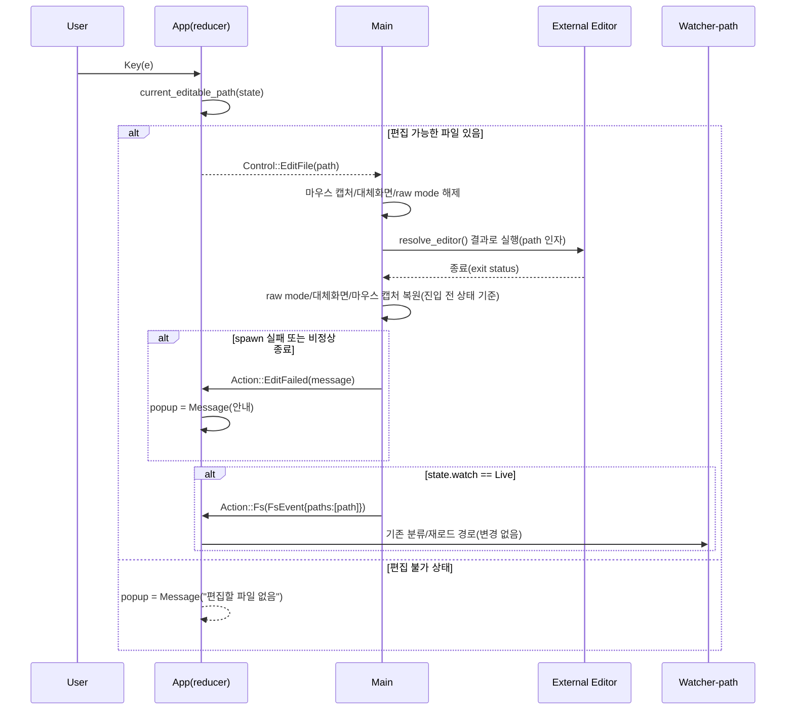

> 참고: spec-viewer 자체 spec-kit 지원 검증 픽스처. `.kiro/specs/spec-viewer-editor-mode/design.md`를 spec-kit의 `plan.md` 역할로 가져왔습니다.

# Design — spec-viewer-editor-mode

## 정의
spec-viewer 사용자를 위해 문서 패널에 표시된 파일을 외부 에디터로 열고 편집을 마치면 자동으로 뷰어 화면과 반영된 내용으로 돌아오게 하는, 본편 `app`/`main`/`keymap`을 확장하는 기능이다.

## Boundary Commitments

### In-Scope (This Spec Owns)
- **편집 진입 판정**: 문서 패널이 편집 가능한 단일 파일을 표시 중인지 판정(1.1, 1.3).
- **에디터 선택**: `--editor` CLI 옵션 → `$VISUAL` → `$EDITOR` → `vi` 우선순위 결정(2.1~2.4).
- **터미널 일시정지/복귀**: raw mode·대체화면·마우스 캡처를 내렸다가 자식 프로세스 종료 후 되돌리는 시퀀스(1.2, 5.1, 5.2).
- **편집 후 반영**: 기존 파일워처 경로(`Action::Fs`)를 재사용한 자동 재렌더, `--no-watch`와의 상호작용(3.1~3.3).
- **오류 보고**: 에디터 실행 실패·비정상 종료를 사용자에게 알림(4.1, 4.2).
- **도움말 노출**: 신규 키를 기존 키맵 표 메커니즘으로 자동 노출(6.1).
- **문서화**: 본편 `.kiro/specs/spec-viewer/design.md`의 Out-of-Scope "Spec Mutation" 문구에 이 기능을 예외로 명시하는 각주 추가(구현 단계 산출물, 코드 아님).

### Out-of-Scope
- **뷰어 내장 편집기**: 텍스트 입력·커서 이동 등 자체 편집 UI 구현 — 외부 에디터에 위임(brief.md Approach).
- **`.kiro/` 메타데이터 조작**: `spec.json` 승인 상태 변경 — 여전히 kiro 스킬군 소유.
- **동시 다중 편집**: 한 번에 하나의 파일만 편집 가능.
- **`Definition`(합성 `## 정의` 요약) 편집**: 실제 파일 하나에 대응하지 않으므로 대상에서 제외.
- **에디터 내부 동작**: 문법 강조·플러그인 등 외부 에디터 자체 기능에는 관여하지 않음.

### Allowed Dependencies
- 외부: 신규 크레이트 없음 — 기존 `std::process::Command`(표준 라이브러리), `crossterm 0.29`(이미 의존, raw mode·대체화면·마우스 캡처 API)만 사용.
- 내부 의존 방향(기존과 동일, 왼→오만): `app` → `ui` → `main`. `app`는 여전히 터미널·프로세스를 몰라야 한다 — `Control::EditFile(PathBuf)`는 데이터만 담고, 실행은 `main`이 전담(research.md "Control::EditFile" 결정).

### Revalidation Triggers
- crossterm/ratatui 메이저 업그레이드 시 raw mode·대체화면·마우스 캡처 일시정지/복귀 시퀀스 재검증.
- `$EDITOR`/`$VISUAL` 관례(공백 분리 토큰화)가 실제로 안 맞는 에디터 설정 사례가 보고되면 `resolve_editor` 재검토.
- 본편 `design.md`의 "Spec Mutation"/"파일 쓰기 없음" 문구가 다른 스펙에 의해 다시 개정되면, 이 스펙이 추가한 각주와의 정합성 재확인.

## Architecture

### Boundary Map


`app`(리듀서)는 편집 요청을 `Control::EditFile`로 신호만 보내고, 실제 터미널 제어·프로세스 실행은 이미 그 상태를 쥔 `main`이 전담한다. 편집 후 반영은 새 경로를 만들지 않고 기존 `Watcher → Reducer` 경로(`Action::Fs`)를 재사용한다.

### Technology Stack
| Layer | Choice | Role |
|-------|--------|------|
| Process | `std::process::Command`(표준 라이브러리) | 에디터 자식 프로세스 실행(셸 미경유), 종료 코드 확인 |
| Terminal | crossterm 0.29(기존 의존성) | raw mode·대체화면·마우스 캡처 토글(이미 `main.rs`가 사용 중인 API 재사용) |

### Key Decisions
- **`Control::EditFile(PathBuf)`로 리듀서-신호/메인-실행 분리** — 기존 `app`↔`main` 계층 분리를 지키면서 편집 요청을 전달. 대안 비교는 research.md.
- **에디터 실행은 셸 미경유, 프로그램+인자 배열로 토큰화** — `$EDITOR="code -w"` 같은 인자 포함 값 지원 + 인젝션 표면 최소화. 근거는 research.md.
- **재렌더는 새 로직 대신 기존 `Action::Fs` 경로 재사용** — 자식 종료 후 감시가 켜져 있으면(`state.watch == Live`) `Action::Fs(FsEvent{paths: vec![path]})`를 합성해 기존 분류·재로드·스크롤 보존 규칙을 그대로 물려받는다(3.1). 감시가 꺼져 있으면(`Manual`) 아무것도 하지 않는다(3.2).
- **키 배정 `e`** — 기존 키맵(`a c e h i l m o p v w x y`)에서 비어 있고 "edit"과 직관적으로 대응.

## System Flows

### 편집 키 입력 → 에디터 전환 → 복귀·반영

- **1.1/1.3 판정**: `current_editable_path`는 `DocView::Rendered{path,..}`일 때만 `Some(path)`, 그 외(Empty/Definition/Missing/Deleted/ReadError/MetaError)는 `None`.
- **5.1**: `main`이 진입 전 마우스 캡처 활성 여부를 기억해 두었다가 복귀 시 그 값 그대로만 재적용(이미 꺼져 있었으면 다시 켜지 않음).
- **5.2**: 자식 프로세스 대기가 동기 블로킹이므로 그 구간 동안 `run_loop`는 다른 이벤트를 폴링하지 않는다 — 별도 잠금 불필요(Synchronous Core, 본편 design.md Key Decision과 동일한 전제).

## Components and Interfaces

### app — Action/Control 확장
- Intent: 편집 요청 판정과 실패 보고를 리듀서 안에 순수 함수로 유지.
- Requirements: 1.1, 1.3, 4.1, 4.2, 5.1
```rust
pub enum Action {
    // 기존 변형 그대로 + 아래 2개 추가
    Edit,
    EditFailed(String),
}
pub enum Control {
    Continue,
    Quit,
    EditFile(PathBuf),   // main이 소비: 터미널 일시정지 + 에디터 실행 신호
}
fn current_editable_path(state: &AppState) -> Option<&Path>;  // DocView::Rendered{path,..}만 Some
```
- `Action::Edit` 처리: `current_editable_path`가 `Some`이면 `Control::EditFile(path.clone())` 반환. `None`이면 `state.popup = Some(Popup::Message("편집할 파일이 없습니다"))` 설정 후 `Control::Continue`.
- `Action::EditFailed(msg)` 처리: `state.popup = Some(Popup::Message(msg))`, `Control::Continue`. 4.1(실행 실패)과 4.2(비정상 종료) 공용.

### keymap — 신규 바인딩
- Intent: 기존 `BINDINGS` 표 메커니즘으로 편집 키와 도움말을 동시에 노출.
- Requirements: 6.1
```rust
Binding { keys: &[KeyCode::Char('e')], action: "edit", help: "문서 패널에 표시된 파일을 외부 에디터로 열기" }
```

### main — 터미널 일시정지/복귀와 에디터 실행
- Intent: `Control::EditFile`을 소비해 실제 프로세스 실행과 터미널 상태 전환을 담당하는, 순수 판단(`resolve_editor`)과 부수효과(실행)를 분리한 얇은 계층.
- Requirements: 1.2, 2.1~2.4, 3.1, 3.2, 4.1, 4.2, 5.1
```rust
/// 우선순위(`--editor` → `$VISUAL` → `$EDITOR` → `"vi"`)로 고른 값을 공백
/// 기준 토큰화해 반환한다. tokens[0]이 실행 파일, tokens[1..]이 고정 인자.
pub fn resolve_editor(cli_editor: Option<&str>) -> Vec<String>;

/// `Control::EditFile(path)`를 받아 처리한다: 마우스 캡처/대체화면/raw mode를
/// 진입 전 상태 기억 후 해제 → `resolve_editor()` 결과 + `path`로 자식 프로세스
/// 실행(셸 미경유) → 종료 대기 → 상태 복원. 반환값으로 실행 성공 여부와 종료
/// 상태를 알려, 호출부가 `Action::EditFailed`/`Action::Fs` 여부를 결정한다.
fn run_editor(terminal: &mut Terminal<impl Backend>, path: &Path, cli_editor: Option<&str>, mouse_capture_enabled: bool) -> EditOutcome;
enum EditOutcome { Reloaded, Failed(String) }
```
- `run_loop`가 `step()`의 반환값이 아니라 `update()`의 `Control` 값을 직접 매치하는 지점에 `Control::EditFile(path) => { ... }` 분기 추가 — `run_editor` 호출 후 `EditOutcome::Failed(msg)`면 `step(terminal, state, Action::EditFailed(msg))`, `Reloaded`면(그리고 `state.watch == Live`일 때만) `step(terminal, state, Action::Fs(FsEvent{paths: vec![path]}))`.
- `Args`(clap)에 `#[arg(long = "editor")] editor: Option<String>` 추가(2.1).

## Data Models
새 도메인 타입 없음 — `Action`/`Control` 두 기존 열거형에 변형을 추가하는 것으로 충분하다(위 Components and Interfaces가 전부).

## Error Handling
- **에디터 실행 실패(4.1)**: `Command::spawn`이 `Err` 반환 → `run_editor`가 `EditOutcome::Failed("에디터 실행 실패: {io error}")` 반환 → `Action::EditFailed` → `Popup::Message`. 뷰어는 계속 동작.
- **에디터 비정상 종료(4.2)**: `ExitStatus::success() == false` → `EditOutcome::Failed("에디터가 비정상 종료됨(코드 {n})")`와 별개로, 파일 변경 여부에 따른 재렌더(`Action::Fs`, `state.watch == Live`일 때만)는 그대로 시도한다 — 실패 메시지와 재렌더는 상호 배타가 아니다.
- **터미널 복원 실패**: crossterm의 raw mode/대체화면 API가 실패해도(실제 tty가 아닌 환경 등) 패닉하지 않고 에러를 무시한 채 계속 진행 — 기존 마우스 캡처 실패 처리(본편 Error Handling "기능 강등")와 동일한 관용.

## Testing Strategy
- **Depth**: Standard(신규 로직 + 다중 상태 분기 — 영속 상태기계나 도메인 규칙 수준은 아님).
- **Unit (L6)**: `resolve_editor` 4가지 우선순위 분기(2.1~2.4, 인자 포함 값 토큰화 포함) · `current_editable_path` 6가지 `DocView` 변형 분기(1.1, 1.3).
- **Integration/Service (L5)**: 리듀서 테스트로 `Action::Edit` → `Control::EditFile`/안내 팝업 분기(1.1, 1.3), `Action::EditFailed` → `Popup::Message` 반영(4.1, 4.2).
- **Integration/UI-API (L3)**: `TestBackend`로 도움말 팝업에 `e` 키 노출 확인(6.1), 편집 불가 상태에서 상태 표시줄 안내 문구(1.3) — 기존 `ui` 테스트 패턴 재사용.
- **E2E (L2)**: 임시 디렉터리 + 테스트 전용 셸 스크립트를 `--editor`로 지정해 파일을 실제로 고치고 종료하도록 구성, `--no-watch` 유무에 따라 재렌더 여부(3.1, 3.2) 및 저장 안 함(3.3) 시나리오 검증. 실제 raw mode 토글 성공 여부는 이 레벨에서 단정하지 않는다(진짜 tty가 아니면 실패할 수 있음 — 본편 main.rs의 기존 한계와 동일).
- **Acceptance (L1)**: 실제 터미널에서 `m` 실행 → `e`로 실제 에디터(vi 등) 진입 → 저장 후 종료 → 화면이 정상 복원되고 변경이 반영됨을 수동 확인(본편 main.rs 주석의 "실행→종료→터미널 복원" 검증 관례와 동일).

## File Structure Plan
```
spec-viewer/
  src/
    app/
      mod.rs        # + Action::{Edit, EditFailed}, Control::EditFile(PathBuf), current_editable_path()
      keymap.rs      # + Binding { 'e' -> "edit" }
    main.rs           # + Args.editor: Option<String>, resolve_editor(), run_editor(), EditOutcome,
                       #   run_loop의 Control::EditFile 분기
  README.md            # Keys 표에 `e`, Flags 표에 `--editor` 추가
```

## Optional (필요 시만)

### Security
- 에디터 실행은 셸(`sh -c`)을 거치지 않고 `Command::new(prog).args(rest).arg(path)`로 직접 실행 — 파일 경로나 `$EDITOR` 값에 셸 메타문자가 섞여도 해석되지 않는다(research.md "에디터 실행은 셸을 거치지 않고" 결정).
- 실행되는 에디터는 사용자 자신이 설정한 `$EDITOR`/`$VISUAL`/`--editor`이므로 신뢰 경계는 기존 셸 사용과 동일 — 새로운 공격 표면을 추가하지 않는다.
